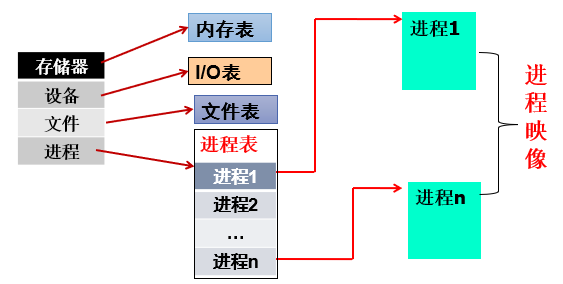
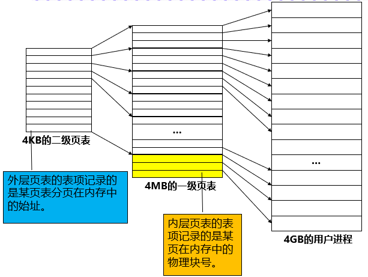

# 操作系统基础

---

作者：	Dyllan（2018091605001）

摘要：	奇怪的操作系统增加了.jpg

​				两章存储器以罗列定义为主，最后四章随缘更新（其他科目要紧.jpg)

关键词：OS

---

## 操作系统引论

### 操作系统的概念

>当前对于OS还没有一个**统一的、适用的**定义！ 

#### 当前的OS定义

1.  操作系统是一道**程序**
    -   **管理**计算机**硬件资源**；
    -   为应用程序**提供基础平台**；
    -   在计算机**用户和硬件之间扮演中间人**的角色；
2.  操作系统是一个**资源分配者**
    -   **管理**计算机的**所有资源**；
    -   当用户**请求冲突**时，以**公平有效使用资源**为原则做出裁决；
3.  操作系统是一个**管理者**
    -   控制程序的运行，防止程序出错或不正确使用计算机；

**操作系统定义：**操作系统是一组 以**控制和管理计算机软硬件资源**、**合理地对各类作业进行调度**以及**方便用户使用**为目的 的程序集合。

**课本OS定义：**操作系统**位于硬件层之上**，**位于其它系统软件层之下**的一个**系统软件**，使得管理系统中的**各种软件和硬件资源得以充分利用**，**方便用户使用**计算机系统。

#### 现代操作系统的四种基本观点

1.  从外部看OS

    1.  计算机用户的观点：用户环境
        1.  OS是**用户**与**计算机硬件系统**之间的接口；

    1.  应用程序员的观点：虚拟机器
        1.  OS是建立在**计算机硬件平台**上的**虚拟机器**；

2.  从内部看OS

    1.  OS开发者：资源管理
        1.  作为**计算机系统资源**的管理者：

            -   处理机管理：分配和控制处理机；
            -   存储器管理：分配和回收内存；
            -   I/O（Input/Output）设备管理：I/O分配与操作；
            -   文件管理：文件存取、共享和保护；
    2.  OS开发者：作业组织
        1.  OS是计算机系统**工作流程的组织者**，它负责**协调**在系统中运行的**各个应用软件的运行次序**；

#### 操作系统的目标

1.  方便性：
    -   计算机只能识别0、1，而用户熟悉的是各种语言；
    -   通过命令和图形界面方便用户使用；
2.  有效性：
    -   提高系统资源利用率；
    -   提高系统吞吐量；（e.g. 神威计算机，多个任务，吞吐量大）
3.  可扩充性：
    -   便于修改和增加功能；
4.  开放性：
    -   系统能支持世界标准规范；
    -   实现应用程序的**可移植性**和**互操作性**，要求**具有统一的开放环境**；

#### 操作系统的主要功能⭐（重点，此处为概要，详细见各单元）

操作系统应具有五方面的功能：（这个就是本OS课程的**目录**）（务必熟悉！！）

1.  处理机管理（CPU）

    -   **主要功能：**按照一定的算法**把处理机分配给进程（线程）**，并对其进行有效的管理和控制；

    1.  进程控制

        -   **主要功能：**为作业/任务**创建进程**、**撤消已结束的进程**，以及**控制进程**在运行过程中的状态转换；

    2.  进程同步和互斥

        -   协调多个进程的运行；

        -   协调方式：

            1.  **进程互斥：**多个进程（线程）访问临界资源时，采用**互斥方式**；

                

            2.  **进程同步：**进程相互合作完成共同任务时，由**同步机构**协调进程的执行次序；

                

    3.  进程通信

        -   负责进程之间的信息交换；

    4.  进程调度

        -   从**进程的就绪队列**中按照一定的算法选出一个新进程，把处理机分配给它，使进程投入执行；

            -   **作业**进入内存后变为**进程**；
            -   **一个作业**通常与**多个进程**相对应；

            

2.  存储器管理

    -   **主要功能：**为多道程序的运行提供良好的环境，方便用户使用存储器，**提高存储器的利用率**以及**从逻辑上扩充内存**；
    -   功能：
        -   内存分配；
            1.  **静态**分配方式：每个作业**预先分配**好内存空间，并不再改变；
            2.  **动态**分配方式：每个作业**可随时申请**新的附加内存空间，以适应程序和数据的动态增长；
        -   内存保护；
            -   确保每道用户程序都**只在自己的内存空间内运行**，彼此**互不干扰**；
            -   **保护机制：**设置两个界限寄存器，越界检查都由硬件实现；
        -   地址映射；
            -   **地址空间：**程序所在的空间。空间内的单元编号为**逻辑地址**（相对地址）；
            -   **内存空间：**由一些列单元限定的地址范围。其中的地址为**物理地址**；
            -   **地址映射：**运行时，将地址空间中的**逻辑地址**转换为内存空间中的**物理地址**的过程；
        -   内存扩充；
            -   利用虚拟存储技术，从**逻辑**上**扩充内存容量**（虽然有点怪，但想通后也没错，本质就是将**部分外存**用于暂存**内存中暂时不需要的数据**）；
            -   机制：
                1.  **请求调入**功能：若当前程序需要的数据或程序未装入内存，则**从外存中**将所需部分**调入内存**，然后继续运行；
                2.  **置换**功能：将内存中**部分暂时不需要的数据或程序**调出到外存，然后将**需要的部分**装入内存；
    -   结构与功能：
        -   有合适的内存分配的数据结构，该结构用于**记录内存空间的使用情况**；
        -   **内存分配功能**——为用户程序**分配内存**空间；
        -   **内存回收功能**——当用户不再需要的内存时，系统能**回收内存**；

3.  设备管理

    -   I/O管理；
    -   主要任务：
        -   完成用户进程提出的**I/O请求**；
        -   为用户进程**分配其所需的I/O设备**；
        -   **提高**CPU和I/O设备的**利用率**；
        -   提高I/O速度；
        -   **方便用户**使用I/O设备；
    -   功能：
        1.  **缓冲管理：**有效地缓和CPU和I/O设备**速度不匹配**的矛盾 ，提高CPU的利用率；
        2.  **设备分配：**根据用户进程的**I/O请求**，按照某设备的**分配策略**，为进程分配其所需的设备；
        3.  **设备处理：**设备的驱动，提供设备之间的接口；

4.  文件管理

    -   主要任务：
        -   管理**用户文件**和**系统文件**；
        -   方便用户使用；
        -   保证文件安全性；
    -   主要功能：
        -   文件存储空间管理；
        -   目录管理；
        -   文件的读/写管理和保护；

5.  方便用户使用的用户接口（用户与操作系统的接口）

    -   首先，要意识到**对大多用户来说，操作系统是一个“黑盒子”**，因此OS要提供一个指引用户如何使用的**人性化接口**；

    -   **用户通过接口使用计算机**，接口影响计算机的使用方式；

    -   操作系统接口的作用：

        -   保护操作系统（防止“豆芽🌱”用户的错误操作导致的灾难的发生）
        -   方便应用程序的移植（让程序可在**有同一系统的不同主机**运行）
        -   让用户觉得简单方便（用户接口起了“导师🛕”的作用）

    -   基本方式：

        -   命令行

            ```c
            // myEcho.c
            #include <stdio.h>
            int main(int argc,char* argv[])
            {
                printf("ECHO:%s\n", argv[1]);
                return 0;
            }
            ```

            编译，然后将目录路径加入环境中：

            

        -   图形接口（GUI）

            -   构建**消息循环队列**完成消息响应；
            -   OS提供**消息框架**和**相关API**；
            -   有图标，方便用户使用！

        -   假脱机；

        -   应用程序（将命令行和GUI组合成一个整体）

    -   计算机**用户需要用户接口（简称接口）**：
    
        -   OS的Interface（用户接口）：由OS实现的由**所有用户命令**所构成的集合；
        -   用户接口也称命令接口；
            -   用户可通过**命令接口**向作业发出命令，**控制作业的运行**；
        -   命令的表示形式：
            -   **字符**形式：**较灵活**但**繁琐且难记**；
        -   **菜单**形式：试图**在字符终端上提供友好的用户界面**；
            -   **图形**形式：**直观且易记**但**不灵活**；

    -   **应用软件**需要的System Call（系统调用、接口）：
    
        -   程序接口（应用编程接口）：由OS实现的由**所有系统调用**所构成的集合；
        -   又称**程序接口**或**应用编程接口**（Application Programming Interface, **API**）
            -   <u>**程序接口**由一组**系统调用**组成</u>，每一个系统调用都是一个能完成特定功能的**子程序**；

>   OS实现了对计算机资源的抽象（隐藏、扩充）
>
>   
>
>   -   抽象出功能，逐层增加抽象程度，大大简化用户使用；

### 操作系统的基本特征

1.  并发性；**(最重要)**

    -   并发是OS最重要的特征，其他特征都以并发为前提；
    -   **基本特征中的并发性**指具有可**并发执行**，和**并发中的并发性**不同（俺觉得是早期翻译的锅）

    -   并发定义：（注：**并发**和**并发性**不能混为一谈！）
        -   **并发**包含**并行性**和**并发性**，指**并发执行**的n个**过程**；
        -   **并行**性：两个或多个事件在**同一时刻**发生；（同时！）
        -   **并发**性：两个或多个事件在**同一时间间隔内**发生；（一段时间内）
    -   任务共行：
        -   **宏观：** 操作系统中有**多个任务同时运行**；
        -   **微观：** **单处理机系统**中的**任务并发（多个任务交替运行）**，或**多处理机系统**中的**任务并行（多个任务在多个处理机上同时运行）**；

2.  共享性；（和并发性互为存在的条件，都是最基本的特征）

    -   **系统中的资源**可供内存中**多个并发执行的进程**共同使用；

    1.  互斥共享：
        -   **临界资源：**一段时间内只允许一个进程访问的资源；
        -   **互斥共享：**临界资源可供多个进程使用，但一段时间仅允许一个进程使用；
    2.  同时访问：
        -   **宏观：**资源共享指**多个任务**可以**同时使用**系统中的资源；
        -   **微观：**多个进程交替互斥使用系统中每个资源（e.g. 硬盘）

3.  虚拟性；

    -   通过某技术把**物理实体**映射为若干**逻辑上的对应物**；
        -   时分复用：
            -   虚拟处理机：分时实现；
            -   虚拟设备：SPOOLING技术（自学内容）
        -   空分复用：
            -   虚拟存储器：虚拟存储管理实现；

4.  异步性；

    -   多道程序环境下，程序（进程）以异步的方式执行，执行顺序、完成时间不可确定不可预知。（如何确保正确性，需要合适的算法进行管理）

>   引入进程：
>
>   -   **目的：**使多个程序能够**并发执行**；
>   -   **好处：**提高系统资源利用率和系统吞吐量，改善系统性能；
>
>   进程：
>
>   -   **能独立运行，是<u>资源分配</u>的基本单位**；
>   -   进程之间不能直接通信（联系实验中的管道通信和套接字）
>
>   线程：
>
>   -   **能独立运行，是<u>独立调度</u>的基本单位**；
>   -   线程之间可以直接通信；

### 操作系统的形成与发展

#### 操作系统发展的主要动力

-   不断发展计算机资源利用率的需要：
    -   人际矛盾；
    -   器件的速度差异；
-   器件的不断更新换代，硬件升级和新型硬件的出现：
    -   8位-16位-32-64；
-   计算机体系结构的不断发展：
    -   单机OS-多机OS-网络OS-......；
-   不断提出新的应用需求，诞生新的服务；
-   纠正错误：
    -   任何操作系统都有错误（bug）；

#### 操作系统的发展阶段

1.  手工操作阶段；
2.  成批处理阶段；
3.  执行系统阶段；

#### 操作系统的发展历史

1.  未配置操作系统的计算机系统；
2.  单道批处理系统
    -   内存中仅存一道作业运行；
    -   特征：自动性、顺序性、单道性；
    -   优点：减低人工成本，让作业自动接续；
    -   缺点：平均周转时间长，没有交互能力；
3.  多道批处理系统
    -   内存中存放多道作业运行；
    -   特征：多道性、无序性、调度性（进程调度和作业调度）
    -   优点：
        -   提高CPU利用率；
        -   提高内存和I/O设备利用率；
        -   增加系统吞吐量；
    -   缺点：平均周转时间长，没有交互能力；
4.  分时系统
    -   多道作业同时进行；
    -   特征：
        -   多路性：可被**多个终端**同时控制；
        -   交互性：以对话的方式为用户服务；
        -   独占性：每个终端用户仿佛有台虚拟机；
5.  实时系统
    -   计算机在及时响应外部事件请求外，**在规定时间内**完成对该事件的处理，并控制**所有实时设备和实时任务**协调一致地运行，通过**降低资源利用率**来提高事件的处理能力；
    -   特征：
        -   多路性：同时**控制多个对象**；（注：和分时系统的多路性不同）
        -   独立性：独立运行；
        -   交互性：仅限访问系统中某些特定的专用服务程序；
        -   可靠性：高可靠性，具有过载保护；
        -   **及时性：**控制对象必须在截止时间内完成；
6.  通用操作系统
    -   同时具有：分时、实时、批处理功能；
    -   目标：
        -   提高处理能力；
        -   扩展应用领域；
    -   常见模式：
        -   分时（前台）+批处理（后台）
        -   实时（前台）+批处理（后台）

#### 其他操作系统分类

1.  单用户操作系统
    -   同一时刻仅允许一个用户使用；
    -   应用：现在常见的笔记本系统、台式机系统等；
    -   特点：单用户，多线程，多进程；
2.  网络操作系统
    -   **建立在宿主操作系统之上**，提供网络通信、网络资源共享、网络服务的软件包；
    -   目标：相互通讯、资源共享、提供网络服务；
3.  分布式操作系统
    -   紧耦合：由多机系统发展而来，有公共内存，是多处理机操作系统；
    -   松散耦合：由计算机网络发展而来，无公共内存，无公共时钟；
    -   特征：
        -   统一的操作系统；
        -   资源进行了进一步的共享（共享内存和CPU）；
        -   可靠性；
        -   透明性；
    -   目标：进一步共享资源，使负载均衡，计算加速；
    -   途径：作业迁移、进程迁移；
4.  多处理机操作系统
    -   多处理机系统：具有公共内存的多CPU系统；
    -   对称多处理机系统：没有主从关系的多处理机系统；
    -   多处理机操作系统：
        -   有效管理和使用多个CPU的操作系统；
        -   复杂性：有多个主动体（CPUs）；
5.  嵌入式操作系统
    -   特点：微内核结构，许多操作系统功能以应用程序模式运行；
        -   核心小、适应性方位广、可靠性高；
        -   效率低；
6.  多媒体操作系统
    -   除具有一般操作系统的功能外，还具有多媒体底层扩充模块，支持高层多媒体信息的采集、编辑、播放和传输等处理功能的系统；
7.  智能卡操作系统；

### 操作系统的体系结构

操作系统是一个大型系统软件，其结构已经历了四代的变革：

-   第一代OS：无结构；
-   第二代OS：采用了模块式结构；
-   第三代OS：层次式结构；
-   第四代OS（现代OS）：微内核结构；

​        操作系统中增加了越来越多的功能，并且随着底层硬件更高的性能，更加通用，操作系统的大小和复杂性也随着增加。

​        为了控制该软件的复杂性，在开发OS时，先后引入了分解、模块化、抽象和隐蔽等方法。开发方法的不断发展，促进了OS结构的更新换代。

## 进程管理⭐

小总结：

-   计算机**解决问题**$\Rightarrow$执行**程序**
-   **执行中**的程序与**不运行（静止）**的程序存在**很大区别**$\Rightarrow$引出**进程**
    -   **可执行程序是静态的**，当它被执行时就变成了**动态的进程**；
-   CPU**太快**$\Rightarrow$引出**并发**，提高CPU利用率$\Rightarrow$进一步深化了**进程**；
-   **进程并非一直运行**，走走停停$\Rightarrow$**状态转换**$\Rightarrow$实时现场切换$\Rightarrow$**进程调度**；

**可执行程序**和**内存映像**的区别：

-   **可执行程序位于磁盘**中而**内存映像位于内存**中；
-   可执行程序没有堆栈，因为**程序被加载到内存中才会分配堆栈**；
-   可执行程序虽然也有未初始化数据段，但它并不被储存在位于硬盘中的可执行文件中；
-   **可执行程序是静态的、不变的**，而**内存映像随着程序的执行是在动态变化的**，数据段随着程序的执行要存储新的变量值，栈在函数调用时也是不断变化中；

### 前趋图和程序执行

-   程序的**执行方式**：
    -   顺序执行：单道批处理系统；
    -   并发执行：多道批处理系统；
        -   **应用级并发**：若干应用程序的并发执行；
        -   **系统级并发**：操作系统自身软件的并发执行；

#### 前驱图（DAG，Directed Acyclic Graph）

-   前驱图是一个**有向无循环图**；
-   用于**描述**进程之间**执行的前后关系**；
-   **节点**：一条语句、一个程序段、一个进程；
    -   **初始**节点：**没有前趋**的结点；
    -   **终止**节点：**没有后继**的结点；
-   前驱图中必须**不存在循环**；


-   **顺序执行**特征：
    -   顺序性：处理机的操作**严格按照程序所规定的顺序执行**；
    -   封闭性：程序运行时**独占全机资源**，程序一旦开始执行，其**执行结果不受外界因素影响**；
    -   可再现性：只要程序执行时的**环境和初始条件相同**，都将获得**相同的结果**；


-   **并发执行**特征：

    -   并发执行；
        -   间断性：程序并发执行时，由于**共享系统资源**，这些程序形成相互制约的关系，具有**“执行-暂停-执行”**特征（e.g. 锁）；
        -   失去封闭性：程序并发执行时，多个程序**共享系统资源**，因而这些资源的状态将**由多个程序来改变**，从而导致程序的运行失去封闭性；

        -   不可再现性：程序并发执行，由于**失去了封闭性**，从而也**失去了可再现性**；


>   已知一个求值公式(A2+3B)/(B+5A)，若A、B已赋值，试画出该公式求值过程的前趋图，并判断哪些求值过程可以并发执行。
>
>   

### 进程的描述

-   在**多道程序**环境下，允许**多个程序并发执行**；

-   **正是程序并发执行时的特征，才导致操作系统引入进程的概念**；

-   定义相关：
    -   为**使程序（含数据）能独立运行**，应为之配置一个专门的数据结构即**进程控制块**（PCB）；
    -   **进程实体**（进程映像）的组成：（此处更详细的内容见在ppt后面的补充）
        -   程序段；
        -   相关的数据段；
        -   进程控制块（PCB）；
    -   **创建进程**，实质上是**创建进程实体中的PCB**；
    -   **撤消进程**，实质上是**撤消进程的PCB**；
    -   典型的**进程定义**：
        -   进程是程序的**一次执行**；
        -   进程是**一个程序及其数据**在处理机上**顺序执行时发生的活动**；
        -   进程是**程序在一个数据集合上运行的过程**，是系统进行**资源分配和调度**的一个**独立单位**；
    
-   特征：
    -   动态性（最基本）：**进程**的实质是**进程实体的一次执行过程**，**“它由创建而产生，由调度而执行，由撤消而消亡”**。可见，进程实体有一定的生命期；
        -   **程序**是**一组有序指令的集合**，其本身并不具有运动的含义，因而是**静态**的；
    -   并发性：多个进程实体**同存于内存中**，且能**在一段时间内同时运行**；
    -   独立性：进程实体是一个能**独立运行**、**独立分配资源**和**独立接受调度**的基本单位；
    -   异步性： 进程按**各自**独立的、不可预知的速度向前推进，或说**进程实体按异步方式运行**；

-   进程的三种基本状态：
    -   就绪状态（Ready）：
        
        -   当进程已分配到除CPU以外的所有必要资源后，只要**再获得CPU**，便可**立即执行**；
        
    -   执行状态：
        
        -   进程已获得CPU，其程序**正在执行**；
        
    -   阻塞状态：
        
        -   正在执行的进程由于发生某事件而**暂时无法继续执行**时，便**放弃处理机**而处于暂停状态，把这种暂停状态称为阻塞状态，有时也称为等待状态；
        
    -   
    
        >   -   此处的I/O请求并**不意味**着只有I/O请求才会让进程进入阻塞状态，其他设备的请求或处理机问题都可能引发进程阻塞。
        >   -   进程的状态**一定唯一**（e.g. 进程不可能同时处于运行态和阻塞态，其他同理）；
        >   -   **单处理机系统**不存在多进程同时处于执行状态；
    
-   进程的五种状态：
    -   创建状态：
        -   当一个新进程**刚刚建立**，还未将其放入就绪队列时的状态；
    -   终止状态：
        -   当一个进程已经**正常结束**或**异常结束**（即 结束），操作系统已将其**从系统队列中移出**，但尚**未撤消**；
    -   就绪状态：在上面ヾ(≧▽≦*)o
    -   执行状态：在上面ヾ(≧▽≦*)o
    -   阻塞状态：在上面ヾ(≧▽≦*)o
    
    
    
-   挂起状态：

    -   挂起原语（Suspend）：
        -   当出现了**引起进程挂起的事件**（用户请求将自己挂起，或者父进程请求挂起自己的子进程...）时，系统使用**挂起原语**Suspend( )；
        -   状态变化：
            -   活动就绪状态$\stackrel{挂起}{\longrightarrow}$ 静止就绪状态；
            -   活动阻塞状态$\stackrel{挂起}{\longrightarrow}$ 静止阻塞状态；
    -   激活原语（Active）：
        -   当**发生激活事件**后，系统利用**激活原语**Active( )；
        -   状态变化：
            -   静止就绪状态$\stackrel{激活}{\longrightarrow}$ 活动就绪状态；
            -   静止阻塞状态$\stackrel{激活}{\longrightarrow}$ 活动阻塞状态；

    

    >   挂起状态又称**静止状态**！！！
    >
    >   处于静止状态的进程**保存在磁盘**上，它只有**被对换到内存才能被调度执行**！

-   造成**挂起的原因**（可能）：

    -   终端用户的请求；
    -   父进程请求；
    -   负荷调节的需要（当系统中的**工作负荷较重**时，就会挂起部分不重要进程，以降低系统负荷）
    -   操作系统的需要（操作系统有时希望**挂起某些进程**，以便**检查运行中的资源使用情况**或进行**记账**）

#### 进程管理中的数据结构

-   操作系统**控制表**的结构：
    -   操作系统**维护的基本信息**可以分为四类：
        -   存储器；
        -   设备；
        -   文件；
        -   进程；
    -   **进程**是操作系统中**最基本、最重要**的概念，多道程序出现后为了刻画程序执行的动态情况，描述运行程序的活动规律而引入进程；
    -   **进程**最少必须包括**一个或一组被执行的程序**，以及与这些程序相关联的局部变量、全局变量和任何已定义的常量的数据单元；
    -   属于一个进程的**程序、数据、栈和属性的集合**称为**进程映像**；



#### 进程控制块（PCB）

-   PCB的作用：

    -   使一个在**多道程序环境**下**不能独立运行**的程序（含数据）成为一个**能独立运行**的基本单位（进程）
        -   这句有点绕，简单说就是没有PCB这个程序不能直接运行，而当将这个程序挂上PCB并上链后，它就变成了一个能独立运行的进程。
    -   在进程的整个生命期（指 进程没结束）中，OS可以通过PCB**定位进程**，并**控制进程**；
    -   综上，**PCB是进程存在的唯一标志！**

-   OS是根据PCB来对并发执行的进程进行控制和管理的（上面那句换种说法）：

    -   进程**创建**：**分配**进程控制块；
    -   进程**调度**：**保存和读取**进程控制块；
    -   进程**撤销**：**回收**进程控制块；

-   PCB的**内容**：

    1.  进程**标识符**信息

        -   进程标识符用于**唯一**地**标识一个进程**；
        -   标志符**种类**：
            1.  **内部**标识符PID：为每一个进程赋予一个**唯一的数字标识符**，通常是进程的序号；
                -   设置内部标识符主要是为了**方便操作系统使用**；
            2.  **外部**标识符UID：它**由创建者提供**，通常是由字母、数字组成，往往是由**用户（进程）**在**访问该进程**时使用；
                -   可理解为这是进程的名字（e.g. 我的id：2018091605001，名字：Dyllan）

    2.  **处理器**状态信息

        -   由处理机的各种**寄存器的内容**组成的：
            -   **通用寄存器**，又称为**用户可视**寄存器；
            -   **指令计数器**（PC），其中存放了要访问的**下一条指令的地址**（e.g. 链表中节点指向下个节点的指针）
            -   **程序状态字**（PSW），其中含有**状态信息**，如条件码、执行方式、中断屏蔽标志等；
            -   **用户栈指针**（SP），用于存放**系统调用参数**及**调用地址**；
                -   <u>栈指针指向该栈的栈顶；</u>

    3.  进程**调度**信息

        -   与**进程调度**和**进程对换**有关的信息：

            1.  **进程状态**：指明**进程的当前状态**；

                

            2.  进程**优先级**；

            3.  进程调度所需的其他信息：

                -   e.g. 进程已等待CPU的时间总和、进程已执行的时间总和等；

            4.  事件：

                -   进程由**执行状态**转变为**阻塞状态**所等待发生的事件
                -   又称**阻塞原因**；

    4.  进程**控制**信息

        1.  程序和数据的**地址**：
            -   进程的程序和数据所在的内存或外存地址；
        2.  进程**同步和通信**机制：
            -   实现进程同步和进程通信时必需的机制；
            -   如消息队列指针、信号量等；
        3.  **资源**清单：
            -   进程所需的全部资源及已经分配到该进程的资源的清单；
        4.  链接**指针**：
            -   本队列**下一个进程的PCB**的首地址；

>   在操作系统中，PCB大多以链表的形式存在！

### 进程同步

每一个进程都具有**顺序性**，但在多道程序设计系统中，多个进程要**竞争、轮流占用处理器**；

进程的**并发性**：

-   **可同时执行的进程**被称为**并发进程**，即它们**具有并发性**；
-   若两个进程的执行**不互相影响**也**不相互依赖**，则它们是**可各自独立的，即进程相互之间**无关；
-   若两个进程的执行中，某方**依赖**于对方的进展状况或可能会**互相影响**，则这些进程是**有交互**的；
    -   对于有**交互的进程**来说，并发会破坏**封闭性**和**可再现性**；

#### 并发进程之间的关系

1.  进程互斥
    -   多个进程**不能同时使用一个资源**；
    -   某进程使用该资源时，**其他进程必须等待**；
2.  进程同步
    -   多个进程的**调用存在时序关系**，某些进程的执行必须先于另一些进程（优先级）；
3.  进程通信
    -   多个进程之间传递消息（进程之间不共享资源）

###  进程控制

#### 基础

-   进程控制的**原因**：

    -   有交互的并发进程执行时出现**与时间有关的错误**，其**根本原因**是**对共享资源（变量）的使用不受限**；
    -   $\Rightarrow$ 必须**对共享变量的使用加以限制**。

-   **解决方法：**

    -   将**进程竞争**的资源设置为**互斥**使用的资源；
    -   只能被**互斥**使用的资源又称**临界资源**（**临界**可理解为两个进程业务交界处）
    -   **访问临界资源**的那段**代码**被称为**临界区**；
    -   任何时刻，**只允许一个进程进入临界区**，从而实现互斥访问；

-   **资源竞争**：

    -   **竞争**指多个进程竞争使用**同一互斥资源**时发生的**冲突**；
    -   **没有竞争到资源**的进程必须等待在**阻塞队列**中（不止阻塞队列可实现这个等待，其他也可）
    -   死锁：**被阻塞**的进程**永远得不到申请**的资源；

-   **临界区**使用原则（**互斥原则**）

    1.  **空闲让进：**如果临界区空闲，则只要有进程申请就立即让其进入；

    2.  **忙则等待：**每次仅允许**一个进程**处于临界区；

    3.  **有限等待：**进程只能在临界区内逗留有限时间，**不得使其他进程在临界区外无限期等待**；

    4.  **让权等待：**当进程**不能进入自己的临界区**时，应立即**释放处理机**，以免进程处于**“忙等”**状态；

        ```c++
        while(WaitFalse());	// 一直循环，直到等到申请的资源（忙等状态）
        ```


-   **原语**：
    -   操作系统内核或微核提供核**外调用的过程或函数**称为原语；
    -   原语是由若干条机器指令构成，**用于完成特定功能**的一段程序；
-   **原子**操作：
    -   执行中**不能被其它进程（线程）打断的操作**就叫原子操作；
    -   当该次操作不能完成的时候，必须回到操作之前的状态，**原子操作不可拆分**；

#### 信号量

-   n个进程访问一个资源，可通过**传递信号**进行合作；
-   信号量**可迫使访问资源的进程**在某个位置**被阻塞**，直到资源访问轮到它时**被唤醒**；

    -   e.g. 有a和b两个进程，它们访问同一资源buffer，buffer的互斥信号量mutex初始为1（最多仅允许一个进程访问）；

        1.  a先访问buffer，mutex=1>0，a访问成功，mutex = mutex-1；
		2.  b后访问，但mutex=0，b被阻塞并被添入阻塞队列排队；
        3.  a访问完，mutex = mutex+1；
        4.  然后b被唤醒，mutex = mutex-1；
        5.  b访问完，mutex = mutex+1；
-   **分类：**
    -   **互斥**信号量：用于申请或释放资源的**使用权**，常初始化为1；
        -   常用的资源**锁**；
    -   **资源**信号量：用于申请或归还资源，可以初始化为**大于1的正整数**，表示系统中**某类资源的可用个数**；
        -   e.g. 某服务器进程最多允许5个客户端访问数据库，则资源信号量初始为5；
-   类型：
    1.  整形信号量

        -   定义了一个用于表示**空闲资源数**的**整数**；

        -   仅由两个原子操作进行访问：

            -   等待资源，等到后占用一个空闲资源，又称**P操作**；
            
                ```pascal
                wait(S):	while S<=0 do no-op; // no-op：空操作
        					S := S-1;
                ```
                
            -   释放资源，当资源使用完后，归还资源，又称**V操作**；
                ```pascal
                signal(S):	S := S+1;
                ```

            -   wait和signal原语必须**成对出现**；

            -   wait和signal原语不能出现次序错误、重复或遗漏：

                -   遗漏wait则不能保证互斥访问；
                -   遗漏signal则不能在使用临界资源后将占用的资源释放（其他进程可能会出现死锁）
            
            >   注意：整型信号量是一个存在**忙等现象**的信号量！
            >
            >   在现在基本不会被使用！编程语言的PV操作通过下述三个方法实现；
            >
            >   理论基础学着时玩玩就好，用在项目里写这个会被打的ao

    2.  记录型信号量

        -   是一种**不存在忙等现象**的进程同步机制；

        -   数据结构：

            -   ```pascal
                type semaphore = record （pascal语言中的定义）
                	value:integer；
                 	// 	value的初值表示系统中某类资源的数目：
                 	//		value 的初始值 > 1 时，称为资源信号量；
                 	//		value 的初始值 = 1 时，称为互斥信号量；
                	L:list of process；// 信号量的阻塞队列
                end
                ```

            -   ```c
                struct semaphore	//（C语言中的定义）
                {  
                	int value;  	/*信号量的值*/
                 	list process;	/*等待该信号量的阻塞队列*/
                };// 自己稍微改写了下；
                
                
                // Linux源码：
                struct semaphore {
                    atomic_t count;	/*信号量的值*/
                    int sleepers;	/*等待的进程数*/
                    wait_queue_head_t wait;	/*等待该信号量的阻塞队列*/
                #if WAITQUEUE_DEBUG
                    long __magic;	/*设置调试参数*/
                #endif
                }
                ```
            
        -   原子操作定义：

            -   定义和整形信号量差不多，但实现算法不同（利用了阻塞队列）

        

        

        -   原语：
            -   wait	 	P操作
            
                -   ```pascal
                    procedure  wait（S）
                        var  S：semaphore;
                    	begin   
                    		S.value:＝S.value-1;
                        	if S.value ＜ 0 
                    			then block（S.L）;
                    			//进程阻塞, 进入S.L队列；
                    	end
                    ```
                
            -   signal  	V操作
            
                -   ```pascal
                    procedure  signal（S）
                    	var  S:semaphore;
                    	begin
                    		S.value:＝S.value+1;
                    		if  S.value ≤ 0
                    			then wakeup(S.L);
                    			// 唤醒阻塞队列首进程;
                    			// 将进程从S.L队列中移出;
                    	end
                    ```
            
            -   关于`S.value​`的解释：
            
                -   `S.value > 0`：表示**还可执行wait(s)**而不会阻塞的进程数（**可用资源数**）；
                -   `S.value ≤ 0`：表示已**无资源可用**，因此请求该资源的进程被阻塞；
                    -   此时`S.value`的**绝对值**等于该信号量阻塞队列中的**等待进程的数量**；
            
            -   >   到这，基本就没了，若还是不理解，可看ppt上的例子；
                >
                >   这个信号量**非常非常非常重要**，必考ao
                >
                >   对了，上面那个算法**伪代码的语法**请务必会写ao

    3.  AND信号量

        -   当一个进程需要事先获得多个资源时，可能会与其他进程冲撞，最终导致死锁：

            

        -   AND型信号量的**思想**：所有资源要么一次**全部分配给进程**，要么**一个也不分配**；

        -   在wait操作中，增加了一个“AND”条件，故称为**AND同步**，或称为**同时wait操作**；

        -   原语：

            -   ```c++
                Swait(S1, S2, …, Sn)	// P原语；
                {  
                	if (S1 ≥ 1 and S2 ≥ 1 … Sn ≥ 1)
                	{	
                        // 满足资源要求时的处理；
                		for (i = 1; i <= n; ++i) 
                			Si=Si-1; 
                	}
                	else
                	{
                        // 某些资源不够时的处理；
                		进程进入第一个小于1的信号量的阻塞队列;
                        恢复PC寄存器为Swait开始时的状态;
                	}
                } 
                ```

            -   ```c++
                Ssignal(S1, S2, …, Sn)	// V原语；
                {
                	for (i = 1; i <= n; i++)
                    {
                        Si++; //释放占用的资源；
                        for (each process P waiting in Si.L)
                        {
                            //检查每种资源的等待队列中的所有进程；
                            从等待队列Si.queue中取出进程P;
                            if(判断P是否通过Swait中的测试)
                            {
                                //注:与signal不同，需重新判断进程P进入就绪队列; 
                                break;
                            }
                            else
                            {
                                //未通过检查（资源不够用）时的处理；
                                进程P进入某等待队列;
                                //然后继续循环判断下一个进程
                            }
                		}
                	}
                }
                ```

    4.  信号量集

        -   我的**引言：**有些时候，进程需要申请**多个某种资源**，例如 malloc、new这类内存分配，系统**无法枚举完所有不同内存大小的资源**并为它们设置信号量（永远不可能），若多次调用之前的那两种wait原子操作来分配内存也不合适（这样的思想也没错，但若**多个进程同时请求内存**时，它们分别得到的内存是**非常零散的不连续碎片**，几乎无法被高效使用），因此引出了信号量集，让系统可以一次分配多个某种资源给进程（这样就能轻松获得一个**连续空间的内存**！）。

        -   **本质上就是AND型信号量的升级版。**

        -   语法：

            -   ```c
                Swait(S1, t1, d1; ... )
                ```

                -   Si：资源i现有数量（和前面三个的定义完全一样）；
                -   ti：给进程分配资源i的分配下限量：
                    
                    -   `Si < ti`时不分配资源，并阻塞进程；
				-   di：申请资源i的数量（解决了分配数量问题）
                
                -   ```c++
                    Swait(S1, t1, d1; ... )	// P原语；
                    {  
                        if (S1 ≥ t1 and S2 ≥ t2 … Sn ≥ tn)// 和AND不同处！
                        {	
                            // 满足资源要求时的处理；
                            for (i = 1; i <= n; ++i) 
                                Si=Si-di; // 和AND不同处！
                        }
                        else
                        {
                            // 某些资源不够时的处理；
                            进程进入第一个小于1的信号量的阻塞队列;
                            恢复PC寄存器为Swait开始时的状态;
                        }
                    }
                    ```
    
                
                -   >   和AND就两行区别，当然，这个是我模仿AND写的(✿◡‿◡)
                
            -   ```c++
                Ssignal(S1, d1; ... )
    			```
    
                -   ```c++
                    Ssignal(S1, d1; ... )	// V原语；
                    {
                    	for (i = 1; i <= n; i++)
                        {
                            // 和AND不同处！
                            Si += di; //释放占用的资源；
                            for (each process P waiting in Si.L)
                            {
                                //检查每种资源的等待队列中的所有进程；
                                从等待队列Si.queue中取出进程P;
                                if(判断P是否通过Swait中的测试)
                                {
                                    //注:与signal不同，需重新判断进程P进入就绪队列; 
                                    break;
                                }
                                else
                                {
                                    //未通过检查（资源不够用）时的处理；
                                    进程P进入某等待队列;
                                    //然后继续循环判断下一个进程
                                }
                    		}
                    	}
                    }
                    ```
            
                -   >   和AND仅一行不同；

#### 信号量的应用

1.  利用信号量实现**进程互斥**
    -   利用互斥信号量mutex实现；
2.  利用信号量来**描述前驱（合作）关系**
    -   **前驱关系：**在并发执行的进程P1和P2中，分别有代码C1和C2，要求C1在C2开始前完成；
    -   典型例子：生产者消费者问题（消费者进程要求生产者必须先生产资源）

#### 硬件同步机制

**引言：**虽然可以利用软件方法解决诸**进程互斥进入临界区**的问题，但有一定难度，并且**存在很大的局限性**，因而现在已很少采用。相应地，目前许多计算机已提供了一些**特殊的硬件指令**（允许对一个字中的内容进行检测和修正、或者是对两个字的内容进行交换等）。可利用这些特殊的指令来解决临界区问题。

-   **换句话说**，就是系统会为对一般变量添加“锁”；

    -   e.g. 有一个int变量`a`，进程P1和P2分别对它进行修改操作，当P1开始对`a`进行修改时，P2将无法修改！因为系统给它上锁了，只有P1修改完P2才能进行修改；

    -   注意：假设有个数组`int[n]`，进程P1和P2分别对`int[1]`、`int[2]`进行修改操作，P1和P2是可以**同时**分别对`int[1]`、`int[2]`进行修改的！因为系统只锁了地址为`&int[1]`、`&int[2]`的两个int变量！

        -   若这两个进程对`int[1]`进行修改操作，则它们如上面变量`a`一样是无法同时修改的。

    -   >   一般变量是我编的一个概念，我一时想不起来该什么称呼它了，反正大概理解指的是什么就行；（sorry~）
        >
        >   **“锁”**指的是系统通过特殊指令编写的**互斥访问约束**，这里抽象为一个锁；
        >
        >   这两个例子是我扣细节了，但我觉得很必要，愿它们能为理解提供点帮助ao

**同步机制：**

1.  关中断
    -   **中断：**
        
        -   系统内发生任何非寻常的或非预期的**急需处理事件**，使得CPU暂时**中断**当前**正在执行的程序**而转去**执行相应的事件处理程序**；
        -   处理完毕后又返回到**原来被中断处**，继续执行或调度新的进程执行的过程；
        
    -   **中断响应：**CPU**收到中断请求**后转向相应的事件处理程序；
    
    -   **中断处理：**CPU**响应中断**，转入中断处理程序，系统开始处理中断；
    
    -   **开中断：**系统可以**在连续运行时中断**，去运行中断服务函数；
    
    -   **关中断：**关闭[系统中断](https://www.baidu.com/s?wd=系统中断&tn=44039180_cpr&fenlei=mv6quAkxTZn0IZRqIHckPjm4nH00T1d9ryu-uHFBnjbsP16smWn10ZwV5Hcvrjm3rH6sPfKWUMw85HfYnjn4nH6sgvPsT6KdThsqpZwYTjCEQLGCpyw9Uz4Bmy-bIi4WUvYETgN-TLwGUv3ErHm4PjmYnWT)，系统**不响应其他的中断**，不允许系统打断连续的运行；
    
    -   **为什么**关中断可以解决互斥问题？
    
        -   首先，关中断只能解决**单处理器系统**的互斥问题！
        -   关中断最主要的是限制处理器**交叉执行程序**的能力，即关中断期间，只有一个程序在这个期间里面运行，自然避免了优先权等引起的中断；
        -   关中断时间内**只有一个程序**能运行，自然，它拥有了资源的唯一使用权，变相实现了资源的互斥访问；
        -   需要资源时就关中断，用完资源再开中断；
    
    -   **优点：**最简单的实现互斥的方法之一；
    
    -   **缺点：**
    
        -   滥用关中断的权利**可能导致严重后果**；
        -   关中断时间过长，会严重影响系统效率，限制了处理器交叉执行程序的能力（其他程序长时间不能运行）；
        -   不适合于**多处理器系统**，因为在一个处理器上关中断，并**不能防止其他进程**在**其他处理器**上执行相同的临界段代码；
    
    -   >   PPT有伪代码，不难理解，且不重要，就不贴了！
    
2.  利用**Test-and-Set指令**实现互斥

    -   **Test-and-Set指令**：硬件指令，“测试并建立”；
    -   许多计算机中都提供了这种指令；

3.  利用**Swap指令**实现进程互斥

    -   **Swap指令**：对换指令，用于交换两个字的内容；
    -   在Intel 80x86中又称为XCHG指令；

#### 管程（自学内容）

-   进程同步机制的一种；
-   结构很像类，意思就是定义个共享作用域，域内有一组可访问域内变量的方法；该域变量私有，只能用域内方法进行访问；任何一个方法被访问时，其他进程不能访问该域方法。

#### 操作系统内核

-   内核是计算机硬件的第一层扩充软件，为系统对进程控制、存储器管理等提供有效的机制；
-   内核常驻内存，紧靠硬件，运行效率较高；
-   为了防止OS及关键数据如PCB等受到用户程序有意或无意的破坏，通常将处理机的执行状态划分为两种；

### 经典进程的同步问题

>   这个章节必定出一道大题！请注意Pascal语言的语法规范！
>
>   这题分值很重！务必重写几次**作业和课件中的代码**！！！

#### 生产者与消费者

>   你的实验一报告更详细！
>
>   注：这个可以通过进程通信方式实现（例如 消息传递系统）


```pascal
var mutex, empty, full:semaphore：= 1, n, 0;
buffer:array[0, …, n-1] of item;
in, out:integer:＝0, 0;
begin
	parbegin
		proceducer:begin
			repeat
			...
			produce an item nextp;
			...
			wait(empty);	//这可合并为Swait(empty,mutex)
			wait(mutex);
			buffer(in) := nextp；
			in := (in+1)mod n；
			signal(mutex);	//这可合并为Ssignal(mutex,full)
			signal(full);
			until false;
		end 
		consumer:begin
			repeat
			wait(full);		//这可合并为Swait(full,mutex)
			wait(mutex);
			nextc := buffer(out);
			out := (out+1)mod n;
			signal(mutex);	//这可合并为Ssignal(mutex,empty)
			signal(empty);
			consume the item in nextc;
			until false;
		end
	parend
end 
```

#### 哲学家就餐问题（三种解法）

1.  **至多只允许四个哲学家同时进餐**，以保证至少有一个哲学家能够进餐，最终总会释放出他所使用过的两支筷子，从而可使更多的哲学家进餐。

    ```c++
    Semaphore chopstick[5]={1,1,1,1,1};
    Semaphore room=4;
    void philosopher(int i)
    {
        while(true)
        {
    		think();
    		wait(room); //请求进入房间进餐
    		wait(chopstick[i]);//请求左手边的筷子
    		wait(chopstick[(i+1)%5]); //请求右手边的筷子
    		eat();                               
    		singal(chopstick[i]);// 释放左手边的筷子
    		signal(chopstick[(i+1)%5]);//释放右手边的筷子
    		singal(room);
    	}
    }
    ```

2.  利用**AND信号量**机制解决死锁问题

    ```c++
    Semaphore chopstick[5]={1,1,1,1,1};
    void philosopher(int i)
    {
    	while(true)
    	{
    		think();
    		Swait(chopstick[(i+1)%5]，chopstick[i]);
    		eat();
    		Ssignal(chopstick[(i+1)%5]，chopstick[i]);
    	}
    } 
    ```

3.  规定奇数号的哲学家先拿起他左边的筷子，然后再去拿他右边的筷子；而偶数号的哲学家则相反。

    

    >   释放筷子的顺序没有强制规定！

    ```c++
    Semaphore chopstick[5]={1,1,1,1,1};
    void philosopher(int i)
    {
    	while(true)
    	{
    		Think();
    		if(i%2==0) //偶数号哲学家，先右后左
    		{
    			wait(chopstick[(i+1)%5]);
    			wait(chopstick[i]);
    			eat();
    			signal(chopstick[(i+1)%5]);
    			singal(chopstick[i]);
    		}
    		else //奇数号哲学家，先左后右
    		{
    			wait(chopstick[i]);
    			wait (chopstick[(i+1)%5]);
    			eat();
    			signal(chopstick[i]);
    			signal(chopstick[(i+1)%5]);
    		}
    	}
    }
    ```

#### 读写问题

-   条件：
    1.  **允许多个读者**进程**同时读数据**；
        -   当一个读者正在读数据时，另一个读者也需要读数据，应允许第二个读者进入，同理第三个及随后更多的读者都被允许进入；
    2.  **不允许多个写者**进程同时写数据，即**只能互斥写数据**；
        -   现在假设一个写者到来，由于写操作是排他的，所以它不能访问数据，需要阻塞等待。如果一直都有新的读者陆续到来，写者的写操作将被严重推迟；
    3.  若有**写者进程正在写数据**，则**不允许读者**进程读数据；
        -   **“读者优先”**；
        -   一旦有读者正在读数据，允许多个读者同时进入读数据；
        -   只有当全部读者退出，才允许写者进入写数据；
1.  利用**记录型信号量**解决读者-写者问题：
    -   规则：
        -   只要有一个Reader进程在读，便不允许Writer进程去写；
    -   为实现Reader与Writer进程间在读或写时的互斥而设置了一个**互斥信号量**`Wmutex`；
    -   仅当`ReadCount=0`，表示尚无Reader进程在读时，Reader进程才需要执行`Wait(Wmutex)`操作；
    -   若`wait(Wmutex)`操作成功，Reader进程便可去读，相应地，做`ReadCount++`操作；(每多一个Reader执行一次`ReadCount++`)
    -   同理：
        -   仅当Reader进程在执行了`ReadCount--`操作后`ReadCount=0`时，才需执行`signal(Wmutex)`操作，以便让Writer进程写；
    -   `ReadCount`是一个可被多个Reader进程访问的临界资源；
    -   `ReadCount`是`int`，**被多个进程同时访问**，要为它设置一个**互斥信号量**`Rmutex`；
    
    ```pascal
    var rmutex, wmutex: semaphore:=1,1; 
    ReadCount:integer:=0;  // 表示正在读的进程数目
    	begin
    		parbegin
    			Reader:begin
    				repeat
    				wait(rmutex);   // 保护Readcount变量同时只能被一个读者使用
    				if ReadCount==0
    					then wait(wmutex); // 表示尚无Reader进程在读时，允许读，互斥写者
    				ReadCount∶=ReadCount+1;
    				signal(rmutex);
    				...
    				perform read operation;
    				...
    				wait(rmutex);
    				ReadCount∶=ReadCount-1;
    				if ReadCount==0
    					then signal(wmutex); // 以便让Writer进程写
    				signal(rmutex);
    				until false;
    			end
    			writer:begin
    				repeat
    				wait(wmutex);
    				...
    				perform write operation;
    				...
    				signal(wmutex);
    				until false;
    			end
    		parend
    	end
    ```
    
2.  利用**信号量集**解决读者-写者问题：
    -   为实现Reader与Writer进程间在读或写时的互斥而设置了一个**互斥信号量**`Wmutex`，初始值为1；（防止读进程在**写进程执行写操作**时执行读操作）
    -   设置一个资源信号量`L`，初始值为RN，代表最多**允许RN个读进程**同时进入临界区；

    ```pascal
    var L, wmutex: semaphore:=RN,1; 
    	begin
    		parbegin
    			Reader:begin
    				repeat
    				Swait(L,1,1);	// 有个读者进入，保证了“读者优先”
    				Swait(wmutex,1,0);	// 保证没有写进程在进行写操作
    				...
    				perform read operation;
    				...
    				Ssignal(L,1);	// 一个读者退出了
    			end
    			writer:begin
    				repeat
    				Swait(wmutex,1,1;L,RN,0);	// 前者是互斥，后者是保证没有读进程进行读操作；
    				...
    				perform write operation;
    				...
    				Ssignal(wmutex,1);	// 释放锁；
    				until false;
    			end
    		parend
    	end
    ```

### 进程通信

#### 进程通信的类型

进程通信的方式：

-   **低级通信：**进程之间的互斥和同步，由于其所交换的**信息量少**而被归结为低级通信；
-   **高级通信：**是指用户可直接利用**操作系统所提供的一组通信命令**高效地传送**大量数据**的一种通信方式；

>   **信号量机制**作为同步工具十分合适！但并**不适合作为大量数据的通信工具**：
>
>   -   低效率；
>   -   对用户不透明；

常用的**高级进程通信机制**：

-   **共享存储器系统：**在内存中分配一片**共享存储区**；

    1.  基于**共享数据结构**的通信方式

        -   **共用某些数据结构**，借以实现进程间的信息交换；
        -   信号量机制并不适合作为大量数据的通信工具：
            -   如在生产者—消费者问题中，就是用**有界缓冲区**这种数据结构来实现通信的；
            -   这种通信方式是**低效的**，只适于**传递相对少量的数据**；
        
    2.  基于**共享存储区**的通信方式

        -   进程在通信前**向操作系统**申请共享存储区中的**一个分区**；

        -   申请进程把获得的共享存储分区连接到本进程上，此后便可象读/写普通存储器一样地读/写共享存储分区：

            ```c++
            // 举个例子；
            int *data = null;	// 指针！
            int main()
            {
            	data = new int[n];	// data存的是地址；
                if(!fork())	// 复制原数据空间，即复制的data的值是data数组的地址！无论多少个进程，data都指向同一个存储空间的地址！！
                {
                	...	// 进程1
                    return 0;
                }
            	...	// 进程2
                return 0；
            }
            ```

        -   该方式下，通信进程之间的同步与互斥访问共享存储区由进程负责；

        -   优点：实现简单；

        -   缺点：n个进程实现互相通信需要浪费很大的存储空间。若想减少空间浪费，则必然会增大通信算法复杂度，浪费更多时间；

-   **管道通信：**写者向**管道文件**中写入数据；读者从该文件中读出数据；

    -   **管道：**用于连接一个读进程和一个写进程以实现他们之间通信的一个**共享文件**，又名**pipe文件**；
        -   向管道(共享文件)提供输入的发送进程(即写进程)， 以**字符流**形式将**大量的数据**送入管道；
        -   接受管道输出的接收进程(即读进程)，则从管道中接收(读)数据；
    -   由于发送进程和接收进程是利用管道进行通信的，故又称为**管道通信**；
    -   这种方式**首创于UNIX系统**，由于它能**有效地传送大量数据**，因而又被引入到许多其它操作系统中；
    -   大量短数据并不适合用管道通信，因为文件读写存在一定开销；
    -   管道通信**协调通信**的**协调机制**：
        1.  **互斥：**只允许**一个进程**对pipe执行读/写操作；
        2.  **同步：**
            -   当写(输入)进程把一定数量(如4KB)的数据写入pipe，便去睡眠等待， 直到读(输出)进程取走数据后，再把它唤醒；
            -   当读进程读空pipe时，也应睡眠等待，直至写进程将数据写入管道后，才将之唤醒；
        3.  **确定对方是否存在，只有确定了对方已存在时，才能进行通信**；
    -   **字符流遵循先进先出顺序！**（FIFO原则）

-   **消息传递系统：**以消息（Message）为单位在进程间进行数据交换；

    -   **应用最广泛**的进程通信机制！

    -   进程间**数据交换**以**格式化的信息**（message）为单位；

    -   优点：程序员使用**通信原语**完成通信，其**实现细节被隐藏**，**简化**了通信程序的**编写复杂性**；

    -   微内核与服务器程序的通信采用本机制，可满足多处理机OS、分布式OS、计算机网络的通信要求；

    -   消息通信实现方法：

        -   **直接通信**方式；

            1.  **对称**寻址方式：1v1
                -   send(Receiver, message); 发送一个消息给接收进程；
                -   receive(Sender, message); 接收Sender发来的消息；
            2.  **非对称**寻址方式：1vn
                -   send(P, message); 发送一个消息给接收进程P；
                -   receive(id, message); 接收**来自任何进程**的消息，进程id不固定；

        -   **间接通信**方式；

            1.  信箱

                -   信箱的**创建**和**撤消**：进程可利用信箱创建原语来建立一个新信箱：
                    -   创建者进程应给出信箱名字、信箱属性(公用、私用或共享)；
                    -   对于共享信箱，还应给出共享者的名字；
                    -   当进程不再需要读信箱时，可用信箱撤消原语将之撤消；
                -   消息的**发送**和**接收**：当进程之间要利用信箱进行通信时，必须使用共享信箱，并利用系统提供的下述通信原语进行通信：
                    -   send(mailbox, message); 将一个消息发送到指定信箱；
                    -   receive(mailbox, message); 从指定信箱中接收一个消息；
                -   信箱**数据结构**：
                    1.  信箱头：存储信箱基本信息；
                    2.  信箱体：存储数据；
                -   **创建者是信箱的拥有者**：
                    -   信箱可由操作系统创建，也可由用户进程创建；
                -   信箱**分类**：
                    1.  私用信箱：
                        -   **用户进程**可为自己建立一个新信箱，并作为**该进程的一部分**，会随着进程的结束而被销毁；
                        -   信箱的**拥有者**有权从信箱中**读取消息**，**其他用户**则只能将自己构成的消息**发送到该信箱**中；
                        -   **单向通信**链路；
                    2.  公用信箱：
                        -   **由操作系统创建**，并提供给系统中的所有核准进程使用；
                        -   **进程**既可把消息**发送**到该信箱中，也可从信箱中**读取发送给自己的消息**；
                        -   **双向通信**链路；
                    3.  共享信箱
                        -   由**某进程创建**，在创建时或创建后，指明它是**可共享**的，同时须指出**共享进程(用户)的名字**；（指定和某某共享一个信箱）
                        -   信箱的**拥有者**和**共享者**，都有权从信箱中取走发送给自己的消息；

            2.  **消息缓冲队列**通信；

                -   机制：

                    -   发送进程利用**send原语**将消息直接发送给接收进程；
                    -   接收进程利用**receive原语**接收消息；
                    -   用于**本地进程**通信；

                -   数据结构：

                    1.  **消息缓冲区**

                        -   在消息缓冲队列通信方式中，主要利用的数据结构是消息缓冲区；

                            ```pascal
                            type message buffer=record
                            	sender; //发送者进程标识符
                            	size;	//消息长度
                            	text;	//消息正文
                            	next;	//指向下一个消息缓冲区的指针
                            end
                            ```

                    2.  **PCB**中有关通信的**数据项**

                        -   在PCB中增加用于对消息队列**进行操作**和**实现同步**的**信号量**；

                            ```pascal
                            type processcontrol block=record
                            	...
                            	mq;   	//消息队列队首指针
                            	mutex;	//消息队列互斥信号量
                            	sm;   	//消息队列资源信号量
                            	...
                            end 
                            ```

                    

                1.  **发送原语：**

                    1.  **初始化**消息缓冲区；
                    2.  添加**消息正文、发送进程标识符、消息长度**等信息；
                    3.  调用发送原语，发送给目标进程；

                    -   由于该**队列属于临界资源**，故在执行insert操作的前后，需要**执行wait**和**signal操作**；

                2.  **接受原语：**

                    1.  接收进程调用**接收原语receive(data)**，从自己的消息队列mq中，摘下**第一个消息缓冲区i**；
                    2.  将其中的数据**复制**到以data为首址的指定消息**接收区**内；

                    -   完成消息的接收后接收进程**返回到用户态**继续进行；

                

                ```pascal
                procedure send(receiver, a)
                begin
                	getbuf(a.size,i);	//根据a.size申请缓冲区；
                	i.sender:=a.sender;	// 将发送者标识符复制给i；
                	// 将发送区a中的信息复制到消息缓冲区之中；
                	i.size:=a.size;
                	i.text:=a.text;
                	i.next:=0;
                	getid(PCB set,receiver,j);	//获得接收进程内部标识符；
                	wait(j.mutex);
                	insert(j.mq,i);//将消息缓冲区插入消息队列；
                	signal(j.mutex);
                	signal(j.sm);	//消息队列资源信号量加1；
                end
                ```

                ```pascal
                procedure receive(b)
                begin
                	j:=internal name;	// j为接收进程内部的标识符；
                	wait(j.sm);	//首先申请消息队列资源信号量，从而才有权个消息；
                	wait(j.mutex);
                	remove(j.mq,i);	//将消息队列中第一个消息移出；
                	signal(j.mutex);
                	// 将消息缓冲区i中的信息复制到接收区b;
                	b.sender:=i.sender;
                	b.size:=i.size;
                	b.text:=i.text;
                end
                ```

                

-   客户机-服务器系统；

    1.  套接字（Socket）

        >   大多是计网的知识，略过。

        -   TCP调用时序图：

            

        -   UDP调用时序图：

            

    2.  **远程过程**调用和**远程方法**调用

        -   **远程过程（函数）调用**RPC：一种通信[协议](http://zh.wikipedia.org/wiki/網絡傳輸協議)，用于**通过网络连接**的系统；
            -   **该协议**允许运行于**一台主机（本地）系统**上的进程调用**另一台主机（远程）系统**上的进程；
            -   **程序员**只需进行**常规的过程调用**，无需额外地为此编程；
        -   若涉及的软件采用[面向对象编程](http://zh.wikipedia.org/wiki/面向对象编程)，那么**远程过程调用**亦可称做**远程方法调用**；

### 线程

**进程：拥有资源**和**独立运行**的基本单位；

**线程：**比进程**更小**的能**独立运行**的基本单位，是**调度**和**分配**的基本单位；

**线程**可以提高系统内**程序并发执行**的程度，进一步提高系统的**吞吐量**；

**线程**能比进程更好地提高**程序的并发执行程度**，充分发挥多**处理机**的优越性；

#### 基本概念

>   进程是一个资源的拥有者，因此系统对它的创建、撤销和切换均需要付出较大的时间和空间开销；
>
>   线程可以使多个程序更好地并发执行，同时减少系统开销；

**进程特点：**

1.  **资源拥有权：**一个进程包括一个保存进程映像的虚地址空间，并且随时分配对资源的控制或所有权；
2.  **调度/执行：**进程是被操作系统调度的实体；

**线程**：**保留**了**并发的优点**，**避免**了**进程的高代价**；

>   **线程**又称**轻型**进程，**传统进程**又称**重型**进程；
>
>   从编程实验中可以感受到，进程像是继承**原来的数据**的**全新程序**，而线程更像是一个**程序中**同时运行多个**某函数**；

**线程**与**进程**的比较：（六个角度，略）

1.  调度；（分别是什么的基本单位？）
2.  并发性；（一个进程中的多个线程之间可并发）
3.  拥有资源；（线程用于它所属进程的所有资源，本身无资源）
4.  独立性；（同一进程中的不同线程的独立性低于不同进程）
5.  系统开销；（空间开销角度）
6.  支持多处理机系统；（一个进程分为多个线程分配到多个处理机上并行执行）

**线程的属性：**

1.  轻型实体；（自身不拥有资源）
2.  独立调度和分派的基本单位；
3.  可并发执行；
4.  共享进程资源；

**进程的状态：**

1.  **执行**状态：表示线程正获得CPU而运行；
2.  **就绪**状态：表示线程已具备了各种运行条件，一旦获得CPU便可执行；
3.  **阻塞**状态：表示线程在运行中因某事件而受阻，处于暂停执行的状态；（挂起状态）


#### 线程的组成


线程控制块TCB：

1.  一个唯一的**线程标识符**；
2.  一组**寄存器** ：包括程序计数器、状态寄存器、通用寄存器的内容；
3.  线程**运行状态**：用于描述线程正处于何种运行状态；
4.  **优先级**：描述线程执行的优先程度；
5.  线程专有**存储器**：用于保存线程自己的**局部变量**拷贝；
6.  **信号屏蔽**：对某些信号加以屏蔽；
7.  两个**栈指针**：核心栈、用户栈；
    -   **用户栈：**普通的函数调用；
    -   **内核栈：**系统调用、中断处理；


#### 进程的创建与终止

**线程的创建：**

1.  在多线程OS环境下，应用程序在启动时，通常仅有一个“初始化线程”线程在执行；
2.  在创建新线程时，需要利用一个**线程创建函数(或系统调用)**，并提供相应的创建参数；
    -   如指向线程主程序的入口指针、堆栈的大小，以及用于调度的优先级等；
3.  在线程创建函数执行完后，返回一个**线程标识符**；

**线程的终止：**

1.  线程完成了自己的工作后自动退出（类似main的`return 0`）；
2.  或线程在运行中**出现错误**或由于某种原因而**被其它线程强行终止**；

#### 线程的同步与通信

**同步机制：**

1.  互斥锁（mutex）；（短期锁定资源）
2.  条件变量；（长期等待资源）
3.  信号量机制；
    1.  私用信号量：私用信号量属于**特定的进程**所有；
    2.  公用信号量：所有于**不同进程**，实现不同进程间或不同进程中各线程之间的同步，**是一种比较安全的同步机制**；（又称系统信号量）

### 线程的实现

1.  **用户级线程：**

    -   用户级线程仅存在于**用户空间**中；
    -   对于这种线程的创建、撤消、线程之间的同步与通信等功能，都**无须内核**来实现；（功能执行的**效率高的原因**！）

    1.  由**应用程序**完成所有线程的管理；
        -    **线程库(用户空间)：**通过一组管理线程的**函数库**来提供一个线程运行管理系统（运行系统）；
    2.  **内核**不知道线程的存在；
    3.  **线程切换**不需要核心态特权；
    4.  **调度算法**可以是**进程专用的**；

    -   **优点：**
        -   线程切换不调用内核；
        -   调度是应用程序特定的：可以选择最好的算法；
        -   可运行在任何操作系统上（只需要线程库），可以在一个不支持线程的OS上实现；
    -   **缺点：**
        -   当线程执行一个系统调用时，该线程及其所属进程内的所有线程都会被阻塞；
        -   多线程应用不能利用多处理机进行多重处理；（内核只把处理器分配给进程，一个进程只能占用一个CPU）

2.  **内核支持线程 （Kernel Supported Threads)**

    -   在**内核的支持**下运行的；
    -   无论是**用户进程中的线程**，还是**系统进程中的线程**，他们的创建、撤消和切换等，是依靠**内核**实现的；

    1.  所有线程**管理由内核完成**；
    2.  没有线程库，但**内核提供API**；
    3.  线程的创建、撤消是**依靠内核**实现的；
    4.  线程之间的切换**需要内核支持**；
    5.  以**线程**为基础进行调度；
    6.  内核是根据每个**线程的控制块**（TCB）来控制线程的；

    -   **优点：**
        -   在**多处理器系统**中，内核能够同时调度同一进程中多个线程并行执行；
        -   如果进程中的一个线程被**阻塞**了，内核可以调度该进程中的其它线程占有处理器运行，也可以运行其它进程中的线程；
        -   内核支持线程具有很小的数据结构和堆栈，线程的**切换比较快**，**切换开销小**；
        -   内核本身也可以采用多线程技术，可以提高系统的执行速度和效率；
    -   **缺点：**
        -   对于线程切换而言，其**模式切换**的开销较大；
            -   在同一个进程中，从一个线程切换到另一个线程时，需要从**用户态**转到**内核态**再转到**用户态**进行；
            -   因为**用户进程的线程在用户态运行**，而**线程调度和管理在内核中实现**，系统开销较大；

3.  **组合方式（用户级线程和内核支持线程并存）**

    

    


#### 采用线程的优点

1.  在一个已有进程中创建一个新线程比创建一个全新进程**所需的时间少**；

2.  终止一个线程比终止一个进程**花费的时间少**；

3.  线程间切换比进程间切换**花费的时间少**；

4.  线程提高了不同的执行程序间**通信的效率**，同一个进程中的线程共享存储空间和文件，它们无需调用内核就可以互相通信；

#### 总结

1.  进程 = 地址空间 + 指令执行序列；
2.  一个**地址空间** + 多个**指令执行序列** → **引出线程**；
3.  线程具有**并发的优点**，却比进程的**代价低**得多；
4.  Webexplorer表明线程简单实用 → 线程怎么实现；
5.  线程在同一地址空间中 → 线程库可以用户级实现；
6.  用户级线程，核心级线程，两者都有；
7.  各类线程的实现细节，其中上下文切換是核心；

## 处理器调度与死锁⭐

>   调度算法是重点！
>
>   死锁的原因必须掌握！
>
>   银行家算法必考！

**处理器调度引言：**

-   处理机是计算机系统中的**重要资源**；
-   在多道程序环境下，**进程数目通常多于处理机的数目**；
-   系统必须按一定方法**动态**地**把处理机分配**给就绪队列中的一个**进程**；
-   **处理机利用率和系统性能**（吞吐量、响应时间）在很大程度上**取决于处理机调度**；

**作业：**

-   作业是用户在一次**算题过程**中或一次**事务处理**中，**要求计算机系统所做的工作**的**集合**；
-   在批处理系统中，系统已作业为单位从外存调度内存；

**作业步：**

-   **定义：**计算机系统完成一个作业所需的一系列有序的**相对独立的工作步骤**；

-   计算机完成作业是通过**执行一系列有序的工作步骤**进行的，每个步骤完成作业的一部分特定工作；
-   作业的各个作业步虽然**功能相对独立**，但它们之间**相互关联**；
    -   往往是一个作业步的执行需要使用上一个作业步的执行结果；（相互关联）


**作业控制块JCB：**

-   JCB是一个作业在系统中存在的**唯一标志**，系统根据JCB才感知到作业的存在；
-   JCB中包含了对作业进行管理的**必要信息**；
-   JCB的具体内容因系统不同而异；

### 处理机调度的层次

引言：

-   在多道程序系统中，一个作业从提交到执行，通常都要经历**多级调度**；
    -   如高级调度、低级调度、中级调度以及I/O调度等；
-   系统的**运行性能**在很大程度上**取决于调度**；
    -   如吞吐量的大小、周转时间的长短、响应的及时性等；
-   **调度是多道系统的关键；**

#### 调度的级别

>   **多道程序度：**即允许**多少个作业**同时在内存中运行；
>
>   **周转时间：**从作业被提交给系统**开始**，到作业**完成**为止的这段**时间间隔**；
>
>   **吞吐量：**是指在单位时间内系统所完成的**作业数**；
>
>   **时间尺度：**通常为**毫秒级**；
>   $$
>   响应比=\frac{等待时间+要求服务时间}{要求服务时间}=\frac{响应时间}{要求服务时间}
>   $$

1.  高级调度：决定哪些程序（作业）可以进入系统；

    -   称**作业调度**、长程调度或接纳调度；

    -   **批处理系统**需要有**作业调度**，**分时和实时系统**无需此调度；
    -   在每次**执行作业调度**时，都须做出以下两个决定：
        1.  接纳**多少个作业**（取决于**多道程序度**，适当折中）
        2.  接纳**哪些作业**（取决于采用的**调度算法**）

2.  中级调度：决定内存中程序的位置和状态；

    -   称**内存调度**或中程调度(Medium-Term Scheduling)；
    -   **主要目的：**为了提高**内存利用率**和**系统吞吐量**；
    -   **具体实现：**
        -   将暂时不用的进程调至外存等待，使其不占用内存资源；（此时的进程状态称为**就绪驻外存状态或挂起状态**）
        -   当这些进程重新**具备运行条件**、且**内存稍有空闲**时，由中级调度来决定把外存上的那些具备运行条件的就绪进程，**重新调入内存**，并修改其状态为**就绪状态**，挂在就绪队列上等待进程调度；

3.  低级调度：决定CPU资源再就绪进程间的分配；

    -   称为**进程调度**或短程调度；
    -   决定就绪队列中的哪个进程应**获得处理机**，然后再由**分派进程**执行**把处理机分配给该进程**的具体操作；
    -   **三种类型OS都必须配置这级调度（最基本调度）；**
    -   **进程调度方式**：
        1.  **非抢占方式**：进程占用处理机直至**自愿放弃**或发生某事件**被阻塞**时，在把处理机分配给其他进程；
            -   **优点：**算法简单，系统开销小；
            -   **缺点**：
                -   紧急任务不能及时响应；
                -   短进程到达要等待长进程运行结束；
        2.  **抢占方式**：允许暂停某个正在执行的进程，将处理机重新分配给另一个进程；
            -   **优点**：可以防止一个长进程长时间占用处理机，能为大多数进程提供更公平的服务，特别是能满足对响应时间有着较严格要求的实时任务的需求；
            -   **缺点：**抢占方式比非抢占方式调度所需付出的开销较大，且调度算法复杂；
    -   **基本机制：**
        -   **排队器**：为了提高进程调度的效率，应事先将系统中所有的就绪进程按照一定的方式排成一个或多个队列；
        -   **分派器(调度程序)**：分派器把由进程调度程序所选定的进程从就绪队列中取出，然后进行上下文切换，将处理机分配给它；
        -    **上下文切换机制**：当对处理机进行切换时，会发生两对上下文切换操作；
    -   **功能：**
        -   按某种算法选取进程（调度）；
        -   保存处理机的现场信息（上下文切换第一步骤）；
        -   把处理器分配给进程（上下文切换第二步骤）；

**三种调度的比较**

| 调度类型 | 运行频率 | 运行时间 | 算法复杂性 |
| :------: | :------: | :------: | :--------: |
| 低级调度 |    高    |    短    |     低     |
| 中级调度 |    中    |   较短   |     中     |
| 高级调度 |    低    |    长    |     高     |


### 调度队列模型和调度准则

#### 调度队列模型

1.  **仅有进程调度**（低级调度）的调度队列模型 （分时系统）

    -   每个进程在执行时，可能有以下几种情况：
        -   进程获得CPU，**正在执行**；
        -   任务在给定**时间片内已完成**，释放处理机后为完成状态；
        -   任务在**时间片内未完成**，进入就绪队列末尾；
        -   在执行期间因某事件而**阻塞**；

    

2.  具有**高级**和**低级调度**的调度队列模型

    -   **就绪队列**的形式：
        -   在**批处理系统**中，常用**高优先权队列**；
        -   进程进入就绪队列时，**按优先权高低**插入相应位置；
        -   调度程序总是把处理机分配给就绪队列首进；
    -   设置**多个阻塞队列**：
        -   根据事件的不同设置多个队列提高效率；

    

3.  同时具有**三级调度**的调度队列模型

    -   进程的就绪状态分为**内存就绪**(表示进程在内存中就绪)和**外存就绪**(进程在外存中就绪)；
    -   阻塞状态进一步分成**内存阻塞**和**外存阻塞**两种状态；
    -   在调出操作的作用下，可使进程状态由**内存就绪**转为**外存就绪**，由**内存阻塞**转为**外存阻塞**；
    -   在中级调度的作用下，又可使**外存就绪**转为**内存就绪**；

    

#### 选择调度方式和调度算法的若干准则

**调度目标：**

-   提高**处理机的利用率**；
-   提高系统**吞吐量**；
-   尽量**减少**进程的**响应时间**；
-   防止进程长期得不到运行；

**平均**周转时间：$T=\frac{1}{n}\big[\sum^{n}_{i=1}T_i\big]$

**带权**周转时间：$W=T/T_s$ （$T_s$指作业实际运行时间，$T_s=T-T_{wait}$ 运行时间=周转时间 - 等待时间）

**平均带权**周转时间：$W=\frac{1}{n}\big[\sum^n_{i=1}\frac{T_i}{T_{Si}}\big]$

**准则：**

-   面向**用户**的准则
    -   **周转时间短**：用来评价**批处理系统**的性能、**选择作业调度**方式与算法的重要准则之一；
        -   作业在外存后备队列上等待调度的时间；
        -   进程在就绪队列等待调度的时间；
        -   进程在CPU上的执行时间；
        -   等待I/O操作完成的时间；
    -   **响应时间快**：用来评价**分时系统**的性能、**选择进程调度**算法的重要准则之一；
        -   从键盘输入的请求信息传送到处理机的时间；
        -   处理机对请求信息进行处理的时间；
        -   将所形成的响应回送到终端显示器的时间；
    -   **截止时间的保证**：用来评价**实时系统**的性能、**选择实时调度**算法的重要准则之一；
        -   开始截止时间；
        -   终止/完成截止时间；
    -   **优先权准则**：适合**批处理**、**分时**和**实时**系统；
        -   让某些紧急的作业能得到及时处理；
        -   往往还需选择抢占式调度方式，才能保证紧急作业得到及时处理；
-   面向**系统**的准则
    -   **系统吞吐量高**：评价**批处理系统**
        -   吞吐量是指在单位时间内，系统所完成的作业数；
        -   与批处理作业的平均长度有关；
    -   **处理机利用率高**：主要对**大、中型多用户系统**，对单用户或实时系统不重要；
    -   **各类资源的平衡利用**（内存、外存、I/O设备等）：主要对**大、中型系统**，对微型机或实时系统不重要

**引起进程调度的因素（归纳）：**

-   正在执行的进程执行完毕、或因事件而不能再继续执行；
-   执行中的进程因提出I/O请求而暂停执行；
-   在进程通信或同步过程中执行了某种原语操作；

>   **进程切换**：当一个进程占用处理机执行完（或不能继续执行），则换另一个进程占用处理机执行；
>
>   **进程调度**：把处理机分配给不同的进程占用执行；
>
>   **调度程序**：实现分配的程序；
>
>   **进程的上下文**：执行现场；

### 调度算法

>   不会用的建议看ppt例子，特别是书写格式；
>
>   必出大题，选填也有一堆；
>
>   会用的显然就看看优缺点8

1.  **先来先服务**调度算法**FCFS**：适合作业调度（高级调度）和进程调度（低级调度）
    -   **算法：**先来先执行；
    -   **优点：**
        -   有利于长作业（进程）；
        -   有利于CPU繁忙型作业（进程）；
    -   **缺点：**
        -   不利用短作业（进程），特别是来的较晚的短作业（进程）；
        -   不利于I/O繁忙型作业（进程）；
    -   **用于批处理系统，不适于分时系统**；
    
2.  **短作业（进程）优先**调度算法**SJ(P)F**：适合作业调度和进程调度
    -   **算法：**以要求**运行时间长短**进行调度顺序；
    -   **优点：**
        -   能有效降低作业（进程）的平均等待时间；
        -   提高系统的吞吐量；
    -   **缺点：**
        -   该算法**对长作业不利**，更严重的是可能将导致长作业(进程)长期不被调度；
        -   该算法完全**未考虑作业的紧迫程度**，因而不能保证紧迫性作业(进程)会被及时处理；
        -   由于作业(进程)的长短只是根据用户所提供的估计执行时间而定的，而用户又可能会有意或无意地缩短其作业的估计运行时间，致使该算法**不一定能真正做到短作业优先调度**；
        -   无法实现**人—机交互**；
    
3.  **最短剩余时间优先**调度算法**SRT**；
    -   **算法：**调度时选择**预计剩余时间最短**的进程；
    
4.  **优先权**调度算法**PSA**：适合于作业调度和进程调度

    -   **算法**：给每个作业（进程）设置一个优先级，按优先级大小决定谁先运行。

    1.  **非抢占式优先权**算法
        -   主要用于**批处理系统**中，也可用于某些**对实时性要求不严**的**弱实时系统**中；
    2.  **抢占式优先权**调度算法
        -   常用于**要求比较严格**的**强实时系统**中，以及**对性能要求较高**的**批处理**和**分时系统**中；

5.  **高响应比优先**调度算法**HRRN**（**动态优先级**）
    -   **算法**：计算优点权：$优先权（响应比R_P）=\frac{等待时间+要求服务时间}{要求服务时间}$；
    -   **HRRN是介于FCFS和SJ(P)F之间的一种折中算法**；
    -   **特点：**
        -   **对短作业有利：**等待时间相同的作业，则要求服务的时间愈短，其优先权越高；
        -   **先来先服务：**要求服务的时间相同的作业，则等待时间愈长，其优先权越高；
        -   **对长作业有利：**优先权随等待时间的增加而提高，其等待时间足够长时，其优先权便可升到很高， 从而也可获得处理机；
        -   **缺点：**需要进行响应比计算，**增加了系统开销**；

6.  **时间片轮转**法：适合进程调度
    -   **算法：**给定固定时间片，若没在时间片内完成，则将进程送到就绪队列末尾，等待下次被分配时间片；
    -   **时间片太大**$\rightarrow$FCFS算法
    -   **时间片太小**$\rightarrow$切换开销大；
    -   **考虑因素：**
        -   系统对响应时间的要求（用户数一定时，成正比）；
        -   就绪队列中的进程数目（保证响应时间，成反比）；
        -   系统的处理能力（保证用户键入的命令能在一个时间片内处理完毕）；
    -   常用于**分时系统**及**事务处理系统**；
    -   **缺点：未有效利用系统资源**；

7.  混合多种调度算法（**多级队列调度**）
    -   **算法**：多个**就绪队列**，**不同的队列**采用**不同的调度方法**；
    -   **缺点：**无法区分I/O bound和CPU bound
    -   **前台**的就绪队列是**交互性**作业的进程，**采用时间片轮转**；
    -   **后台**的就绪队列是**批处理**作业的进程，**采用优先权**或**短作业优先**算法；
    -   **调度方式**：
        -   优先调度前台，若前台无可运行进程，才调度后台；
        -   分配占用CPU的时间比例，如：前台80%，后台20%

8.  更成熟的多级队列调度（**多级反馈队列**）（**最通用**的调度算法）
    -   **算法：**
        -   设置**多个就绪队列**，并为**各个队列**赋予**不同的优先级**；
        -   一个新进程进入内存后，首先将它放入**第一队列的末尾**，按**FCFS原则**排队等待调度；
        -   仅当**第一队列空闲**时，调度程序才调度第二队列中的进程运行；
            -   第n-1队列空闲时，调度程序才调度第n队列中的进程运行；
    -   **不需要知道进程执行所需时间**；
    -   **性能：**
        -   **终端型作业用户**：交互型作业，通常较小，第一队列一个时间片即交互型作业，**通常较小**，第一队列一个时间片即可完成可完成；
        -   **短批处理作业用户**：第一队列一个时间片即可完成，或第一队列、第二队列各一个时间片；
        -   **长批处理作业用户**：可能到第N个队列，按时间片轮转，**不必担心得不到处理**；

9.  基于公平原则的调度算法
    -   保证调度算法：
        -   $进程获得CPU的时间比率=\frac{进程已经执行的时间}{进程创建依赖经历的时间/n}$

### 实时调度

**实时任务：**

-   任务的**结束时间有严格约束(Deadline)** ，即任务执行必须在Deadline之前完成；
-   具有**紧迫性**；
-   前述算法不能很好地满足实时系统对调度的特殊要求，所以引入**实时调度**；

**实时操作系统RTOS**（Real-Time Operating System）

-   对外部输入的信息，实时操作系统能够**在规定的时间内处理完毕并做出反应**；
-   **正确性：**保证计算逻辑正确，且在规定时间内得到结果；
-   通常给定一个**开始时间**或者**结束时间的最后期限**；

>   **硬实时系统**：有一个刚性的、**不可改变的时间限制**，它**不允许**任何超出时限的错误；
>
>   **软实时系统**：的时限是柔性灵活的，它可以容忍偶然的超时错误；
>
>   -   e.g. 一个任务在规定时间完成95%，不一定要求100%；

#### 实现实时调度的基本条件

1.  提供**必要的调度信息**
    1.  就绪时间（该任务成为就绪状态的起始时间）
    2.  **开始截止时间**和**完成截止时间**；
    3.  **处理时间**（任务开始执行到完成所需时间）
    4.  **资源**要求；
    5.  **优先级**：若**错过**开始截止时间，则赋予**“绝对”**优先级；
2.  系统**处理能力强**
    -   实时必然需要一个处理能力强大的系统；
    -   若系统中有`m`个周期性的**硬实时任务**，它们的**处理时间**可表示为`Ci` ，**周期时间**表示为`Pi`，则在**单处理机**情况下，必须满足下面的**限制条件**：$\sum^m_{i=1}\frac{C_i}{P_i}\leq 1$，系统才是可调度的；
        -   若有`N`个处理机，则限制条件为：$\sum^m_{i=1}\frac{C_i}{P_i}\leq N$；
3.  **采用抢占式调度机制**；
4.  **具有快速切换机制**
    1.  具有**快速响应外部中断**的能力；
    2.  具有**快速的任务分派**能力；

#### 实时调度算法

**分类：**

1.  非抢占式调度算法
    1.  非抢占式轮转调度算法；
    2.  非抢占优先权调度算法；
2.  抢占式调度算法
    1.  基于时钟中断的抢占式优先权调度算法；（大多实时系统采用）
    2.  立即抢占(Immediate Preemption)的优先权调度算法；（严格的实时系统采用）

**常用算法：**

1.  **最早截止时间优先**  EDF(Earliest Deadline First) 算法；
2.  **最低松弛度优先**      LLF(Least Laxity First)算法；

### 产生死锁的原因和必要条件

>   **永久（可重用）性资源：**
>
>   -   **可抢占**性资源：某进程在获得这类资源后，该资源可以再被其他进程或系统剥夺；（e.g. CPU）
>   -   **不可抢占**性资源：系统把这类资源分配给某进程后，就不能强行收回，只能在进程用完后自行释放；（e.g. 打印机（草，抢占打印机hhh））
>
>   **临时性（消耗性）资源**：只能使用一次的资源，可再生资源（如生产者生成的资源）；

#### 产生死锁的原因

1.  竞争资源；

    1.  竞争**不可抢占性资源**引起死锁：

        

    	
    	
    2.  竞争**临时性(消耗性)资源**引起进行死锁

2.  进程推进顺序不当引起死锁；

    -   **联合进程图（ Joint Progress Diagram ）**记录共享资源的多个进程的执行进展**（重点）**
    -   区域为两个进程使用某一资源；
        -   若两个资源区域重叠，则会产生死锁！

    
    
    

#### 死锁定义

若一组进程中的每一个进程都在等待仅由该组进程中的其它进程才能引发的事件，那么该组进程是死锁的；

-   死锁会造成**进程无法执行**；
-   死锁会造成**系统资源的极大浪费**（资源没法释放）；

#### 产生死锁的必然条件（必考！！）

1.  **互斥条件 ：**进程对分配到的资源进行**排它性使用**；
2.  **请求和保持条件 ：**进程已经**保持了至少一个资源**，但**又提出了新的资源要求**，而**该资源又被其他进程占有**，请求进程阻塞，**但对已经获得的资源不释放**；
3.  **不剥夺条件 ：**进程已获得的资源，**使用完之前不能被剥夺**，只能用完**自己释放**；
4.  **环路等待条件 ：**发生死锁时，必然存在进程—资源的环形链；
    -   有环路不一定死锁！

### 死锁处理方法

1.  **预防死锁：**设置某些限制条件，**破坏四个必要条件**中的一个或几个；
    -   **优点**：容易实现；
    -   **缺点**：系统资源利用率和吞吐量降低；
2.  **避免死锁：**在资源的动态分配过程用某种方法**防止系统进入不安全状态**；
    -   **优点：**较弱限制条件可获得较高系统资源利用率和吞吐量；
    -   **缺点：**有一定实现难度；
3.  **检测死锁：**预先不采取任何限制，也不检查系统是否已进入不安全区，通过**设置检测机构**，**检测出死锁后解除**；
4.  **解除死锁：**常用撤消或挂起一些进程，回收一些资源；

>   先3后4。

### 预防死锁的方法

1.  摒弃**“请求和保持”**条件
    1.  **第一种协议：**系统要求所有进程**一次性申请所需的全部资源**，只要有一种资源要求不能满足，即使是已有的其它各资源，也全部不分配给该进程，而让其等待；
        -   **优点：**简单、易于实现且很安全；
        -   **缺点：**资源严重浪费，进程延迟执行；
    2.  **第二种协议：**允许一个进程**只获得运行初期所需的资源**后便开始运行。进程运行过程中再**逐步释放**已分配给**自己的**、且**已使用完毕**的**全部资源**，然后再请求新的所需资源；
        -   **优点：**使进程更快地完成任务，提高设备的利用率，减少进程发生饥饿的概率；
2.  抛弃**“不剥夺”**条件
    -   进程在**需要资源时才提出请求**，一个已经保持了某些资源的进程，再提出新的资源要求而**不能立即得到满足**时，**必须释放已经保持的所有资源**，待**以后需要时再重新申请**；
    -   **优点：**摒弃了“不剥夺”条件；
    -   **缺点：**
        -   实现复杂，代价大；
        -   延长了进程的周转时间，增加系统开销，降低系统吞吐量；
3.  摒弃**“环路等待”**条件
    -   系统将**所有资源按类型进行线性排队**（常用  不常用），并赋予不同的序号，所有进程**对资源的请求**必须严格按资源序号**递增的次序**提出，按序号**递减的次序**释放；

### 避免死锁的方法

>   此章重要的是**安全状态判断方法**和**银行家算法**！
>
>   **ppt的例子**相比于这个归纳来说，更加重要！
>
>   请务必保证**ppt的题**都会做！

#### 安全状态

系统能按某种进程顺序（P1, P2, …，Pn）（称**〈P1, P2, …, Pn〉序列**为**安全序列**），来为每个进程Pi分配其所需资源，直至满足每个进程对资源的最大需求，使每个进程都可顺利地完成；

**不安全状态：**如果系统无法找到这样一个安全序列；

-   并非所有不安全状态都是死锁状态，但当**系统进入不安全状态**后，便**可能**有进入死锁状态；
-   **系统处于安全状态**时，**不会**进入死锁状态；

#### 银行家算法（必考）

-   **死锁避免策略：**
    1.  当前状态下，某进程申请资源；
    2.  系统假设将资源分给该进程，满足它的需求；
    3.  检查分配后的系统状态是否是安全的，如果是安全，就确认本次分配；
        -   如果系统是不安全的，就取消本次分配并阻塞该进程；
        -   第三步又称安全算法；

#### 作业实例

1.  在银行家算法的例子中，如果$P_0$发出的请求向量由$Request(0,2,0)$改为$Request(0,1,0)$，系统可否将资源分配给它？

    -   （回答 继承 原第一问和第二问处理后的结果，初始available = (2,3,0) ）

    -   $Request_0(0,1,0)\leq Need_0(7,4,3)$

    -   $Request_0(0,1,0)\leq Available_0(2,3,0)$

    -   $Available:=(2,3,0) - (0,1,0)=(2,2,0)$  

    -   $Need_0:=(7,4,3) - (0,1,0)=(7,3,3)$  

    -   $Allocation_0:=(0,1,0) + (0,1,0)=(0,2,0)$  

    - | Proess |  Work  | Need  | Allocation | Work+Allocation | Finish |
        | :----: | :----: | :---: | :--------: | :-------------: | :----: |
        |   P1   | 2,2,0  | 0,2,0 |   3,0,2    |      5,2,2      |  true  |
        |   P3   | 5,2,2  | 0,1,1 |   2,1,1    |      7,3,3      |  true  |
        |   P0   | 7,3,3  | 7,3,3 |   0,2,0    |      7,3,3      |  true  |
        |   P2   | 7,3,3  | 6,0,0 |   3,0,2    |     10,3,5      |  true  |
        |   P4   | 10,3,5 | 4,3,1 |   0,0,2    |     10,3,7      |  true  |

    - 系统可将资源分配给它；

2.  在银行家算法中，若出现下述资源分配情况，试问：

    | Proess | Allocation |  Need   | Available |
    | :----: | :--------: | :-----: | :-------: |
    |   P0   |  0,0,3,2   | 0,0,1,2 |  1,6,2,2  |
    |   P1   |  1,0,0,0   | 1,7,5,0 |           |
    |   P2   |  1,3,5,4   | 2,3,5,6 |           |
    |   P3   |  0,3,3,2   | 0,6,5,2 |           |
    |   P4   |  0,0,1,4   | 0,6,5,6 |           |

    1.  该状态是否安全？

        -   | Proess |    Work    |  Need   | Allocation | Work+Allocation | Finish |
            | :----: | :--------: | :-----: | :--------: | :-------------: | :----: |
            |   P0   |  1,6,2,2   | 0,0,1,2 |  0,0,3,2   |     1,6,5,4     |  true  |
            |   P3   |  1,6,5,4   | 0,6,5,2 |  0,3,3,2   |     1,9,8,6     |  true  |
            |   P1   |  1,9,8,6   | 1,7,5,0 |  1,0,0,0   |     2,9,8,6     |  true  |
            |   P2   |  2,9,8,6   | 2,3,5,6 |  1,3,5,4   |   3,12,13,10    |  true  |
            |   P4   | 3,12,13,10 | 0,6,5,6 |  0,0,1,4   |   3,12,14,14    |  true  |

        -   存在安全序列，该状态安全；

    2.  若进程P2提出请求Request（1,2,2,2）后，系统能否将资源分配给它？

        -   $Request_2(1,2,2,2)\leq Need_2(2,3,5,6)$

        -   $Request_2(1,2,2,2)\leq Available_2(1,6,2,2)$

        -   $Available:=(1,6,2,2) - (1,2,2,2)=(0,4,0,0)$  

        -   $Need_2:=(2,3,5,6) - (1,2,2,2)=(1,1,2,4)$  

        -   $Allocation_2:=(1,3,5,4) + (1,2,2,2)=(2,5,7,6)$  

        -   | Proess | Allocation |  Need   | Available |
            | :----: | :--------: | :-----: | :-------: |
            |   P0   |  0,0,3,2   | 0,0,1,2 |  0,4,0,0  |
            |   P1   |  1,0,0,0   | 1,7,5,0 |           |
            |   P2   |  2,5,7,6   | 1,1,2,4 |           |
            |   P3   |  0,3,3,2   | 0,6,5,2 |           |
            |   P4   |  0,0,1,4   | 0,6,5,6 |           |

        - 无法满足任何一个进程的资源请求，系统可能进入不安全状态；

        - 系统拒绝分配资源给它；

### 死锁的检测与解除

#### 死锁的检测

1.  资源分配图

    1.  先看系统还剩下多少资源没分配，再看有哪些进程是**不阻塞**的（“不阻塞”即：系统有足够的**空闲资源**分配给它）；
    2.  把**不阻塞的进程**的所有边都去掉，形成一个**孤立的点**，再把系统分配给这个进程的资源回收回来；
    3.  看**剩下的进程**有哪些是不阻塞的，然后又把它们逐个变成**孤立的点**；
    4.  最后，所有的资源和进程都变成**孤立的点**。这样的图就叫做**“可完全简化”**；

    -   **“死锁定理”：**
        -   如果一个图**可完全简化**，则**不会产生死锁**；
        -   如果一个图不可完全简化（即：图中还有“边”存在），则会产生死锁；

#### 死锁的解除

1.  **剥夺资源：**从**其它进程**剥夺足够数量的资源给死锁进程，以解除死锁状态；
2.  **撤消进程：**最简单的撤消进程的方法，是**使全部死锁进程都夭折掉**；或者按照某种顺序**逐个地撤消进程**，直至有足够的资源可用，使死锁状态消除为止；
    1.  **撤消死锁进程：**该方法是目前操作系统中解除死锁的**常用方法**；
    2.  把**死锁进程**恢复到**前一个检查点**，重新执行每个进程；
    3.  按照**某种原则**逐个选择**死锁进程**进行撤消，直到解除系统死锁；
    4.  按照**某种原则**逐个**剥夺进程资源**，直到解除死锁；

#### 最小代价原则

**撤销进程**的**第三和第四种**方法需要选择**系统付出代价**最小的进程：

1.  到目前为止，花费**处理机的时间**最少的进程；
2.  到目前为止，**产生输出**最少的进程；
3.  估计**未执行部分**最多的进程；
4.  到目前为止，**已获得资源量**最少的进程；
5.  **优先级**最低的进程；

## 存储器管理⭐

### 存储器的层次结构


-   **用户的程序**在运行时应存放在**主存**中，以便处理机访问；
-   把**不被马上使用的程序**、数据放在**外部存储器（又称辅存）**中；

>   机组知识，略过。

#### 存储器管理的目的和功能

1.  **主存储器的分配和管理：**
    1.  **记住每个存储区域的状态：**已分配、可分配；
    2.  **实施分配：**在系统程序或用户**提出申请**时，按所需的量给予分配；修改相应的**分配记录表**；
    3.  **接收系统或用户释放的存储区域：**相应地修改**分配记录表**；
2.  **提高主存储器的利用率：**使多道程序能**动态地共享主存**，最好能共享主存中的信息；
3.  **“扩充”主存容量：**这是借助于提供**虚拟存储器**或其它自动覆盖技术来达到的。即为用户提供比主存的存储空间还大的地址空间；
4.  **存储保护：**确保各道用户作业都在所分配的存储区内操作，**互不干扰**；

#### 存储分配方式

1.  **直接指定：**
    -   程序员在编程序时，或编译程序（汇编程序）对源程序进行编译（汇编）时，**使用实际存储地址**；
    -   在多道程序环境下，应保证各作业所用的地址**互不重叠**；
    -   **本质：**由编程人员在编写程序时，或由编译程序编译源程序时，对一个作业的**所有信息**确定**在主存存储空间中的位置**；
    -   **缺点：**
        -   不方便用户；
        -   存储空间的利用低效；
2.  **静态分配：**
    -   **存储分配是在装入时实现的：**
        -   用户在编程时，或由编译程序产生的目的程序，均可从其地址空间的**零地址**开始；
        -   当装配程序对其进行**连接装入时**才确定它们在主存中的相应位置，从而生成可执行程序；
    -   **特点：**
        -   在一个作业**装入时**必须分配其要求的**全部存储量**；
        -   如果**没有足够的存储空间**，就**不能装入该作业**；
        -   一旦一个作业进入内存后，在其退出系统之前，它**一直占用着分配给它的全部存储空间**；
        -   作业在整个运行过程中**不能在内存中“搬家”**、也不能再申请存储量；
    -   **缺点：**在多道程序系统中不能有效地共享存储器资源；
3.  **动态分配：**
    -   **特点：**
        -   作业在存储空间中的位置，也是**在其装入时确定**的；
        -   在其**执行过程中**可根据需要**申请附加的存储空间**；
        -   一个作业已占用的部分存储区域**不再需要**时，可以要求**归还给系统**；
            -   这种存储分配机制能接受**不可预测的分配**和**释放存储区域**的请求，实现个别存储区域的分配和回收；
        -   **存储区域的大小**是可变的；
        -   允许作业在内存中**“搬家”**；

### 程序的装入和链接

#### 基本概念

**逻辑地址（相对地址，虚地址）：**相对于首地址的地址，**不可直接寻址**；

**物理地址（绝对地址，实地址）：**内存中存储单元的地址，**可直接寻址**；

**名空间：**一个用**高级语言编制**的源程序，它存在于由程序员建立的**符号名字空间**；

**地址空间：**程序用来**访问信息所用地址单元**的**集合**，是**逻辑（相对）地址的集合**，由**编译程序**生成；

**存储空间：**主存中**物理单元的集合**，**单元的编号称物理地址或绝对地址**，存储空间的大小是由主存的实际容量决定的；

#### 装入与链接

1.  **编译：**编译程序(Compiler)接受完整的**源一级的程序**，并以类似于成批的方式生成完整的**目标一级的模块**；
2.  **链接：**
    -   目标模块是纯二进制的机器级代码。计算机可以执行目标级代码，但是典型的目标模块是不完备的，它包含对其它目标模块（诸如存取方法或子例程）或库函数的引用；
    -   大部份**目标模块**由**链接程序**链接成一个**装入模块**，让它能被装入内存并执行；
3.  **装入：**由装入程序将装入模块装入内存并执行；


##### 程序的装入

1.  **绝对装入方式**

    -   在编译时，如果知道程序将驻留在内存的具体位置，那么编译程序将产生实际存储地址（绝对地址）的目标代码；
    -   装入程序按照装入模块中的地址，将程序和数据装入内存：
        -   装入模块被装入内存后，由于**程序中的逻辑地址**与**实际内存地址**完全相同，故**不需对程序和数据的地址进行修改**；

2.  **可重定位装入方式**

    -   **重定位**（地址映射/地址变换）：

        -   编译得到的**目标模块**中为**相对地址（通常从0开始）**，即地址都是相对于0开始的；
        -   装入内存时，**相对地址**（数据、指令地址）要作出**相应的修改**以得到正确的**物理地址**，这个修改的过程称为**重定位**；

    -   地址变换方式：

        1.  静态重定位：在装入内存时一次完成的，且以后不能移动；

            -   （一般）物理地址=相对地址+内存中的起始地址；
            -   **优点：**不需硬件支持，可以装入有限多道程序；
            -   **缺点：**一个程序通常需要**占用连续的内存空间**，程序装入内存后不能移动，不易实现共享；

        2.  动态重定位：

            -   不立即把装入模块中的相对地址转换为绝对地址，而是**把这种地址转换推迟到程序执行时进行**；
            -   （一般）采用重定位寄存器（RR）

            

            -   **优点：**
                -   **主存的使用**更加灵活有效；
                -   几个作业**共享一程序段**的单个副本比较容易；
                -   可提供一个**比主存大的存储空间（虚拟空间）**，具体有系统进行存储管理；
            -   **缺点：**
                -   需要附加硬件支持；
                -   实现存储器管理的软件比较复杂；

##### 程序的链接

1.  **静态链接：**
    -   在程序**运行之前**，先将各目标模块及它们所需的库函数，链接成一个完整的装入模块（又称执行模块），以后**不再拆开**；
    -   （就如一些程序，只生成exe可执行文件，并不依赖其他外部库）
2.  **装入时动态链接**：
    -   用户源程序经编译后所得到的**目标模块**，**在装入内存时**，**边装入边链接的**；
        -   在装入一个目标模块时，若发生一个外部模块调用，将引起装入程序去找出**相应的外部目标模块**，并将其装入内存；
    -   **优点：**
        -   便于**软件版本**的修改和更新；
        -   便于实现**目标模块共享**；
3.  **运行时动态链接**（目前**最常使用**的链接方式）
    -   **运行时动态链接**可将某些目标模块的链接推迟到**执行时才进行**；
        -   在执行过程中，若发现一个被调用模块尚未装入内存时，由OS去找到该模块，将它装入内存，并链接到调用模块上；
    -   **优点：**
        -   凡在执行过程中未被用到的目标模块，都不会被调入内存和被链接到装入模块上，这样不仅可**加快程序的装入过程**，而且可**节省大量的内存空间**；

### 连续分配存储管理方式

**连续分配：**为用户程序分配一个连续的内存空间；

#### 存储保护

1.  **自动地址修改：**采用固定偏移量的相对地址；
2.  **0页、1页寻址：**自动地址修改的一种变种；
3.  **界限寄存器：**动态偏移量相对寻址；

#### 连续分配方式

>   **内零头**：**分配给用户**但用户没有使用的空间；
>
>   **外零头**：因为**太小**而没法被分配的空间；

1.  **单一连续分配：**

    -   **单用户、单任务系统**在一段时间内，**只有一个进程在内存**，故内存分配管理十分简单，内存利用率低；
    -   **内存分为两个区域：**操作系统使用、用户使用；
    -   **优点：**易于管理；
    -   **缺点：**
        -   对要求内存空间少的程序，造成**内存浪费**；
        -   程序全部装入，很少使用的程序部分也占用内存**（内存浪费）**；

2.  **固定分区式分配：**

    -   系统把**内存用户区**划分为**若干分区**；

    -   **一个进程占据一个分区**；

    -   在**用户作业装入**及**运行过程**中，其**区域的大小和边界**是**不能改变**的；

    -   **早期用于多道程序**：

        -   固定分区；

            -   **固定分区的划分方法：**
                -   分区大小相等；
                -   分区大小不等；
            -   系统需要提供一个**分区说明表**：
                -   **分区说明表：**说明可被分配的**分区数**及每个**区的大小、起始地址**和**状态**；

            

            -   **优点：**易于实现，开销小；
            -   **缺点：**
                -   产生大量内碎片，造成浪费；
                -   分区总数固定，**限制了并发执行**的程序数目；
                -   **存储空间的利用率太低**（现在的操作系统几乎不用它了）

        -   动态（可变）分区；

            -   根据**进程的实际需要**，动态地为之分配连续的内存空间；

            -   **动态分区方案：**

                -   分区的**数目固定**大小可变；
                -   分区的**数目**和大小都可变；

            -   常用数据结构：

                -   空闲分区表；
                -   空闲分区链；

            -   分区分配算法：（简单，但必考，这里简单阐述）

                1.  基于**顺序搜索**：

                    -   **最佳适应算法(Best Fit)**   
                        -   寻找**正好是要求大小**（或**稍大一点**）的存储空白区；（最适合需求大小的存储空白区）
                        -   **优点：**大作业来时，毕竟容易满足大作业要求的存储大小；
                        -   **缺点：**
                            -   每次分配时，总会产生一个**十分小的空白区（碎片）**，最后会导致碎片堆积，造成浪费；
                                -   **优化：**设置一个**阈值G**，当产生的碎片大小**小于G**，则**不会分配**，继续搜索下一个更大一点的空白区；
                            -   **回收分区**时，将它插入空白区链要**消耗大量时间**；
                        -   **存储链：**按**大小递增**链接；
                    -   **最坏适应算法(Worst Fit)** 
                        -   与最佳适应算法相反，它总寻找**最大的空白区**；
                        -   **优点：**
                            -   划分后的**剩余空白**在后面的分配中很有可能**有用**；
                        -   **缺点：**
                            -   往往**无法满足大作业**的存储空间申请；
                        -   **存储链：**按**大小递减**链接；
                    -   **首次适应算法(First Fit)**  
                        -   **存储链：**按**地址递增**链接；
                        -   选择**第一个足以满足请求的空白区**，无论多大；
                        -   **优点：**
                            -   算法简单，查找速度快；
                            -   **大作业**到来时也比较容易得到满足；
                        -   **缺点：**
                            -   高地址空间被访问频率不高，**存储空间利用率不高**；
                            -   随着系统进行，前面被较多碎片塞满，满足的空白区在高地址，即**找到合适空间的速度降低**；
                    -   **循环首次（下次）适应算法(Next Fit)**
                        -   首次适应算法的变种；
                        -   **存储链：**按**地址递增**链接，且首尾相连的循环链表；
                        -   有一个带旋转的**记录指针**，每次搜索**起点节点**为**上次搜索的结束节点**，循环搜索；
                        -   **优点：**存储空间的利用更加均衡；
                        -   **缺点：**满足大作业的可能性减少了；

                2.  基于**索引搜索**：

                    -   **快速适应算法(Quick Fit)**  
                        -   设置**多个空闲分区链表**，通过**索引表**管理这些链表的表头；
                        -   将空闲分区根据其**容量大小**进行分类，对于每一类具有**相同容量**的所有空闲分区放入同一空闲分区链表；
                        -   **分配过程：**根据进程的**长度**，寻找到能容纳它的**最小空闲分区链表**，并取下**第一块**进行分配；
                        -   **优点：**
                            -   查找效率高；
                            -   不会对分区进行分割，不会产生外零头；
                        -   **缺点：**
                            -   分区归还主存时算法复杂，**系统开销较大**；
                            -   该算法在分配空闲分区时是**以进程为单位**，一个分区**只属于一个进程**：
                                -   会有大量内零头，**造成空间浪费**；
                                -   空闲分区划分越细，浪费则越严重；

                    >   **固定分区**和**动态分区**存在的**问题**：
                    >
                    >   -   并发执行的**进程数量**受到限制；
                    >   -   **内部碎片**影响内存利用率；
                    >   -   算法复杂，**回收分区**时系统**开销大**；

                    -   **伙伴系统**

                        -   伙伴系统是固定分区和动态分区的**折中方案**；
                        -   可用内存块的大小为 $2^k$ (1≤k≤m)
                            -   $2^1$：分配的**最小块**的尺寸；
                            -   $2^m$：分配的**最大块**的尺寸；
                        -   对空闲区按照**大小分类**，相同大小的分区链接为一个**双向空闲链表**；
                            -   最多可形成 k（0 ≤k≤m ）个链表；
                        -   有一进程请求大小为n的存储空间；
                            -   先计算一个`i`，$2^{i-1}<n<2^i$；

                        ```python
                        def largeFriend(i):
                            if 在2^i的空闲链表找到2^i大小的空间():
                                # 将空间分为一半，将2^(i-1)用于分配
                                # 另一半空间加入大小为2^(i-1)的链表
                                # 伙伴：这两个大小为2^(i-1)的空间
                                return 分配空间()
                            else:
                                space = largeFriend(i+1)
                                # 将空间space分为一半，将2^(i-1)用于分配
                                # 另一半空间加入大小为2^(i-1)的链表
                                return 分配空间()
                            
                        def friend(i):
                            if 在2^i的空闲链表找到2^i大小的空间():
                                return 分配空间()
            	        	else: # 表明长度为2^i的空闲分区已经耗尽
                                return largeFriend(i+1)
                        ```
            
                        
                        
                
                3.  哈希算法：优化查找速度的方法；
    
3.  重定位分区分配

    1.  紧凑：
        -   用于**减少外零头**；
        -   将内存中的所有作业进行**移动**，使它们全都**相邻接**；
            -   把原来分散的多个小分区合成一个大分区；
            -   即，存储器的“紧凑”；
    2.  动态重定位：
        -   移动作业不可避免的是**地址的改变**：
            -   若采用**重定位寄存器**，那么移动作业只需改变**重定位寄存器中的值**即可；
        -   在动态运行时装入中，采用相对地址装入内存；
            -   在程序指令真正执行时，才将相对地址转换为物理地址；
    3.  拼凑时机：
        1.  出现相邻空白区即拼接（或某分区被释放后即紧凑）
            -   紧凑工作量大，开销大，但管理简单；
        2.  存储不足（空白分区不够大）时进行拼接；
            -   紧凑次数少，但管理（算法）较复杂；

### 基本分页存储管理方式

>   **连续分配的缺点：**
>
>   -   分配给程序的物理内存**必须连续**；
>   -   存在**外碎片**和**内碎片**；
>   -   内存分配的**动态修改困难**；
>   -   内存**利用率较低**；
>
>   **非连续分配**的**设计目标**：提高内存**利用效率**和**管理灵活性**
>
>   -   允许一个程序的使用**非连续的物理地址空间**；
>   -   允许**共享代码**与**数据**；
>   -   支持**动态加载**和**动态链接**；

PPT上的例题一定要会做哦x

1.  **基本思想**

    -   **离散的基础：**

        -   **分页：**将**程序地址空间**分页；
        -   **分块：**将**内存空间**分块；

    -   离散分配的体现：

        -   内存一块可以装入程序一页；
            -   连续的多个页**不一定**装入连续的多个块！

        >   **页块的大小是不变的！**

    -   离散分配的**优点**：

        -   **没有外零头：**不受连续空间限制，每块都能分出去；
        -   **仅小于一个页面的内零头：**程序大小一般不是页大小的整数倍；

2.  **页面与物理块：**

    -   **页面（页）：**把每个进程的**逻辑地址空间**分成一些**大小相等的片**；
    -   **物理块（页框）**：**内存空间**被分成的**与页相同大小**的若干存储块；
        -   在**为进程分配存储空间**时，总是**以页框为单位**；

3.  **页面大小选择：**

    -   页面大小由机器的**地址结构**决定；
        -   一个机器只能采用一种大小的页面（大页面/小页面）；
        -   小页面：
            -   优点：可减少碎片，能提高内存的利用率；
            -   缺点：
                -   页表过长，占用较多的内存空间；
                -   以页为单位进行换进、换出时效率低；
        -   大页面：
            -   优点：页表小，换进换出时效率高；
            -   缺点：页内碎片相应较大；
    -   大小通常在1KB~8KB之间；

#### 数据结构

1.  **页表：**

    -   每个进程对应**一个**页表；

    -   页表描述该**进程的各页面**在内存中对应的**物理块号**；

        -   页表包含页号、物理块号（甚至存储控制字段）；

        >   只有系统有权访问页表！

2.  **作业表：**

    -   一个系统仅有一张；
    -   **记录作业的页表信息**；

3.  **空闲块表：**

    -   一个系统仅有一张；
    -   **记录主存当前的空闲块；**

#### 地址结构与地址变换

**逻辑地址结构：**页号+页内位移量；（页号对应的页起始地址存在**页表**中）

**页表寄存器（PTR）**：记录当前运行的**进程的页表**在**内存中的地址**和**页表长度**；

**地址变换过程：**

1.  根据**逻辑地址**，计算出**页号**和**页内偏移量**（逻辑地址由页号和页内偏移量拼接而成）；
2.  从**页表寄存器（PTR）**中得到**页表首址**，然后**检索页表**，查找指定页面对应的**页框号**；（第一次访存）
3.  用**页框号乘以页面大小**获得其对应的起始地址，并将其送入**物理地址的高端**；
4.  将**页内偏移量**送入**物理地址低端**，形成完整的物理地址；（之后访问地址内容就是第二次访存）


#### 具有快表的地址变换机构

**快表TLB（联想存储器）：**为了提高地址变换速度，为**进程页表**设置一个专用的高速缓冲存储器；

-   专门保存当前进程**最近访问**过的**一组页表项**；
-   **命中：**块表中存在该表项；
    -   取出其中的**页框号**，加上**页内偏移量**，计算出**物理地址**；
-   **命中失败：**快表中不存在该表项；
    -   按一般步骤找到页框号；
    -   更新快表，将页框号插入快表中；


#### 访问内存的有效时间EAT

**定义：**从进程发出指定逻辑地址的**访问请求**，经过**地址变换**，再到**内存中**找到对应的**物理单元**并取出数据，所花费的**总时间**；


TLB越大越好，但它贵，因此容量小；

-   为什么TLB容量小，也能起作用？
    -   程序的地址访问具有局部性；
    -   空间局部性；

#### 多级页表

作用：处理大页表的存储与检索；

-   内存很大时，传统的一级页表满足不了分页需求；




>   多级页表只解决了大页表不用大片连续存储空间的问题，为减少**用较少内存**去存放大页表的问题；（用虚拟存储器解决）

#### 反置页表IPT

>   逻辑空间越大，页表占内存也越大；
>
>   为了解决大页表占内存过多的问题，应避免**一个进程一个页表**。

**思想：**

-   为主存中的**每一个物理块**建立一个**页表项**并按照**块号排序**；
-   该表**每个表项**包含正在访问该**物理块**的进程标识、页号及特征位，用来完成**主存物理块**到**访问进程的页号**的转换；

**地址转换过程：**

1.  给出进程标识和页号，用它们去比较IPT；

    -   若整个反置页表中**未能找到**匹配的页表项，说明**该页不在主存**，产生**请求调页中断**，请求操作系统调入该页；
    -   否则，该表项的**序号便是物理块号**，块号加上位移，便形成物理地址；

    

##### Hash反置页表


### 对换

**对换：**把内存中**暂不能运行的进程**或**暂时不用和程序和数据**，换到**外存**上，以腾出足够的内存空间；

-   把已具备运行条件的进程，或进程所需要的程序和数据，换入内存；

**对换是系统行为**，是提高内存的利用率的有效措施；

**实现：**可在系统中设一**对换进程**，以执行换进内存、换出至外存操作；

**分类：**

-   **“整体对换”（进程对换）：**对换以**整个进程**为单位，用于分时系统，以解决内存紧张的问题；
-   **“页面对换/分段对换”：**对换以“页”或“段”为单位进行“部分对换”，该方法是实现**请求分页**及**请求分段存储器**的基础，支持虚存系统；

为实现对换，系统需要三方面的功能：

-   对换空间的管理；
-   进程的换入；
-   进程的换出；

### 基本分段存储管理方式

#### 引入

1.  方便编程：

    -   程序是分段的，每个段都有各自的特点、用途；

        

2.  分段共享：

    -   实现**程序和数据共享**以**信息的逻辑单位**（过程、函数或文件）为基础的；

    -   **段是信息的逻辑单位**，可以为共享过程建立一个独立的段，更便于实现程序和数据的共享；

3.  分段保护：

    -   对**内存中的信息**的保护，同样也是对**信息的逻辑单位**进行保护；

4.  动态链接；

5.  动态增长：

    -   程序可随时申请更多内存；

#### 基本原理

1.  **分段：**

    -   作业地址空间按**逻辑信息的完整性**被划分为若干个段；

    -   每段**有段名**，每段**从0开始编址**；

    -   源程序由编译器进行自动分段；

    -   **对段访问：**

        -   **逻辑地址：**段号S+段内地址W；
        -   根据**段号**寻找段，根据**段内地址**进行地址偏移；

        ```assembly
        CALL	[X]|<Y>		转移到子程序X中的入口点Y
        LOAD	1,[A]|<D>	将数组A的D单元的值读入寄存器1
        STORE	1,[B]|<C>	将寄存器1的内容存入分段B的C单元中
        ```

    -   **分段管理：**管理由若干分段组成的作业，按分段进行存储分配；

        -   **实现关键：**如何保证**分段**(二维)地址空间中的一个作业在**线性**(一维)的存储空间中**正确运行**；
            -   可采用**动态重定位技术**；

2.  **段表：**

    -   每个进程有一个段表；（放入内存区）
    -   段表包含：段在内存的**起始地址**和段的**长度**；
    -   **作用：**实现**逻辑段**到**物理内存区**的映射；

    

3.  **地址变换机构：**

    1.  根据**段表寄存器**的内容找到该作业的**段表地址**（段表在内存中的位置）；
    2.  根据**逻辑地址中的段号S**找到它在段表中的位置，得到段在主存中的**起始地址**；
    3.  将**起始地址和位移量W相加**，得到**物理地址**；

**分段优点：**

-   **没有内碎片**，外碎片可以通过内存紧凑来消除；
-   便于改变进程占用空间的大小；
-   **符合人的习惯**，程序员感觉舒服：
    -   不同的段有不同的含义，可区别对待；
    -   每个段**独立编址**，编程容易（如果是一个大的一维地址空间，程序员一会儿就糊涂了！）（分治）

**分段缺点：**

-   进程需**全部装入内存**；
-   空间利用率低；

>   同样可以设置联想寄存器（段表）以提高访问速度；
>
>   

### 分页和分段

#### 区别

1.  **可见与不可见：**
    -   “分页”是**系统活动**，**用户无法介入**，页的大小固定；
    -   “分段”是**用户可见**的，段大小可变；
2.  **物理单位与逻辑单位**：
    -   **页**是信息的**物理单位**，不是完整的**逻辑单位**；
    -   **段**是完整的**逻辑信息单位**；
3.  **地址空间**：
    -   **分页**的用户程序**地址空间是一维的**，是单一线性空间；（所有内容按顺序排列好）
    -   **分段**的用户程序**地址空间是二维的**；（内容分类存放在各自段中，每个段从0开始）
4.  **需求角度：**
    -   **分页**是为了**提高内存利用率**，是**系统管理的需要**；
    -   **分段**是为了更好地满足**用户需要**；
5.  数据结构**决定因素**：
    -   **分页**是用户不关心的，页的长度由**机器地址结构**决定；
    -   **分段**是**用户或编辑程序确定**，段的最大长度由位移量字段的位数决定；

#### 信息共享

>   **分页**实现程序**段的共享**较为困难；（并不是不能共享）
>
>   **分段**易于实现**段的共享和段的保护**；

**可重入代码（纯代码）：**允许多个进程**同时访问（可共享）**，且不允许任何进程对其进行修改**（只读）**；

##### 分页共享

-   对于**数据页面**：
    -   实现起来比较**简单**；
        -   数据页面可以安排在诸作业地址空间中的任何一页面上；
-   对于**代码页面**：
    -   实现起来相对困难；
        -   必须把共享的代码安排到所有共享它的作业地址空间中**相同页号**的页面中；
        -   即共享代码所在的地址空间**必须重叠**；

##### 分段共享

-   分段系统实现存储共享十分简单：


-   分段的共享是通过**两个作业段表的相应表目**都指向COS过程的**同一物理副本**来实现的；
-   **实现机理：**
    -   程序员将**程序**按含义**分成若干部分**，即分段；
    -   id**从0开始编址**每个段（链接速度会很快）；
    -   创建进程（分别载入各个段）时，**建立进程段表**；
    -   内存仍用**可变分区**进行管理，载入段时按照**分配算法**载入；
    -   PC及数据地址要通过段表算出**物理地址**，访问內存；
    -   **进程切换**时，**进程段表**也跟着切换；

### 段页式存储管理方法

#### 引入

-   **分页管理**内存管理**效率高**
    -   没有外零头；
    -   内零头小；

-   **分段管理**符合**模块化思想**
    -   每个分段都具备完整的功能；
    -   方便代码共享、保护；
    -   没有内零头，存在外零头；

#### 原理

-   先将用户程序分段，每段内再划分成若干页；
    -   每段有段名（段号），每段内部的页有一连续的页号；


-   **内存划分：**按**页式**存储管理方案；
-   **内存分配：**以**页为单位**进行**离散**分配；
-   **逻辑地址结构：**
    -   由**段号S**、**段内页号P** 和**页内相对地址（位移量）W**构成；
    
-   **段表、段内页表：**


#### 地址变换

1.  从**段表寄存器**获得进程**段表的起始地址**，根据该地址，查找进程的段表；
2.  根据**逻辑地址**指定的**段号**检索段表，找到对应段的**页表起始地址**；
3.  再根据**逻辑地址**中指定的**页号**检索该页表，找到对应页所在的**物理块号**；
4.  用**物理块号加上逻辑地址**中指定的页内偏移量，形成**物理地址**；

#### 优缺点

**优点：**综合了分段和分页技术的优点，既能**有效地利用存储空间**，又能**方便用户进行程序设计**；

**缺点：**实现段页式存储管理系统需要增加**硬件成本**、**系统的复杂度**和**管理开销**；

## 虚拟存储器⭐

### 虚拟内存的优点

>   虚拟存储思想既有利于系统，又有利于用户；

1.  **地址空间>物理内存：**
    -   用户可以编写**比内存大**的程序；
    -   4G空间可以使用，**简化编程**；
2.  **部分程序放入物理内存**：
    -   内存中可以**放更多进程**，并发度好，效率高；
    -   将需要的部分放入内存，有些**用不到的部分**（如异常处理）从来不放入内存，**内存利用率高**；
    -   程序开始执行、响应时间等更快；

### 虚拟存储器的基本概念

**地址空间：**OS对物理内存（存储）的抽象；

**内存的扩充方法：**

-   **覆盖：**解决“一次性”问题；
    -   应用程序**手动**把需要的指令和数据保存在内存中；
-   **对换：**解决“驻留性”问题；
    -   操作系统**自动**把暂时不能执行的程序保存到外存中；
-   **虚拟存储：**
    -   在**有限容量的内存**中，**自动**装入**更多更大**的程序；

>   **虚拟存储器**实现的**理论依据**是**程序执行的局部性原理**；
>
>   通过**分页或分段**将程序**划分成部分**；

#### 局部性原理

**程序的执行总是呈现局部性**：

-   在一个**较短的时间段**内，程序的执行仅限于某个部分；
-   相应的，它所**访问的存储空间**也局限于某个区域；

局部性的两个方面：

1.  **时间局部性**
    -   程序存在大量**循环操作**；
    -   如果程序中的**某条指令**一旦执行，则不久以后该指令可能**再次执行**；
    -   如果**某数据**被访问过， 则不久以后该数据可能**再次被访问**；
2.  **空间局部性**
    -   程序在一段时间内所访问的地址，可能**集中在一定的范围**之内；
        -   程序是顺序执行的；
        -   程序有局部变量；
    -   一旦程序访问了**某个存储单元**，在不久之后，其附近的存储单元也可能**被访问**；

#### 虚拟存储器的定义

-   具有**请求调入功能**和**置换功能**，能**从逻辑上**对内存容量加以扩充的一种**存储器系统**：
    -   其逻辑容量由**内存容量和外存容量之和**所决定；
    -   其**运行速度接近于内存**速度，而**成本却又接近于外存**；

#### 虚拟存储器的基本工作方式

1.  基于**局部性原理**，一个作业运行前，仅将那些**当前要运行**的页面（段）装入内存启动运行，其余**暂存在外存**；
2.  若运行所需页面（段）**不在内存**，则利用**请求调页（段）功能**将其调入内存；
3.  若此时**内存满**，则利用**置换功能**，将内存中暂时不用的部分页面（段）调至外存，再将所需页面（段）调入；

>   可实现大程序在小内存中运行，也可实现内存中同时装入更多的进程并发执行；


### 虚拟存储器的实现方法

1.  **请求分页系统：**增加了**请求调页、页面置换**两大功能；
2.  **请求分段系统**：增加了**请求调段、分段置换**两大功能；
3.  **段页式虚拟系统**（常见）：增加了**请求调页、页面置换**两大功能；

#### 虚拟存储器的特征

1.  **多次性：**建立在**离散分配**的基础上；
    -   一个作业被**分成多次**调入内存运行；
2.  **对换性：**建立在**离散分配**的基础上；
    -   作业的运行过程中进行**换进、换出**；
    -   换进和换出能有效地**提高内存利用率**；
3.  **虚拟性：**以**多次性**和**对换性**为基础；
    -   从**逻辑上扩充内存容量**，使用户所看到的内存容量远大于实际内存容量；

#### 典型问题：抖动

**描述：**

-   当进程要求装入**新的**页面或程序段时，如果当前**没有足够的空闲空**间，需要交换一些页面或段到外存；
-   如果被交换出去的页面或段**很快将被进程使用**，则**又需要将其换入内存**；

**根本原因：**选择的页面或段不恰当；

### 请求分页存储管理方式

#### 工作原理

1.  作业运行时，只将当前的**一部分装入内存**其余的放在**辅存**；
2.  一旦发现访问的**页不在**主存中，则发出**缺页中断**，由OS将其**从辅存调入主存**；
3.  如果**内存无空块**，则根据某种算法**选择一个页淘汰**以便装入新的页面；

#### 硬件支持

1.  **请求分页的页表**机构；

    

    -   **状态位（存在位）D：**用于说明**该页是否已调入内存**，供程序访问时参考；
        -   D=0，该页不在内存； 
        -   D=1，该页在内存；
    -   **访问位A：**用于记录本页在一段时间**内被访问的次数**，或最近已有多长时间未被访问，**提供给置换算法选择换出页面时参考**；
    -   **修改位M：**用于表示该页在**调入内存后是否被修改过**，也是提供给置换算法在换出页面时**是否将该页面写回**外存作参考；
        -   M=0，该页在内存中未被修改 ；
        -   M=1，该页在内存中已经被修改；
    -   **外存地址：**用于指出该页在外存上的地址，供调入该页时使用；

2.  **缺页中断**机构；

    -   缺页中断是一种**特殊的中断**，与一般中断相比，主要表现为：
        -   通常，CPU只能**在指令之间**接受中断，而**缺页中断**要求在**指令执行中间**得到服务；
            -   发现所要访问的指令或数据不在内存时产生缺页中断并处理；
        -   一条指令可能引起多次不同的页面故障（多次缺页中断）

3.  **地址变换**机构；

    

#### 缺页中断处理流程

1.  操作系统接收到进程产生的缺页中断信号，启动中断处理流程，**保留处理机现场**；
2.  操作系统通知处理机**从外存读取指定的页面**；
3.  处理机**激活I/O设备**；
4.  检查内存**有无足够的空闲空间**装入该页面？
    -   若有，转`6`，否则，执行`5`；
5.  利用**页面置换**算法，选择内存中的某个页面，**换出内存**；
6.  将指定页面**从外存装入内存**；
7.  **更新该进程的页表**；
8.  **更新快表**；
9.  计算**物理地址**；


#### 内存分配策略和分配算法

##### 分配策略

1.  **最小物理块数的确定**
    -   分配物理块数目越少，则进程执行中的缺页率越高，进程的执行速度也减慢；
    -   **最小物理块数：**能保证**进程正常运行**所需的最少物理块数；
2.  **物理块的分配策略**
    -   **固定分配局部置换：**
        -   为每个进程**分配一定数目的物理块**，在整个运行期间都**不再改变**；
        -   **困难在于：**应为每个进程分配多少个物理块**难以确定**；
    -   **可变分配全局置换 （常用方式）**
        -   凡产生**缺页（中断）**的进程，都将**获得新的物理块**；
        -   **缺点：**获得的新物理块来自其他进程，会**导致其他进程的缺页率增加**；
    -   **可变分配局部置换**
        -   只允许**从该进程在内存的页面**中**选出一页换出**；
        -   实时统计进程缺页率，缺页率高时，为其增加一定的内存页；
        -   缺点：实现复杂，**统计需要额外开销**；

##### 分配算法

1.  **平均分配算法**

    -   将系统中所有可供分配的物理块，**平均分配给各个进程**；
    -   **缺点：**看似公平实际不公，未考虑各进程本身的大小；

2.  **按比例分配算法**

    -   根据进程的大小**按比例分配**物理块的算法；
    -   进程页面总数$S=\sum^n_{i-1}S_i$；
        -   $S_i$：每个进程的页面数；
        -   共n个进程；
    -   为每个进程分配的物理块数$b_i$

        $$
        b_i=\Big\lfloor\frac{S_i}{S}\times m\Big\rfloor
        $$

    	-   m：系统中可用的物理块总数；
    	-   b应该取整，它必须**大于最小物理块数**；
    
3.  **考虑优先权的分配算法**

    -   把内存中**可供分配的所有物理块**分成两部分：
        -   一部分**按比例**地分配给各进程；
        -   一部分则根据各进程的**优先权**，**适当地增加**其相应份额后，分配给各进程；
    -   e.g. 实时控制系统采用考虑优先权的分配算法；

#### 调页策略

##### 预调页

-   将那些预计在**不久之后便会被访问**的页面，**预先调入内存**；
-   **处理过程：**
    1.  当进程创建时，预先为进程装入多个页面；
    2.  缺页中断时，系统为进程装入指定的页面以及**与之相临的多个页面**；
        -   程序的局部性；
-   **缺点：**若程序的局部性很差，反而会降低系统的效率；

##### 请求调页

-   进程执行过程中，通过检查页表发现**相应页面不在内存**时，才**装入该页面**；
-   当进程刚开始执行时，由于预先**未装入进程的页面**，故需要频繁地申请装入页面；
    -   执行一段时间以后，进程的缺页率将下降；
-   采用**请求调页**方式，一次装入请求的一个页面；
    -   磁盘I/O的启动频率较高，**系统的开销较大**；

##### 请求调页过程

1.  每当程序所要访问的页面**未在内存**时，便向CPU发出一**缺页中断**；
2.  中断处理程序首**先保留CPU环境**，分析中断原因后，转入缺页中断处理程序；
3.  如果内存已满，则须先按照某种置换算法从内存中选出一页准备换出；如果此页已被修改，则必须将它写回磁盘；
4.  然后再**把所缺的页**调入内存，并**修改页表**中的相应表项，置其**存在位为“1”**，并将此页表项**写入快表**中；
5.  形成所要访问数据的物理地址，再去访问内存数据；

>   整个调入过程，对用户透明！

### 页面置换算法

1.  **最佳(优)置换算法（OPF）**
    -   从主存中**移出永远不再需要**的页面；
        -   **如无**这样的页面存在，则应选择**最长时间不需要访问**的页面；
    -   本身**不是一种实际的方法**，因为页面访问的未来顺序是不知道的；
        -   可将其它的实用方法与之比较来**评价这些方法的优劣**；
        -   所以，这种最佳策略**具有理论上的意义**；
2.  **先进先出（FIFO）页面置换算法**
    -   总是选择作业中**驻留时间最长**（即最老）的一页淘汰；
3.  **最近最久未使用（LRU）置换算法**
    -   选择在最近一段时间内**最久不用**的页面予以淘汰；
    -   缺点：实现起来比较困难，系统开销大；
        -   可用移位寄存器或栈模拟（这个栈更像队列，emmm，随便啦~）
4.  **Clock置换算法**
    -   为每页**设置一位访问位**，再将内存中的所有页面都通过链接指针链接成一个**循环队列**；
        -   当某页**被访问时**，其**访问位被置1**；
        -   置换程序从上次停止位置开始检查页面的访问位；
            -   如果是0，就选择该页**换出**；
            -   若为1，则重新将它**置0**，暂不换出；
    -   置换时是将未使用过的页面换出去，故又把该算法称为**最近未用算法NRU**；
5.  **改进型Clock置换算法**
    -   换出**未修改过**的页面比换出**被修改过**的页面开销小；
    -   换出首选：
        -   在最近**没有被使用过**；
        -   在驻留内存期间**没有被修改过**的页面作为被；
    -   换出次选：
        -   在最近**没有被使用过**；
        -   在驻留内存期间**被修改过**的页面；
6.  **其它置换算法**
    1.  **最少使用置换算法LFU**
        -   当前时间为止**被访问次数最少**的页面被置换；

### 抖动与工具集

##### 抖动

-   如果运行进程的**大部分时间都用于页面的换入/换出**，而几乎不能完成任何有效的工作，则称此进程处于抖动状态；
-   分类：
    -   局部抖动；
    -   全局抖动；

-   产生原因：
    -   进程分配的物理块太少；
    -   置换算法选择不当；
    -   全局置换使抖动传播；
-   预防：
    -   采取局部置换策略；
    -   引入工作集的算法；
    -   L=S准则：
        -   L：缺页之间的平均时间；
        -   S：平均缺页服务时间；
    -   选择暂停的进程；

##### 工具集

-   指进程在执行过程中，从时间t开始的某段时间间隔Δ里**进程实际访问的页面集合**；
    -   记为w(t, Δ)；
    -   时间间隔Δ：工作集的窗口尺寸；

### 请求分段存储管理方式

#### 工作原理

-   请求分段系统中，程序运行之前，只需先调入若干个分段（不必调入所有的分段），便可启动运行；
    -   当所访问的段不在内存中时，可请求OS将所缺的段调入内存；

#### 硬件支持

1.  **请求分段的段表**机制

    

    1.  **状态位（存在位）P：**用于说明该段是否已调入内存，供**程序访问**时参考
        -   P=0，该段不在内存；
        -   P=1，该段在内存；
    2.  **访问位A：**用于记录本段在一段时间内被访问的次数，提供给**置换算法**选择换出段时参考；
        -   A=0，该段未被访问；
        -   A=1，该段被访问；
    3.  **修改位M：**用于表示该段在调入内存后是否被修改过，也是提供给**置换算法**在换出段时是否将该段写回外存作参考；
        -   M=0，该段在内存中未被修改；
        -   M=1，该段在内存中已经被修改；
    4.  **外存地址：**用于指出该段在外存上的地址，供**调入该页**时使用；
    5.  **增补位：**说明该分段是否允许扩展，此外如该段已被增补，则在写回辅存时，需另选择辅存空间；

2.  **缺段中断**机构

    -   缺段中断与缺页中断类似；

    

3.  **地址变换**机构

    

#### 分段共享与保护

##### 分段共享

1.  **分段共享表**

    

    -   所有共享段都在共享段表中**占有一个表项**；
    -   **共享进程计数：**记录有多少进程共享该段；
    -   **存取控制字段：**对同一共享段，不同进程有不同的操作权限；
    -   **段号：**共享段在不同进程中有不同的段号；

2.  **共享段的分配与回收**

    1.  共享段的**分配**
        -   对**第一个**请求使用该共享段的进程，由系统为该共享段分配一物理区，再把共享段调入该区；
            -   同时将该区的始址填入请求进程的段表的相应项中；
            -   在共享段表中增加一表项，填写有关数据，把`count=1`；
        -   当又有**其它进程**需要调用该共享段时，由于该共享段已被调入内存，故此时**无须再为该段分配内存**；
            -   只需在调用进程的段表中，增加一表项，填写该共享段的物理地址；
            -   在共享段表中，填上调用进程的进程名、存取控制等，再执行`count:＝count＋1`操作，以表明有两个进程共享该段；
    2.  **共享段的回收**
        -   当共享此段的某进程不再需要该段时，应将该段释放；
            -   包括撤消该进程段表中共享段所对应的表项，以及执行`count:=count-1`操作；
        -   若`count=0`，则须由系统回收该共享段的物理内存，以及取消在共享段表中该段所对应的表项；
            -   此时已没有进程使用该段；
            -   否则（减1结果不为0）， 则只是取消调用者进程在共享段表中的有关记录；

##### 分段保护

1.  **越界检查** 

    -   寄存器中放有段表**长度信息**，将逻辑地址空间的**段号**与**段表长度**进行比较；
        -   如果**段号等于或大于段表长度**，将发出地址越界中断信号；
    -   保证每个进程只能在自己的地址空间内运行；

2.  **读取控制检测**

    -   只读；
    -   只执行；
    -   读/写；

3.  **环保护机构**

    -   **低编号的环具有高优先权**：
        -   OS核心处于0环内；
        -   某些重要的实用程序和操作系统服务，占居中间环；
        -   而一般的应用程序在外环上；

    

    -   **基本原则**：
        -   一个程序可以访问驻留在**相同环**或**较低特权环**中的**数据**；
        -   一个程序可以调用驻留在**相同环**或**较高特权环**中的**服务**；

## 设备管理

## 文件管理

## 磁盘管理

## 操作系统接口