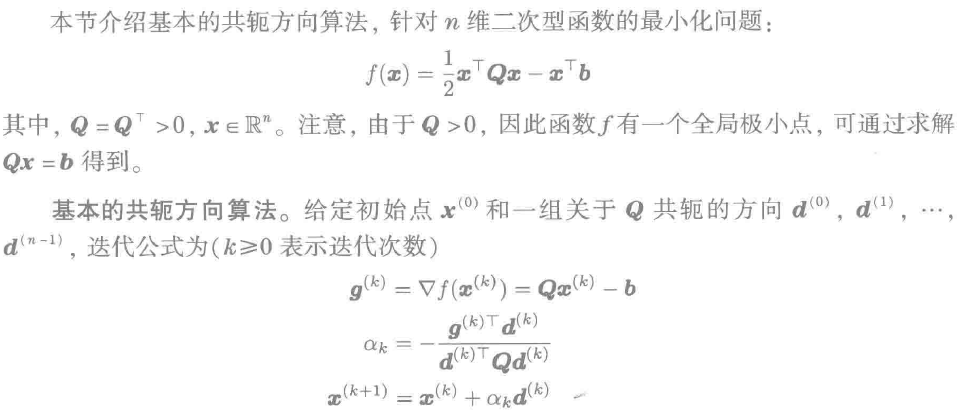
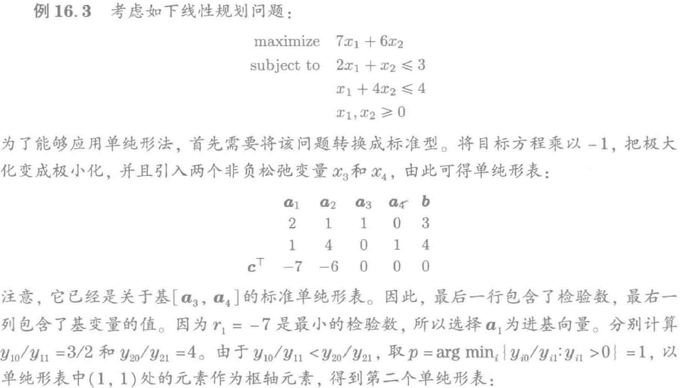
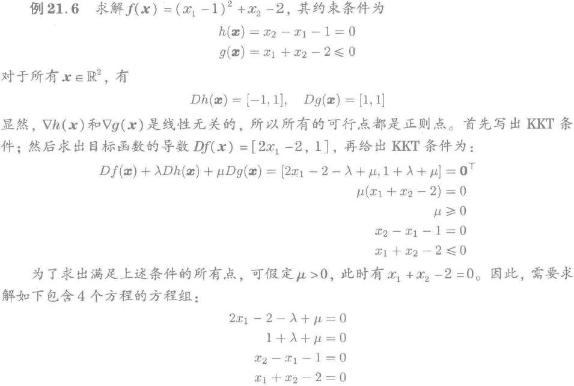

题目：

> 1.1算无约束方程的，一阶必要条件和二阶必要条件
> 1.2带等式约束的最小化，算KKT，判断是不是SONC
> 2.两阶段单纯形法
> 3.互补松弛条件证明对偶问题和原问题是同一个解
> 4.对二次型函数做两次最速下降法迭代（需要计算器，数很阴间）
> 5.共轭梯度，算d1

# 基础知识

## 一阶二阶导数定义

### 一阶定义

### 二阶定义

## 一阶必要条件（FONC）

### 约束集下的一阶必要条件

### 例题

## 二阶必要条件（SONC）

### 必要条件

### 充分条件

### 例子

# 一维搜索方法

## 黄金分割法

## 斐波那契数列法

## 二分法

略

压缩比$(1/2)^N$

## 割线法

## 牛顿法

# 梯度方法

## 最速下降（Steepest Descent）

​	

### 二次型（Quadratic function）最速下降

### 例题

# 牛顿法（高维）

## 例题

# 共轭方向法（Conjugate Direction Methods）

## 共轭向量组

### 例子

## 基本共轭方向算法

### 例子

## 共轭梯度法（Conjugate Gradient Algorithm）

无需算$\{d_i\}$，使用了史密斯正交基。

### 例题

# 单纯形法（Simplex Method）

## 基本算法

### 例题

## 两阶段单纯形法（Two-Phase Simplex Method）

### 例题

# 对偶问题（Duality）

# 带等式约束的非线性最优化问题

## 切线空间 法线空间

## 拉格朗日条件（Lagrange Condition）

### 例题

### 二阶条件（Second-Order）

二阶连续可微 twice continuously differentiable

### 例题

# 含不等式约束的优化问题（Inequality Constraints）

## KKT Condition

## 二阶条件（Second-Order）

## 例题

