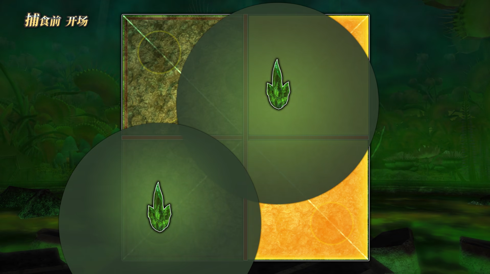

# 捕食前

## 踩圈

踩圈2人，人不够就对最近的人释放可分摊的剧痛aoe，效果是释放一个软泥怪，会自爆。

开场毒圈两个内场两个外场。

第一个这样踩：

## 双重突进：

靠近黄，躲第一个，看黄宝石考虑是否穿，然后开防击退

## 四连

背顺序

第一波必定对角，第二波必定刷在没刷的地方，第三波只有一格安全（找只有一格的），第四波安全区必定是第三个的对角。

记忆：第一波第三波安全点。

## 组合技能

第一种：毒液喷涌

场中诱导，然后八方分散。

第二种：毒液风暴：八方-场中-分摊

然后接爪尾连击or尾爪连击

# 捕食（动脑）

去尖牙对角，看第三跳是否折返

- 不折
  1. 从第二下打不到的那里去第一下
  2. boss回跳，原路会起点
- 折
  1. 等跳完第二下
  2. 顺着第二下那个位置去第一下那里挂机

# 捕食后

毒液泉涌：（通过分摊给宝石染色

随后看技能判断是否靠近：

- 灼热射线：boss那里危险
- 狂怒爪击：去boss后面

## 四分光墙

情况1：

情况2：

## 踩圈

和开场一样，跟爪尾那两个连击。

## 最后一次红宝石之光

有一个方格必定有距离场中最远的两个黄宝石，去那里分摊

后面是双重突进，去boss后面躲第一下，然后开防击退躲第二下。

后面