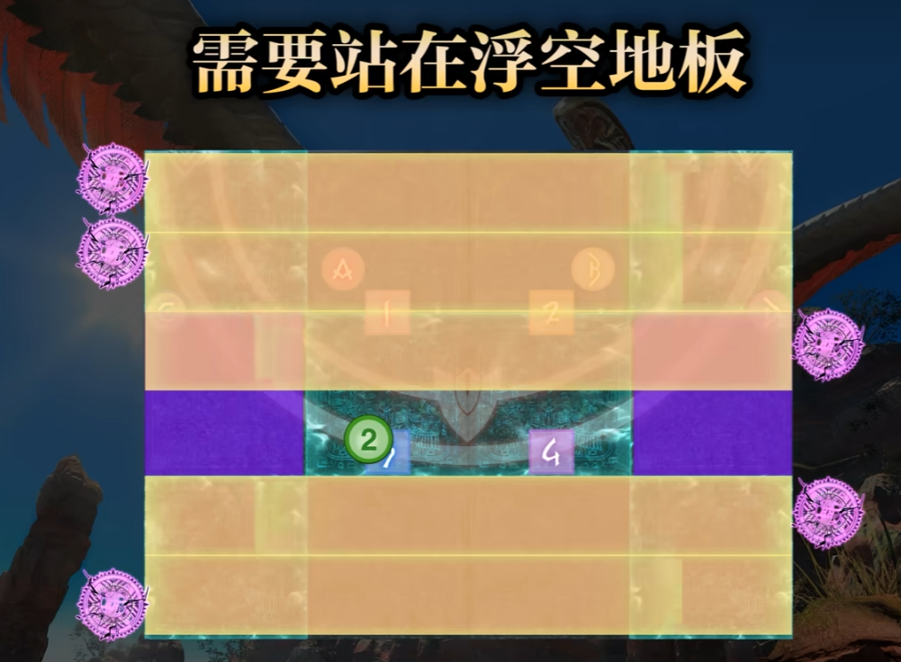

<!--
 * @Author: DyllanElliia
 * @Date: 2024-10-11 19:45:24
 * @LastEditors: DyllanElliia
 * @LastEditTime: 2024-10-11 20:10:11
 * @Description: 
-->
# yysn

冰柱突刺：

- 第一根向右
  - 
- 第一根向左
  - 

三重灾厄

三根羽毛：

## 火阶段

火分摊：左mt组右st组从后向前

## 雷阶段

掉羽毛：

1. 远离第一根羽毛的地方
2. 击杀第二根掉落的羽毛

冰火点名：

雷阶段的三个动作攻击判定时会在原地留下旋风，动作结束后要离开原位

魔法阵：要浮空

## 冰阶段

冰火雷判定很快，开场就触发

注意雪崩和boss动作

动作后带冰花：固定对称

冰线时要注意雪崩，记得微调位置