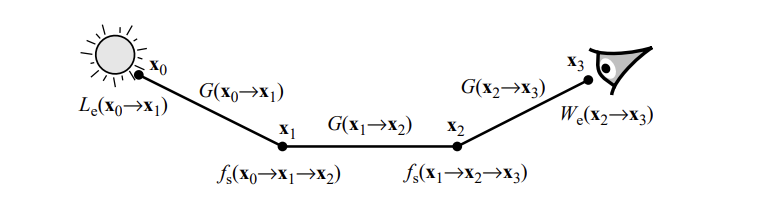
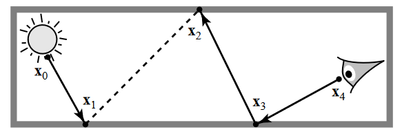
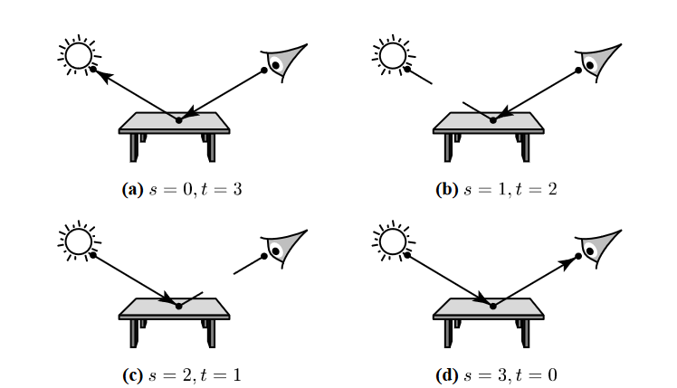

# Bidirectional Path Tracing

> 写后感：
>
> 混合了rayCasting和pathTracing，理解公式很复杂，但公式推导完后和前面的PT和MIS内容高度重合，也算比较好理解。简单理一下思路：
>
> 1. 光源出发和相机出发两条路径，各生成 $n_L$ 和 $n_E$ 长度的路径；
> 2. 从中分别随机截取 $s$ 和 $t$ 长度的子路径组合为长度为 $k=s+t-1$ 的路径 $\overline x_{s,t}$
> 3. 将路径 $\overline x_{s,t}$ 作为一次PT的采样结果进行计算，注意：光子子路径能逆是因为光路可逆。
> 4. 重复几次第2步，目的是采样，实际上使用遍历所有 $s$ 和 $t$ 的可能，不使用随机采样 $s$ 和 $t$。
>
> 但推完后可以明显感觉到它的实现难度较高。
>
> - 路径的起始点计算麻烦，例如第一个光子顶点给第一个采样顶点赋值时，且恰逢相机需要大光圈时。这部分计算需要拆开额外计算。
> - 当路径比较特殊，例如采样路径第二个点就是光源、光子路径第二个点也是光源、光子路径没有第二个点，等等，需要做特殊处理；

## Introduction

回顾路径积分，公式可被描述为：
$$
I_j=\int_\Omega f_j(\overline x)d\mu(\overline x)
$$
其中：

- $\overline x=\bf{x}_0...\bf{x}_k$ 是一条采样路径；

- $\Omega$ 是路径的集合；

- $\mu$ 是辐射面积测量量，$d\mu(\overline x)=dA({\bf{x}}_0)...dA({\bf{x}}_k)$即路径上传输过来的辐射度辐射到物体面上微小面积上积累的面积；

- $f_j$ 是度量贡献函数，即积累的度量有多少对结果有贡献：
  $$
  \begin{align*}
  f_j(\overline x)=&L_e({\bf{x}}_0\rightarrow{\bf{x}}_1)G({\bf{x}}_0\leftrightarrow{\bf{x}}_1)W_e^{(j)}({\bf{x}}_{k-1}\rightarrow{\bf{x}}_k)\\&\prod^{k-1}_{i=1}f_s({\bf{x}}_{i-1}\rightarrow{\bf{x}}_i\rightarrow{\bf{x}}_{i+1})G({\bf{x}}_i\leftrightarrow{\bf{x}}_{i+1})
  \end{align*}
  $$
  

> $W_e({\bf{x}}\rightarrow{\bf{x'}})$ 表示从 ${\bf{x'}}$ 到 ${\bf{x}}$ 的辐射度的重要程度。
>
> 为了方便理解，你可以认为有变化的 $W_e$ 等价于一个大光圈镜头，$W_e\equiv 1$ 等价于小孔成像（孔洞无穷小，且不具有衍射效应）。后者是大多数引擎使用的定义，但若你需要实现一个刀锐奶化，前面的定义更适合。

BDPT是一系列方法的集合，它也可以很好地适配MIS等方法。BDPT生成两个光路：从光源出发的光路和从眼睛出发的光路。

在这个实例中，过程可被描述为如下：

1. 随机一个光源点 ${\bf{x}}_0$；
2. 根据 Ray Casting 生成一个光子路径 ${\bf{x}}_0{\bf{x}}_1$；
3. 根据 Path Tracing 生成一条从眼睛出发的采样路径 ${\bf{x}}_2{\bf{x}}_3{\bf{x}}_4$；
4. 通过BDPT的光传输算法混合上面两个路径的结果作为采样结果。

一般来说，生成 $s$ 深度的光子路径，$t$ 深度的采样路径，一共 $k=s+t-1$ 深度的路径。对于深度为 $k$ 的路径，存在 $k+2$ 种不同的采样分布。

对于 $k=2$ 的BDPT，有四种组合。a 和 d 是退化结果。b可以运行得很好，c和d在光源具有强方向性时很容易退化为有偏估计方法（c：Photon Mapping）

定义一个生成 $s$ 和 $t$ 相关的概率密度函数 $p_{s,t}$ ，则深度为 $k$ 的路径。采用MIS后吗，采样它所有组合下的结果的公式可简单表示为：
$$
F=\sum_{s\ge 0}\sum_{t\ge 0}w_{s,t}(\overline x_{s,t})\frac{f_j(\overline x_{s,t})}{p_{s,t}(\overline x_{s,t})}
\tag{1}\label{BDPTeqSimple}
$$

### Efficiently generating the samples

若每次都要计算 $s$ 和 $t$ 后再进行采样，效率会比较低。因此实际中采用如下优化算法：

1. 生成一条包含 $n_L$ 个顶点的光源子路径；
2. 生成一条包含 $n_E$ 个顶点的采样子路径；
3. 从中分别截取 $s$ 和 $t$ 长度子路径作为一次 $p_{s,t}$ 的采样结果；

定义一组基于采样分布 $p_{s,t}$ 的采样路径：
$$
\overline x_{s,t}={\bf y}_0...{\bf y}_{s-1}{\bf z}_{t-1}...{\bf z}_0
$$
其中：

- ${\bf y}_0$ 为光源起点，${\bf z}_0$ 为镜头起点；
- $0\le s\le n_L,\ 0\le t\le n_E$
- ${\bf y}_{s-1}$ 和 ${\bf z}_{t-1}$ 称为连接顶点，${\bf y}_{s-1}{\bf z}_{t-1}$ 称为连接边。

连接边之间是相互可见的，即两点之间没有任何遮挡物。

> 不难发现，构建长度为 $k$ 的路径，实际可以得到非常多的连接边，即一次采样得到非常多条有效路径。

## Mathematical formulation

上述BDPT公式$\eqref{BDPTeqSimple}$描述了一条由 $p_{s,t}$ 生成的光路 $\overline x_{s,t}$ 上进行采样的结果，定义贡献值为：
$$
C_{s,t}\equiv w_{s,t}(\overline x_{s,t})\frac{f_j(\overline x_{s,t})}{p_{s,t}(\overline x_{s,t})}
$$
则BDPT公式$\eqref{BDPTeqSimple}$可简写为：
$$
F=\sum_{s\ge 0}\sum_{t\ge 0} C_{s,t}
$$
再定义无权重贡献函数（unweighted contribution）：
$$
C^*_{s,t}\equiv \frac{f_j(\overline x_{s,t})}{p_{s,t}(\overline x_{s,t})}
$$
$C^*_{s,t},\ C_{s,t}$ 可简写为如下点乘形式：
$$
\begin{align*}
C^*_{s,t}&=\alpha^L_s c_{s,t}\alpha^E_t \tag{2} \label{aca}\\
C_{s,t}&=w_{s,t}C^*_{s,t}
\end{align*}
$$
其中：

|    Symbol    |            Description            |
| :----------: | :-------------------------------: |
| $\alpha_s^L$ |        光线子路径的测量量         |
| $\alpha_t^E$ |        采样子路径的测量量         |
|  $c_{s,t}$   | 连接边$y_{s-1}z_{t-1}$的BSDF和G值 |
|  $w_{s,t}$   |             权重函数              |

### The density $p_{s,t}$

路径概率密度函数表示为 $p_{s,t}\equiv p_{s,t}(\overline x_{s,t})$。由于顶点相互独立，因此这个路径的概率密度等于路径各个顶点的概率密度 $P_A({\bf x}_i)$ 的累乘结果。对于路径端点来说，可以直接得到 $P_A({\bf y}_0)$ 和  $P_A({\bf z}_0)$。对于中间顶点，从 $\bf x$ 向 $\bf x'$ 的采样结果得到，用 $P_{\sigma^\bot}({\bf x}\rightarrow{\bf x'})$ 表示该采样方向的投影立体角分布。则 $P_A({\bf x})$ 可表示为：
$$
P_A({\bf x})=P_{\sigma^\bot}({\bf x}\rightarrow{\bf x'})G({\bf x}\leftrightarrow{\bf x'})
$$
其中，几何表达式为：
$$
G({\bf x}\leftrightarrow{\bf x'})=V({\bf x}\leftrightarrow{\bf x'})\frac{|\cos{\theta_o}\cos{\theta'_i}|}{||{\bf x}-{\bf x'}||^2},\\where\ V({\bf x}\leftrightarrow{\bf x'})=\begin{cases}v\in(0,1],&if\ {\bf x}\ and\ {\bf x'} mutually\ visiable.\\0,&else.\end{cases}
$$
定义符号 $p^L_i$ 和 $p^E_i$ 分别表示光子子路径和采样子路径的前 $i$ 个顶点的概率密度：
$$
\begin{align*}
p^L_0&=1\\
p^L_1&=P_A({\bf y}_0)\\
p^L_i&=P_{\sigma^\bot}({\bf y}_{i-2}\rightarrow{\bf y}_{i-2})G({\bf y}_{i-2}\leftrightarrow{\bf y}_{i-1})p^L_{i-1}\\
p^E_0&=1\\
p^E_1&=P_A({\bf z}_0)\\
p^E_i&=P_{\sigma^\bot}({\bf z}_{i-2}\rightarrow{\bf z}_{i-2})G({\bf z}_{i-2}\leftrightarrow{\bf z}_{i-1})p^E_{i-1}
\end{align*}
$$
由此，通过递归表达式，可将路径的概率密度简化为：
$$
p_{s,t}(\overline x_{s,t})=p^L_sp^E_t
$$

### The unweighted contribution $C^*_{s,t}$

$$
C^*_{s,t}\equiv \frac{f_j(\overline x_{s,t})}{p_{s,t}(\overline x_{s,t})}
$$

对于不含权重的贡献函数，使用上述类似递归计算的概率密度，定义符号 $\alpha^L_i$ 和 $\alpha^E_i$ 分别表示光子子路径和采样子路径的前 $i$ 个顶点的贡献量：
$$
\begin{align*}
\alpha^L_0&=1\\
\alpha^L_1&=\frac{L^{(0)}_e({\bf y}_0)}{P_A({\bf y}_0)}\\
\alpha^L_i&=\frac{f_s({\bf y}_{i-3}\rightarrow{\bf y}_{i-2}\rightarrow{\bf y}_{i-1})}{P_{\sigma^\bot}({\bf y}_{i-2}\rightarrow{\bf y}_{i-2})}\alpha^L_{i-1},&i\ge 2\\
\alpha^E_0&=1\\
\alpha^E_1&=\frac{W_e^{(0)}({\bf z}_0)}{P_A({\bf z}_0)}\\
\alpha^E_i&=\frac{f_s({\bf z}_{i-1}\rightarrow{\bf z}_{i-2}\rightarrow{\bf z}_{i-3})}{P_{\sigma^\bot}({\bf z}_{i-2}\rightarrow{\bf z}_{i-2})}\alpha^E_{i-1},&i\ge 2\\
\end{align*}
$$

> 关于几何项 $G({\bf x}\leftrightarrow{\bf x'})$，由于这个对递归的定义中，分子分母均包含了几何项，因此被化简了。

对于光源的发射辐射度 $L_e$，可以被拆分为两个部分的点乘：
$$
L_e({\bf y}_0\rightarrow {\bf y}_1)=L^{(0)}_e({\bf y}_0)L^{(1)}_e({\bf y}_0\rightarrow {\bf y}_1)
$$
其中：

- $L^{(0)}_e({\bf y}_0)$ 表示顶点向外恒定辐射的辐射度；
- $L^{(1)}_e({\bf y}_0\rightarrow {\bf y}_1)$ 表示顶点向这个方向上辐射的概率；

> 对于 $L^{(1)}_e$ 的理解，可以举两个例子：
>
> 1. 对于漫反射光源，它向半球方向均匀发射，则 $L^{(1)}_e\equiv 1$ 
> 2. 对于有方向性的光源，例如聚光灯，可以使用遵循某个pdf的重要性采样实现。

在 $\alpha^L_i$ 和 $\alpha^E_i$ 种， $L^{(1)}_e$ 和 $W^{(1)}_e$ 有相似的等价表达式：
$$
\begin{align*}
f_s({\bf y}_{-1}\rightarrow{\bf y}_{0}\rightarrow{\bf y}_{1})&\equiv L^{(1)}_e({\bf y}_0\rightarrow {\bf y}_1)\\
f_s({\bf z}_{1}\rightarrow{\bf z}_{0}\rightarrow{\bf z}_{-1})&\equiv W^{(1)}_e({\bf z}_0\rightarrow {\bf z}_1)
\end{align*}
$$
公式$\eqref{aca}$中，给出了这样的化简：
$$
C^*_{s,t}=\alpha^L_s c_{s,t}\alpha^E_t
$$
其中，$c_{s,t}$ 包含了除 $\alpha^L_i$ 和 $\alpha^E_i$ 外的其他项：
$$
\begin{align*}
c_{0,t}&=L_e({\bf z}_{t-1}\rightarrow {\bf z}_{t-2})\\
c_{s,0}&=W_e({\bf y}_{s-2}\rightarrow {\bf s}_{t-1})\\
c_{s,t}&=f_s({\bf y}_{s-2}\rightarrow{\bf y}_{s-1}\rightarrow{\bf z}_{t-1})G({\bf y}_{s-1}\leftrightarrow{\bf z}_{t-1}) f_s({\bf y}_{s-1}\rightarrow{\bf z}_{t-1}\rightarrow{\bf z}_{t-2})
\end{align*}
$$

> 其中，$G$ 项包含了可见性测试。

### The weighting funcion $w_{s,t}$

$$
w_{s,t}\equiv w_{s,t}(\overline x_{s,t})
$$

公式$\eqref{BDPTeqSimple}$中，权重函数的权重值取决于生成 $s+t+1$ 长度路径的概率密度。

定义 $p_i$ 为 $\overline x_{s,t}$ 中长度为 $i$ 的光子子路径和长度为 $s+t-i$ 的采样子路径的出现概率：
$$
p_i=p_{i,s+t-i}(\overline x_{s,t})
$$
细化来说，$p_s$ 是当前生成的路径的出现概率，那么其他的 $p_0,...p_{s-1},p_{s+1},...p_{s+t}$ 就是其他可能生成的路径的出现概率。

$p_i$ 这个估计量是可以被化简掉的，因为观察发现这个值等效于一个全局整体的缩放系数。例如，若这些样本使用幂形式进行混合，幂 $\beta=2$，那么公式为：
$$
w_{s,t}=\frac{p_s^2}{\sum_ip_i^2}=\frac{1}{\sum_i(p_i/p_s)^2}
$$
如上面这个例子所示，其他混合策略同样满足这个规则。因此我们可以随意地设置 $p_s=1$，然后计算相对与 $p_s$ 的 $p_i$ 部分的结果，这个结果与 $p_s$ 呈倍数关系。

为了计算这个比例关系，我们需要比例 $p_{i+1}/p_i$。计算比例的过程中，光子子路径和采样子路径并没有明显区别，因此忽略这个区别会让计算更加方便。由此，可以把路径 $\overline x_{s,t}$ 重写为 $\overline x={\bf x}_0,...{\bf x}_k,\ k=s+t-1$。这套标记中，$p_i$ 和 $p_{i+1}$ 的区别仅为顶点的区别，因此可以得到这个比例：
$$
\begin{align*}
\frac {p_1} {p_0}&=\frac{P_A({\bf x}_0)}{P_{\sigma^\bot}({\bf x}_{1}\rightarrow{\bf x}_{0})G({\bf x}_{1}\leftrightarrow{\bf x}_{0})}\\
\frac {p_{i+1}} {p_i}&=\frac{P_{\sigma^\bot}({\bf x}_{i-1}\rightarrow{\bf x}_{i})G({\bf x}_{i-1}\leftrightarrow{\bf x}_{i})}{P_{\sigma^\bot}({\bf x}_{i+1}\rightarrow{\bf x}_{i})G({\bf x}_{i+1}\leftrightarrow{\bf x}_{i})},&0<i<k\\
\frac {p_{k+1}} {p_k}&=\frac{P_{\sigma^\bot}({\bf x}_{k-1}\rightarrow{\bf x}_{k})G({\bf x}_{k-1}\leftrightarrow{\bf x}_{k})}{P_A({\bf x}_k)}\\
\end{align*}
$$
由此，就可以通过MIS组合策略计算权重项 $w_{s,t}$ 了。至此，贡献函数的所有内容都已经明确了：
$$
\begin{align*}
C_{s,t}&=w_{s,t}C^*_{s,t}\\
&=w_{s,t}\alpha^L_s c_{s,t}\alpha^E_t
\end{align*}
$$
