# VFMs

## foundation models

- CLIP
- SAM
  - SAM2
- DINO
  - DINOv2

最原始的做法：SAM2，然后输入给CLIP

## All In One

### SAM$\rightarrow$CLIP

关于SAM：SAM2的性能比SAM快接近一倍

将mask内的image送给clip算feature，然后作为mask内的feature

存在两个问题：

1. 没有mask的地方是空白的（小问题

2. 在一些场景下，分割得特别细的subpart的clip feature存在有点严重的视角一致性问题（大问题

   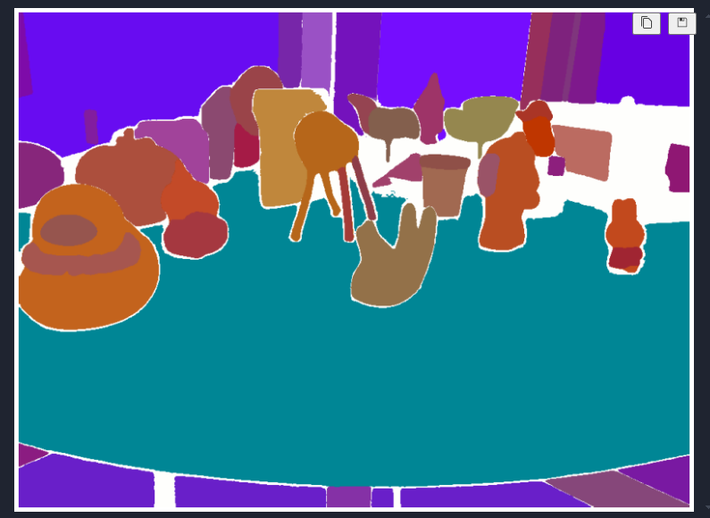

   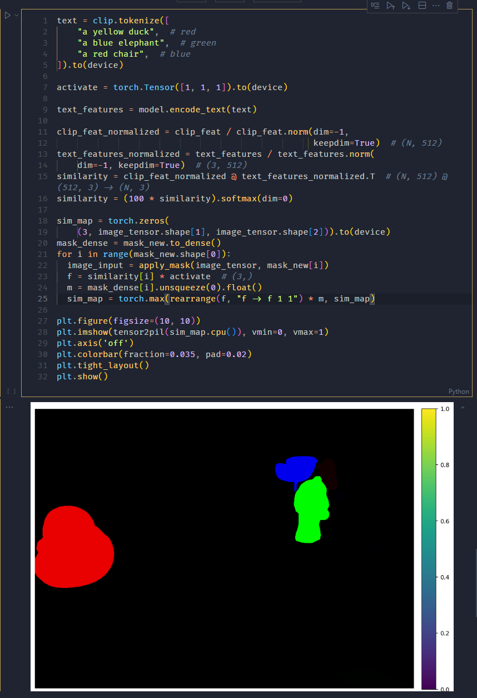

> 个人感觉：特别小的sam mask只适合用于分割。小mask对应的语义不应该被蒸馏，但可以用于合并稀碎mask（或许pca后的clip feature也能做到这个？）
>
> 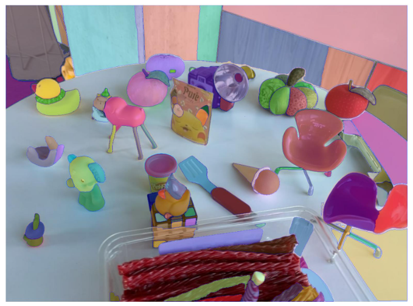
>
> 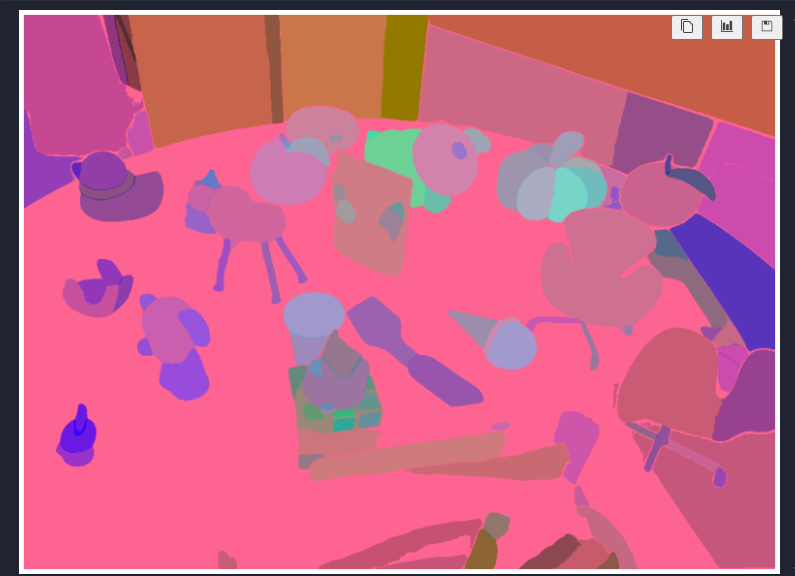
>
> 改善分割应该从constrastive loss入手

### AM-RADIO

This work found that these visual foundation models can be effectively merged into a unified model through multi-teacher distillation.

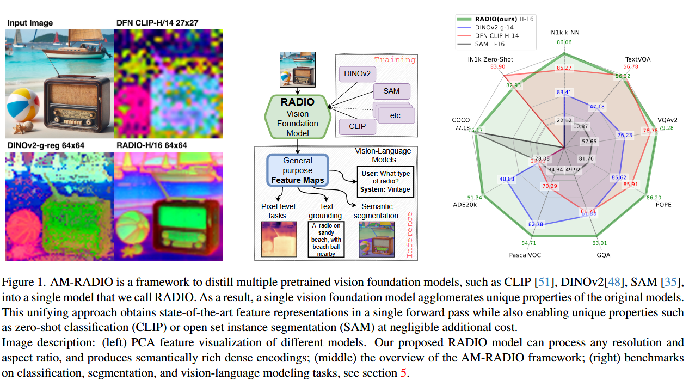

分割边缘模糊，对输入的图像尺寸限制太大。除外，官方接口没有提供更多的尺寸自适应工具（只能输入正方形图像）

问题在于，模型太大，完整尺寸图像放不进去

### APE

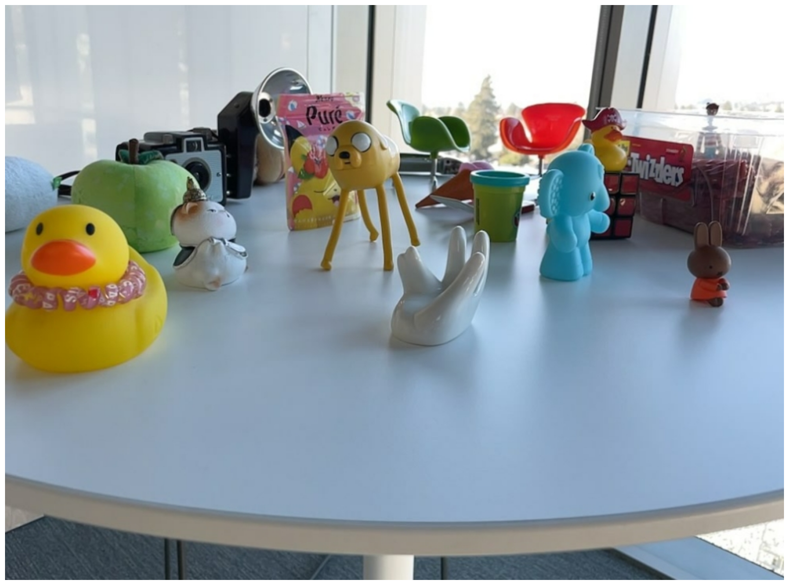

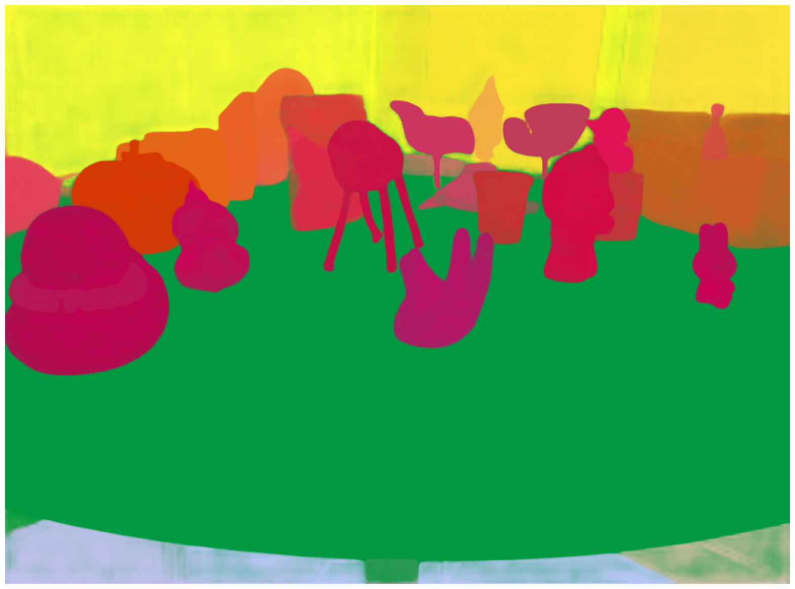

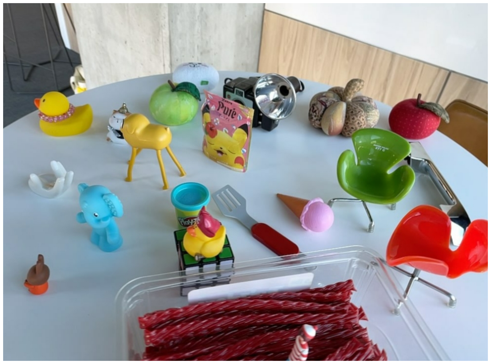

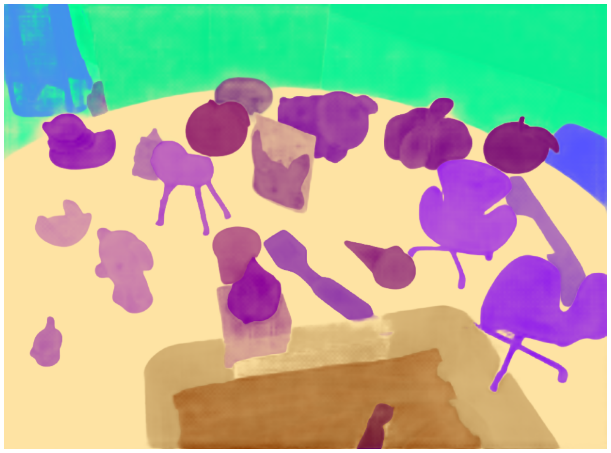

> 算是不错的工具，但是，存在如下问题：
>
> - 分割精度不高，只能处理instance level
> - instance内不干净，因此需要使用聚类处理一下
> - 部分风格边缘存在语义特征的晕染现象，例如最后一只鸭子头

### DINOv2

分割粒度太大

### SAM-CLIP

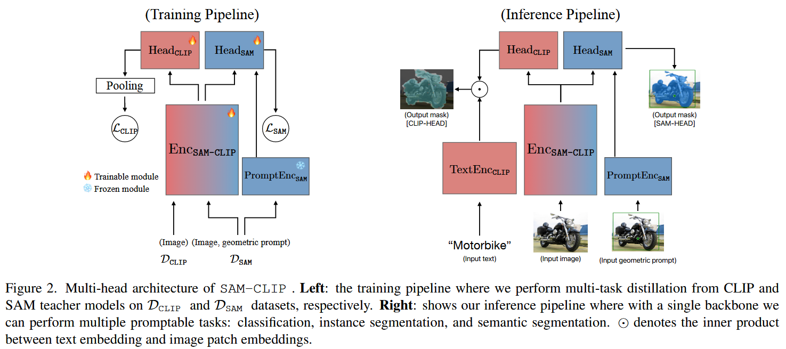

苹果的，但它不开源代码啊。。。

### Open-Vocabulary SAM （14 Sep 2024）

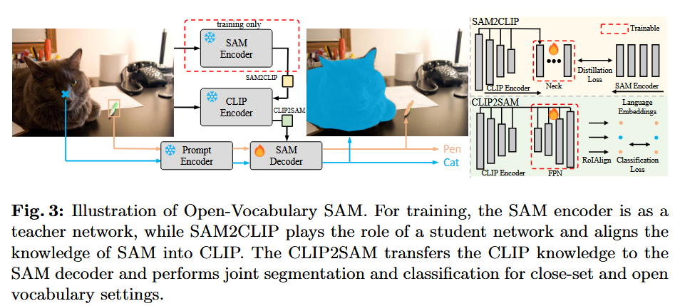

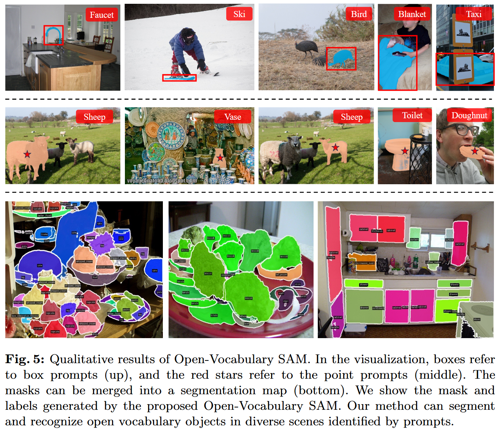

正在配环境ing
