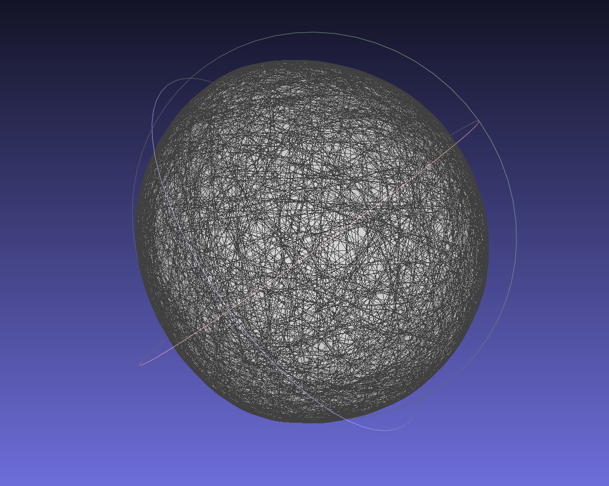
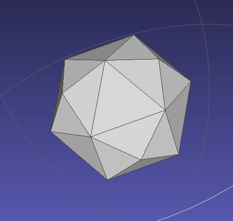
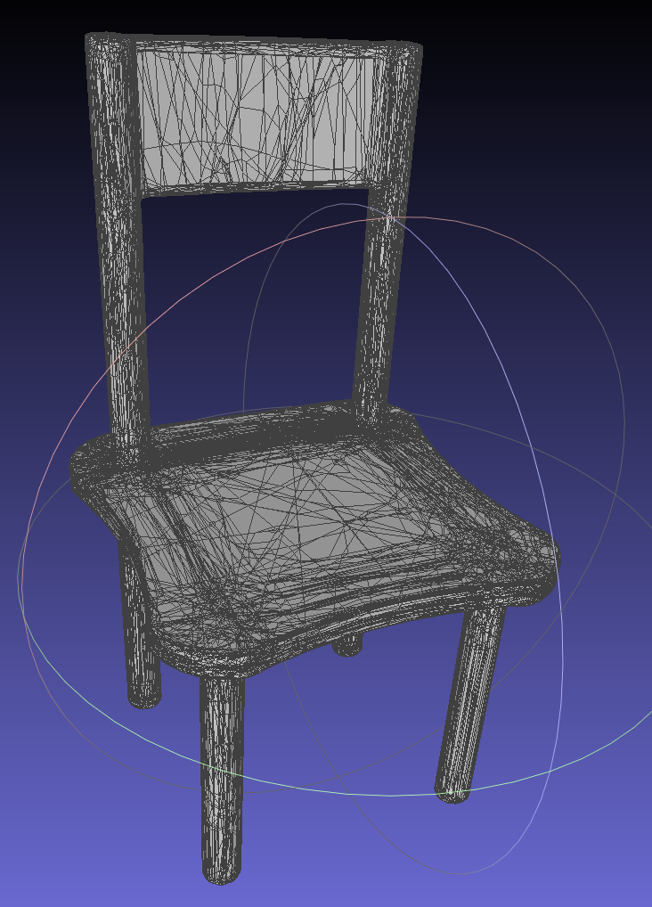
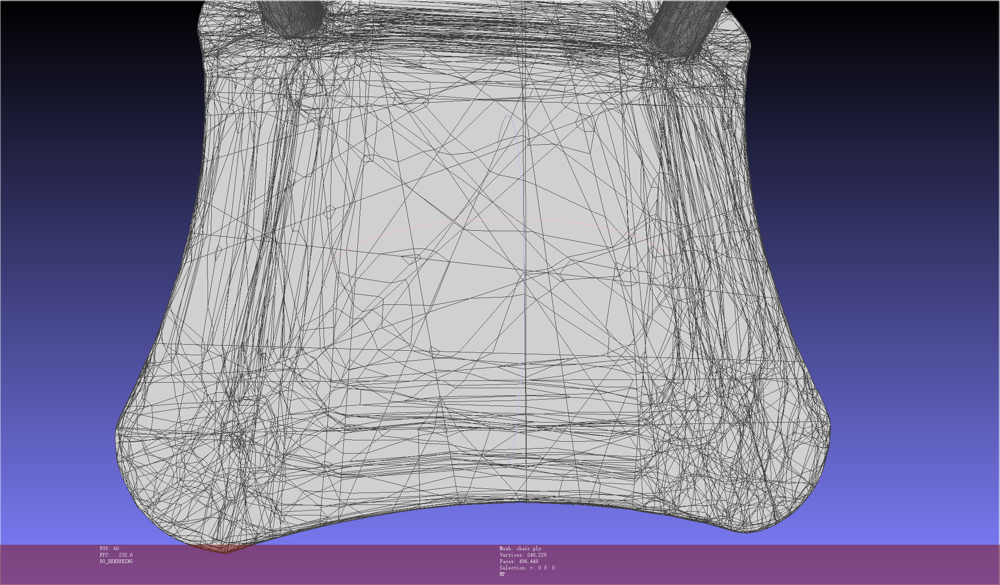
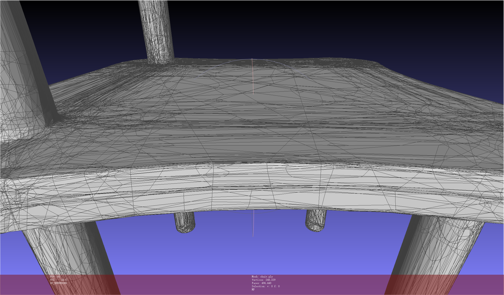
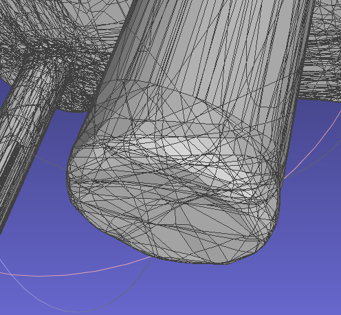
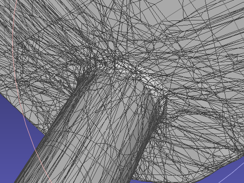
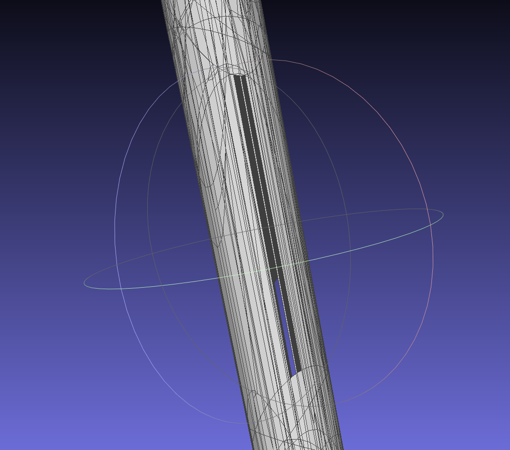

# Analytic Marching

## Learning and Meshing From Deep Implicit Surface Networks Using an Efficient Implementation of Analytic Marching

### Motivation

The topic attracts increased attention with the emerging pipeline of deep learning surface reconstruction, where implicit field functions constructed from deep networks (e.g. MLPs) are proposed for generative shape modeling.

This paper studies a fundamental problem in this context about recovering a surface mesh from an implicit field function whose zero-level set captures the underlying surface.

Existing methods rely on traditional meshing algorithms (e.g. marching cubes ). However, they suffer from loss of precision learned in the implicit surface network, due to the use of discrete space sampling in marching cubes.

Given that an MLP with ReLU partitions its input space into **a number of linear regions**, this paper motivated to connect this local linearity with a same property owned by the desired result of polygon mesh.

In this work, they particularly force on those data of closed manifolds representing, e.g. the boundary of a 3D solid.

### Method 

> **Assuming**: 
>
> 1. An implicit function learns its zero-level iso-surface as a closed, piecewise planar surface.
> 2. A non-degenerate 3D solid has no infinitely thin parts and its boundary surface properly separates the interior and exterior of the solid.

#### Notation

- Explicit representation $\mathcal Z$
- underlying surface $\mathcal M$
- Polygon mesh $\mathcal Z=\{\mathcal V,\{\mathcal P\}\}$, where $\mathcal V=\{v\in\R^3\}$ contains vertices and $\{\mathcal P\subset \mathbb P^2\}$ denotes the collection of connected polygon faces.
- Any planar face thus defines an explicit mapping $g_\mathcal P:\Omega\rightarrow\R^3$ from the domain $\Omega$ (e.g., $\Omega\subset\R^2$) to a plane $\mathbb P^2\subset \R^3$; consequently, the mesh $\mathcal Z$ becomes a piecewise linear approximation of the underlying $\mathcal M$​.
- SDF function $F:\R^3\rightarrow\R$
- Zero-level iossurface $\{x\in \R^3|F(x)=0\}$

#### Method

Input / Output: Recover an explicit representation $\mathcal Z$ of an underlying surface $\mathcal M$ from implicit surface function $F$​.

> which means $F\rightarrow \mathcal Z$.

**About MLP**: A ReLU based MLP partitions its input space into a number of linear regions. Consequently, the zero-level $\{x\in \R^3|F(x)=0\}$ is ebedded in the input space $\R^3$  and is intersected by (some of )the partitioned linear regions.

Given the piecewise planar/linear $\{g_\mathcal P \}$ of a mesh $\mathcal Z$ and the locally linear mappings defined by an MLP based $F$, this work motivates to analytically identify the linear regions intersected by the zero-level isosurface and expect these intersections to form $\mathcal Z$

### Test

#### Shpere

??? The sphere is flat?!

#### Polytope

Seems like a good result.

#### Chair

Issues:

1. Messy Triangles

   

2. Unclean [Or Missing] Sharp Feature

   

   

   

3. This work claims that their results are watertight. However... but why?

   

4. asdf

## Analytic Marching: An Analytic Meshing Solution from Deep Implicit Surface Networks