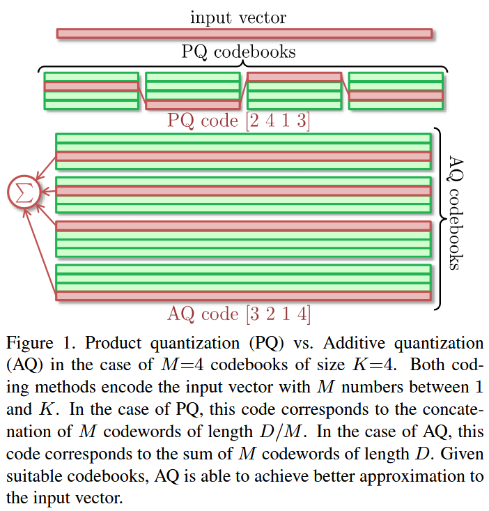
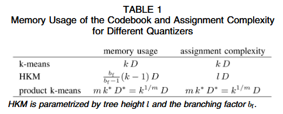

# Codebook Survey

overview 一下调研结果，目前大家关注点在于如何进一步蒸馏压缩 float-bits 和 weight matrix，因为codebook结构上没什么好改进的了。

Codebook 优化算法的目的是压缩一个 非常大的 Weight Matrix，

后续描述中不展开 float-bits 和 matrix 压缩内容。

> 综合调研，个人推荐的修改策略：
>
> 1. 使用 K-mean 初始化替代 Uniform 随机初始化，可参考如下给的代码
> 2. 增加 clustering loss，并消融分析一下
> 3. 推荐尝试 github 上别人实现的 VectorQuantizer，或许修改成本更低（它们的使用形式大多为 `quantizer.fit(data)`）

## Codebook Initialization

Codebook 中的向量应该如何初始化是一个问题。最简单的想法是使用固定值或随机初始化，但存在各自的问题。
后续的优化策略可被归类为 non-uniform quantization。

> LEGaussian 使用的是 uniform 随机初始化。

与初始化有关的工作，它们研究的是初始化后直接得到的 codebook 与原始 weight Matrix 之间性能的差距。

这类工作主要集中于研究两个部分：压缩时空成本 和 加速 nearest neighbor search algorithms（e.g. ANN quantization）

---
考虑到我们会将 初始化后的 Codebook 通过 loss 进行优化，我个人倾向于如下修改思路：

- NOTE: 原先的算法是 随机初始化 codebook，然后使用 lr 优化 codebook
1. 第一步可尝试的是：使用 K-mean 初始化 Codebook，然后使用某个 lr fine-turning Codebook。后续 clustering 中我摘出了 GOI 中的相关代码，可供参考；
2. 这里我抛出一个想法，受启发于 GOI，是否可以直接将这个 fine-turning 放入 3dgs 重建一起？目前基于 dino-clip 实现这点的挑战在于，dino-clip 的特征向量太长了，GOI 能做到这点是因为 APE 模型输出的是类似于 mask+clip 特征结构（dim=256），也就是 一个 mask 对应 一个 clip 特征。针对 LEGaussian 的做法，需要明确两个问题：
   1. dino feature 真的重要吗？和 mask 相比，使用 dino feature 提示边界有优势吗？是否要沿着 dino-clip 走？
   2. 针对 LEGaussian的做法，一个初始化得不错的 Codebook，还需要使用额外的负载均衡 loss 吗？

---

优化的做法有如下：

### Clustering

显然，最经典的做法就是 K-mean。将初始的所有向量聚类得到 K 个中心点，然后用这 K 个中心点初始化 Codebook。

这里直接给GOI的代码：(__train.py__)

~~~Python
def kmeans(x, ncluster, niter=10):
    '''
    x : torch.tensor(data_num,data_dim)
    ncluster : The number of clustering for data_num
    niter : Number of iterations for kmeans
    '''
    N, D = x.size()
    x /= x.norm(dim=1, keepdim=True)  # normalize each data point
    centers = x[torch.randperm(N)[:ncluster]]  # init clusters at random
    for _ in range(niter):
        centers /= centers.norm(dim=1, keepdim=True)
        distances = x @ centers.T
        assignments = distances.argmax(1)
        # move each codebook element to be the mean of the pixels that assigned to it
        centers = torch.stack([x[assignments == k].mean(0) for k in range(ncluster)])
        # re-assign any poorly positioned codebook elements
        nanix = torch.any(torch.isnan(centers), dim=1)
        ndead = nanix.sum().item()
        # print('done step %d/%d, re-initialized %d dead clusters' % (i+1, niter, ndead))
        centers[nanix] = x[torch.randperm(N)[:ndead]]  # re-init dead clusters
    return centers
~~~

定义 codebook

~~~Python
lut = torch.nn.Parameter(torch.rand((dataset.tab_len, dataset.ape_dim), device="cuda", requires_grad=True) * 0.03)
lut_opt = torch.optim.Adam([lut], lr=0.001)
~~~

聚类 GT 中所有 APE feature，先对每个视角的语义图进行聚类，在对视角聚类结果再进行聚类。这样做的目的是省显存

~~~Python
# count kmeans time
iter_start.record()
tot = torch.cat(
    [kmeans(x.semantic['ape'].permute(1, 2, 0).reshape(-1, dataset.ape_dim).unique(dim=0).cuda(), 80)
        for x in scene.getTrainCameras()[::8]
     ], 0)
tot_k = kmeans(tot, dataset.tab_len)
lut.data = tot_k.float().clone().detach().requires_grad_(True)
del tot
iter_end.record()
print(f"Kmeans time: {iter_start.elapsed_time(iter_end) / 1000:.2f}s")
~~~

### Other

部分工作研究一些很特殊的初始化，并设计出了特殊的 Codebook，例如 2024 年的：QuIP#: Even Better LLM Quantization with Hadamard Incoherence and Lattice Codebooks

很多工作会根据具体量化对象设计特殊的量化器，例如最近大家关注的 LLM。

## Multi-Codebook Quantization

这类工作的目的是把庞大的Codebook压缩为low-bits count's codebook。

这类工作很少。GOI 这个工作把经典的两个 loss 都用上了，包括：

- LEGaussian里用到的最大相似度 loss；
- 用于保证 Codebook 内的向量满足 聚类关系 的 self-entropy loss：（具体可查看 GOI's Eq.6）
- $$\mathcal{L}_{ent}=-\sum^N_{i=1}p_i\log{p_i},\quad p_i={\rm Softmax}(\cos\langle v_{gt},CodeBook[i]\rangle *\tau) $$
  - v_{gt}就是一个视角下被拍平的语义图

---

关于 Loss 的修改建议：
1. 在 K-mean 初始化的基础上，在codebook训练中添加 self-entropy loss，消融对比这个loss对指标mIoU的影响；

关于其他 Codebook 的尝试：
1. github上，我发现有一些pytorch实现的 multi-Codebook，封装成 `xxxQuantizer.fit(data)` 这种形式，可以免去一些Codebook修改成本，不妨拿来试试。注：很多 Quantizer 不包含后续的 fine-tuning 阶段
   1. [Additive quantizer](https://github.com/danpovey/quantization)
   2. [PQK-means](http://yusukematsui.me/project/pqkmeans/pqkmeans.html)
   3. [Self-supervised Product Quantization](https://github.com/youngkyunJang/SPQ)
   4. [Product Quantization Tree](https://github.com/cgtuebingen/Product-Quantization-Tree/tree/master/pqt)
   5. 还有其他。。。

关于 加速查询 的想法：
1. multi-codebook 能加速查询吗？我对这块还在犹豫，因此把这个想法放在这先。我有这个想法是因为注意到 multi-codebook 可以加速K-means，这是一种分治法。那么能把分治用于加速查询吗？

---

Product Quantization 和 Additive Quantization 非常好理解，借用 Additive Quantization for Extreme Vector Compression 里的一幅图

具体如下：

### Product quantization (Hybrid Sparse-Quantization)

最早的一篇工作是 2010 年的 Product Quantization for Nearest Neighbor Search。它提出了一种近似的NN search，方法是把数据量化为 Codebook，由此可以简化向量空间，降低搜索成本。两个向量的相似度度量使用 欧氏距离，误差度量使用 MSE。

这篇工作提到：划分子空间分别量化有利于加速 K-mean 初始化：

后续有个优化的版本：Cartesian k-means, In CVPR 2013

最后一篇工作：Guo, R., Kumar, S., Choromanski, K., and Simcha, D. Quantization based fast inner product search. In Artificial intelligence and statistics, pp. 482–490. PMLR, 2016.

### Additive Quantization

结构上没有明显发展，第一篇是2014年的Additive Quantization for Extreme Vector Compression。作者说 AQ 可以被视作 具备 unit component weights 的稀疏编码。后续很多工作证明了 AQ 是一个比 PQ 更 SOTA 的量化器。

由于变成了 Add Operator，所以这个量化器里面的实现有点麻烦。所以想尝试这个量化器的话，推荐用别人改好的。

后续很多工作基于 AD 进行优化，包括初始化策略、Add Operator

衍生发展了 Composite Quantization：Zhang, T., Du, C., and Wang, J. Composite quantization for approximate nearest neighbor search. In International Conference on Machine Learning, pp. 838–846. PMLR, 2014.

目前的 SOTA：Martinez, J., Zakhmi, S., Hoos, H. H., and Little, J. J. Lsq++: Lower running time and higher recall in multi-codebook quantization. In Proceedings of the European Conference on Computer Vision (ECCV), pp. 491–506, 2018.

### Residual Vector quantization

没有后续的重要工作

Chen, Y., Guan, T., and Wang, C. Approximate nearest neighbor search by residual vector quantization. Sensors, 10(12):11259–11273, 2010.