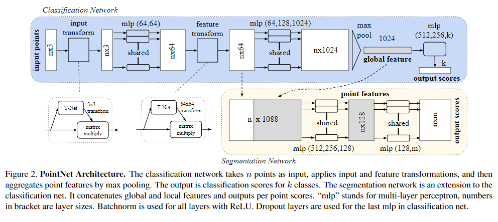
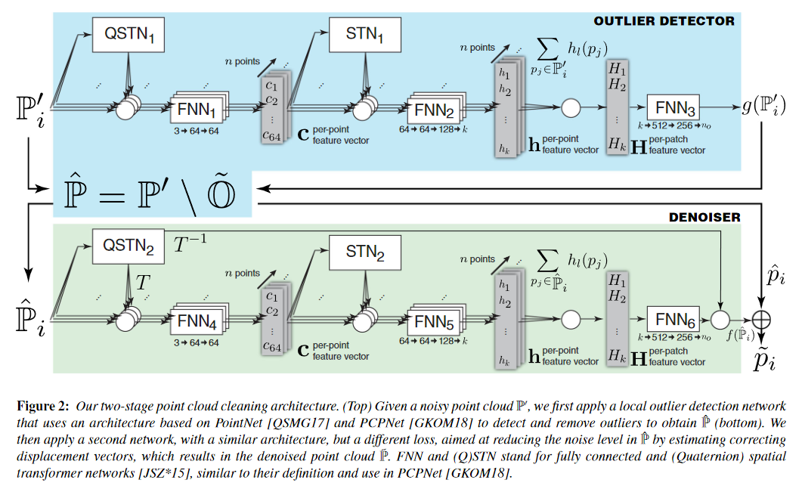
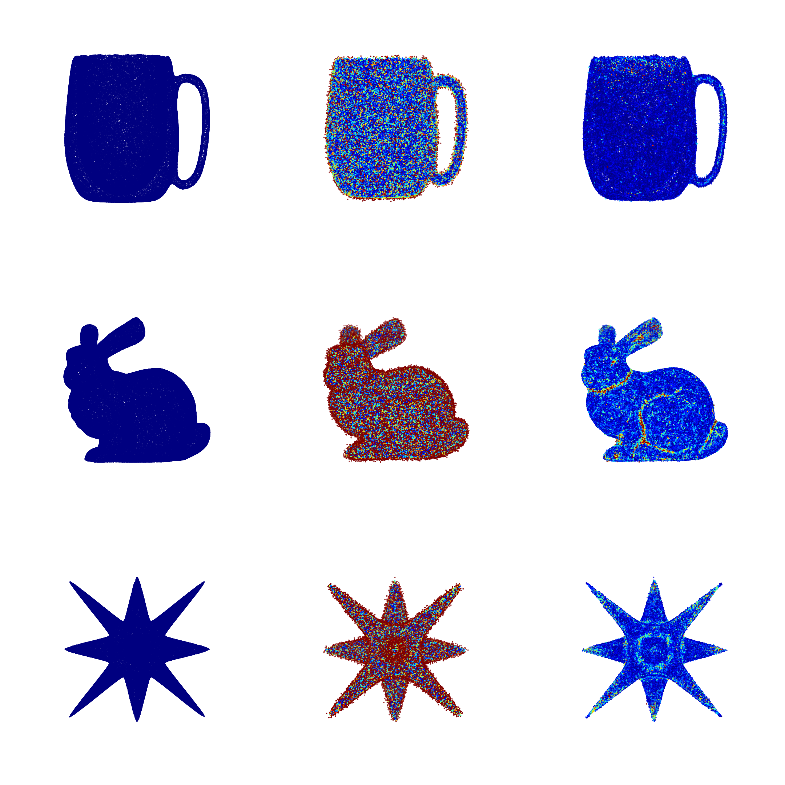
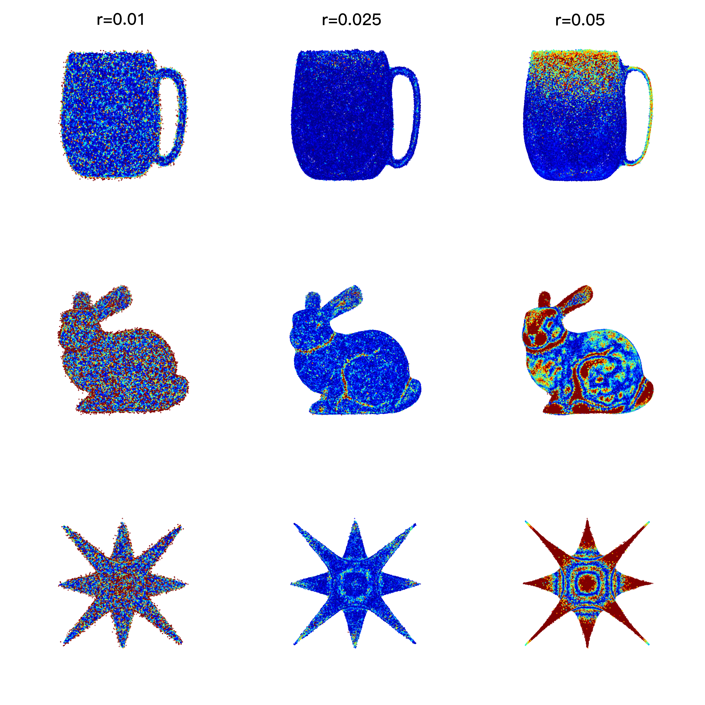

# 22-10-22周报

## 论文研读进展

### PointNet研读

在PointNet前，研究人员用深度学习方法处理点云相关问题时，需要将点云转换为特定视角下的如图像和体素等规整信息，以方便进行卷积操作。PointNet的提出，令后续研究该领域的人可以直接输入点云进行处理，提供了重要理论基础。

文章作者提出，PointNet在分类、模型细分和语义分割任务中具有应用潜力。

PointNet可细分为两个部分：分类和分割。

- **分类网络**：对于输入$n$个点，先将其进行输入变换，获得对齐后的点云。经过MLP进行第一次特征提取后再进行一次特征变换，获得对齐后的点云特征。通过多次MLP后，使用最大池化提取全局特征。最终，将全局特征通过MLP获得最后的分类分数。
- **分割网络**：输入为点云特征和全局特征，合并为新的特征矩阵，通过MLP获得每个点的分类结果。

PointNet的$Loss$函数选择了`nll_loss`作为主要$Loss$。对于特征变换矩阵难以优化的问题，添加$L_{reg}=||I-AA^T||_F^2$加速收敛。

PointNet的优点与不足：

- **优点**：可以直接输入点云数据作为模型输入；可以完成分类和分割能完成的任务。
- **缺点**：不能对于点云局部特征进行提取（或者是较差？）

### PointCleanNet研读

PointCleanNet（以下简化为PCN）实现对稠密点云的降噪，算法实现基于PCPNet可以对点云的某种属性进行估计的特性，实现对高斯噪声和离群点的去噪。

传统方法对点云去噪难免对丢失高频信息，而PCN可以尽可能保护更多细节，同时实现自适应的、鲁棒的降噪效果，对于非噪声点则尽可能保持原始信息。PCN基于PCPNet，通过估计点云Patch的几何信息，采用两步走策略（先去除离群点，后修正剩余点位置）实现点云降噪。

PCN网络可以分为两个主要部分，去除离群和估计修正矢量，最后将剩余点加修正矢量得到最后的降噪结果：

- **去除离群点**：定义$\mathbb{P}'$为输入点集合，通过PCPNet预估点$\mathbb{P}'_i$是离群点的概率$\tilde o_i =g(\mathbb{P}'_i)$。当$\tilde o_i>0.5$时，$\mathbb{P}'_i$是离群点。定义离群点集合$\tilde{\mathbb{O}}$，则去除了离群点的集合为$\hat{\mathbb{P}}=\mathbb{P}'/\tilde{\mathbb{O}}$。
- **估计修正矢量**：$\hat{\mathbb{P}}$为输入点集合，通过PCPNet估计点$\hat{\mathbb{P}}_i$的修正矢量（偏移量）$d_i=f(\hat{\mathbb{P}}_i)$。
- **最终输出**：$\tilde{p_i}=\hat{p_i}+d_i$

> 对于最后的偏移量，作者考虑了单次推导可能导致的残差，使用了多次迭代提高效果，但又由于多次迭代可能导致的点云收缩，基于Taubin提出的平滑方案对偏移量进行了修正。
> $$
> d'_i=d_i-1/k\sum_{p_j\in N(p_i)}d_j
> $$

$Loss$：

- 降噪后的点离期望真值点集中最近点的欧式距离：
  $$
  L_s(\tilde{p}_i,\mathbb{P}_{\tilde{p}_i})=\mathop{\min}_{p_j\in \mathbb{P}_{\tilde{p}_i}}||\tilde{p}_i-p_j||^2_2
  $$

- 正则项，让点分布更均匀：
  $$
  L_r(\tilde{p}_i,\mathbb{P}_{\tilde{p}_i})=\mathop{\max}_{p_j\in \mathbb{P}_{\tilde{p}_i}}||\tilde{p}_i-p_j||^2_2
  $$

- 合并，文章作者给的$\alpha=0.99$：
  $$
  L_a=\alpha L_s+(1-\alpha)L_r
  $$

PCN优缺点：

- **优点**：自适应；对包含离群点和高斯噪声的点云降噪效果较好；结果相对稳定。
- **缺点**：对于与训练使用的噪声差异较大的噪声的去噪效果不好；基于每个点的便宜量的修正方法具有局限性，往上可以考虑在patch层面进行降噪；网络分为了两部分，期望能整合为一个网络；对非均匀噪声点云的降噪效果具有提高空间。

## 点云降噪学习进展

### Pytorch

根据子雄学长发的[Pytorch教程](https://speech.ee.ntu.edu.tw/~hylee/ml/2022-spring.php)和[Pytorch Doc](https://pytorch.org/docs/stable/index.html)学习使用pytorch，并在[下节实践](### 传统降噪实践)中进行实践。

### 传统降噪实践

对于点云降噪，我使用了高斯卷积进行实现。基于前面对于PCPNet等代码的学习，我实现将点云切Patch以优化卷积速度，并基于Pytorch进行并行加速。

对于结果可视化，使用PCN中的$Loss$函数$L_s$实现。Patch的选取半径和卷积核半径有关，卷积核半径由输入参数$r$和点云包围盒对角矢量模长决定。

> 实现过程和测试的代码见文件[ipynb](https://github.com/DyllanElliia/learnGeo/blob/main/denoise/traDenoise.ipynb)
>
> 打包后的运行文件[py](https://github.com/DyllanElliia/learnGeo/blob/main/denoise/week1.py)

该图从左到右分别为ground truth、input和denoise result。该结果在核半径$r=0.025$下生成。由结果可见，该代码实现高斯卷积可以正确实现降噪。高斯卷积会使高频区域趋于平滑，导致信息丢失。

过小的核会导致降噪效果一般，过大的核会导致模型收缩和过平滑问题。

目前主要问题：

- 基于$L_s$的结果可视化需要消耗大量运算时间，因为目前是一个$O(n^2)$的实现算法，可优化或找其他替代；
- 切Patch同样耗时较高，需要其他替代或优化。

## 未来学习

1. 继续学习基于深度学习的点云降噪技术；
2. 在学习传统点云降噪的基础上学习与实践Pytorch等相关工具。