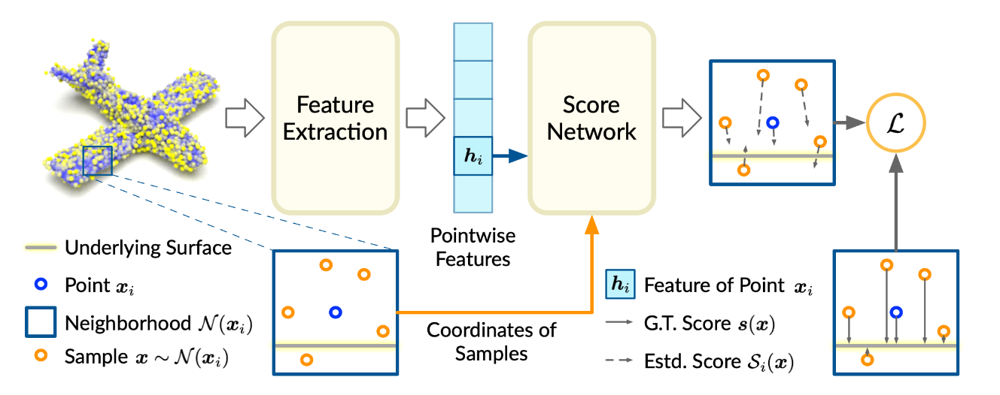

# 22-10-29周报

## 论文研读

> 本周学习了Score-Based Model的基础内容EBMs，并对其中基础推导，结合其他资料梳理了一遍笔记。
>
> 完成了对SBG-based的点云降噪进行的研读。
>
> 简单了解了Diffusion Model。
>
> [How to Train Your Energy-Based Models](https://arxiv.org/abs/2101.03288)
>
> [Score-Based Point Cloud Denoising](https://openaccess.thecvf.com/content/ICCV2021/html/Luo_Score-Based_Point_Cloud_Denoising_ICCV_2021_paper.html)

### Score-Based generative Model

EBM是当前score-based方法的基础模型。

Score-Based generative Model（以下简称SBG）有如下优点：

- 无需对抗学习，得到GAN级别的采样效果；
- 灵活的模型结构，基于这类方法可以设计符合课题的模型；
- 精确的exact log-likelihood computation（对数似然估计）；
- uniquely identifiable representation learning；

符号表：

|      Symbol       | Description                      |
| :---------------: | :------------------------------- |
| $x_i,\ i=1,2,...$ | 第$i$个数据集                    |
|     $\theta$      | 模型的参数，训练时需要寻找的参数 |
|   $p_\theta(x)$   | 模型的概率密度函数               |
|   $p_{data}(x)$   | 未知的真实数据的概率密度函数     |
|   $E_\theta(x)$   | Energy function，可以是任意函数  |

#### Energy-based model(EBM)

EBM源于统计动力学，EBM的模型可被描述为如下形式：
$$
p_\theta(x)=\frac{e^{-E_\theta(x)}}{Z_\theta},\\where:Z_\theta=\int_\infty e^{-E_\theta(x)}dx
$$
其中，$Z_\theta$的作用是让概率密度总为`1`；结果上，能量$E_\theta(x)$越低的状态越有可能发生。

EBM是一种likelihood-based的直接学习data-generating分布的方法。但使用EBM建模时，不使用传统损失函数进行计算，以下用negative log-likelihood举例：
$$
\begin{align*}

\sum_i-{\rm{log}}\ p_\theta(x_i)&=\sum_i-{\rm{log}}\frac{e^{-E_\theta(x_i)}}{Z_\theta}\\
&=\sum_iE_\theta(x_i)+\color{BrickRed}{{\rm{log}}\int e^{-E_\theta(x_i)}dx}

\end{align*}
$$
显然，若要用梯度下降计算$\theta$，离不开处理后面的积分，这是个非常大难以实现的计算量。因此SCG方法使用了一个近似方法实现likelihood。

#### Score Matching

从上可知，对$\theta$求导必然要处理$Z_\theta$问题，因此Score-based方法转而对$x$进行求导，定义score function $s(x)$为log-density function对$x$的梯度。其效果如下：
$$
\begin{align*}
s_\theta(x)=\nabla_x{\rm{log}}\ p_\theta(x)&=-\nabla_xE_\theta(x)-\nabla_x{\rm{log}}\ Z_\theta\\
&=-\nabla_xE_\theta(x)

\end{align*}
$$
同时，我们希望$p_\theta(x)$尽可能接近目标$p_{data}(x)$，若有$s_\theta(x)=s_{data}(x)$，则：
$$
E_\theta(x)=E_{data}(x)+Constant
$$
又因为：
$$
\begin{align*}
p_\theta(x)&=\frac{e^{-E_\theta(x)}}{Z_\theta}\\
&=\frac{e^{-E_{data}(x)-c}}{\int e^{-E_{data}(x)-c}dx}\\
&=\frac{e^{-E_{data}(x)}}{Z_{data}}\\
&=p_{data}(x)
\end{align*}
$$
因此，score相等等价于分布$p$相等，即寻找参数$\theta$问题可被约化为对二者的score进行比较。由此，我们可以定义新的loss：（这里出现了符号冲突，定义$E[x]$为求集合$x$的期望)
$$
\mathcal L=E_{data}[\{s_\theta(x)-s_{data}(x)\}^2]
$$
这种loss被称为Fisher Divergence。然而，$s_{data}(x)$也是未知项，因为我们不知道数据的**真实**分布。前人研究发现，在一些条件下，该loss可被展开为一个不含$s_{data}(x)$的表达式：
$$
\begin{align*}
E_{data}[\{s_\theta(x)-s_{data}(x)\}^2]&=E_{data}[s_{data}(x)]^2+E_{data}[s_\theta(x)]^2\\&-2\int s_{data}(x)s_\theta(x)dx\\
&=const.+E_{data}[s_\theta(x)]^2-2p_{data}(x)s_\theta(x)|^\infty_{-\infty}\\
&+2\int p_{data}(x)\nabla _xs_\theta(x)dx\\
assuming:\ x\rightarrow\pm\infty\ \Rightarrow\ &p_{data}(x)\rightarrow0:\\
&\Rightarrow E_{data}[x]^2+2\int p_{data}(x)\nabla_xs_\theta(x)dx+c\\
if\ x\ is\ high-dim\ data:\\
&\Rightarrow E_{data}[||s_\theta(x)||^2_2]+2E_{data}[tr(\nabla_xs_\theta(x))]+c\\
&= E_{data}[||s_\theta(x)||^2_2+2tr(\nabla_xs_\theta(x))]+c\\
&\Rightarrow E_{data}[||s_\theta(x)||^2_2+2tr(\nabla_xs_\theta(x))]
\end{align*}
$$
其中，$\nabla_xs_\theta(x)$是Hessian矩阵，因此求解这个项的开销在$x$的维度较大时会很高。

Score Matching本身基于连续可微等假设，而实际数据往往是离散的，因此引出后续解决这些问题的优化。

#### Denoising Score Matching

对于图像数据，像素值$x_i\in\{0,1,...,255\}$，是离散的，因此我们会添加噪声$\varepsilon\sim\mathcal{N}(0,\sigma^2\rm I)$，添加噪声后的连续光滑结果为$\tilde x=x+\varepsilon$：
$$
q_{data}(\tilde x)=\int q(\tilde x|x)p_{data}(x)dx,\ where\ q(\tilde x|x)\sim\mathcal N(x,\sigma^2\rm I)
$$
由此，将新数据代入$\mathcal L$，得到新Loss：
$$
\begin{align*}
\mathcal L_{Fisher}(q_{data}(\tilde x)||p_\theta(\tilde x))&=E_{q_{data}(\tilde x)}[||\nabla_{\tilde x}{\rm log}\ q_{data}(\tilde x)-\nabla_{\tilde x}{\rm log}\ p_\theta(\tilde x)||^2]\\
&=const.+E_{q(\tilde x|x)}[||\nabla_{\tilde x}{\rm log}\ p_\theta(x)-\nabla_{\tilde x}{\rm log}\ q(\tilde x|x)||^2]\\
&\Rightarrow E_{q(\tilde x|x)}[||\nabla_{\tilde x}{\rm log}\ p_\theta(x)-\nabla_{\tilde x}{\rm log}\ q(\tilde x|x)||^2]

\end{align*}
$$

> 与之同类的方法很多，就没有继续看了。

#### Langevin MCMC

当我们训练出一个$p_\theta(x)$时，我们可以使用Langevin MCMC实现采样。输入一个根据先验分布构造的初始集$x^0$，通过迭代，根据分布梯度$\nabla_x {\rm log}\ p_\theta(x)$，令集合在第$K$步收敛到一个结果：
$$
x^{k+1}\leftarrow x^k+\frac{\epsilon^2}2 \nabla_x {\rm log}\ p_\theta(x^k)+\epsilon z^k,\ k=0,1,...K-1
$$

> 关于$z$，文中没有明说，但根据Langvin dynamic和退火思路，我认为是一个随机扰动集。

> 截止于此，插入总结：传统EBM的思路是，寻找能量模型$E_\theta(x)$，然后根据这一模型得到目标$s_\theta(x)$，然后基于训练得到模型参数$\theta$，然后将当前迭代的$s_\theta(x)$用于迭代收敛$x$，然后开始下一轮迭代收敛。

### Score-Based Point Cloud Denosing

Score-Based Point Cloud Denosing（以下省略为SPD）实现了将基于EBM的Score-Based Model引用于点云降噪。SPD认为，输入的噪声点云可以被认作是干净点云样本的模型$p(x)$和噪声分布模型$n$的卷积，即$p*n(x)$。此外，SPD沿用传统SBM中的对数似然估计（log-likelihood）计算$x$的分布的上升梯度进行迭代更新$x$（类似于LangevinMCMC，但SPD依旧沿用了某个前人的近似有偏估计，不是创新点）。

本文的创新点：

- 提供了一个实现SBM的神经网络框架，使SBM可用于点云降噪；
- 提供了一个可用于点云降噪的Score function；
- 提供了一个根据Score function的去噪算法；

SPD认为，点云是从3D物体表面采样得到的，因此点云可被认为是一组由2D流形构成的某个3D分布$p(x)$。对于被噪声污染的分布$p*n(x)$来说，点云降噪等价于使用$\nabla_x{\rm log}\ p*n(x)$迭代更新$x$，因为SPD认为$p*n(x)$尽可能多的迭代更新可以得到一个干净的$p(x)$。（见[下面的Figure](#SPDHow2denoise)）

SPD特长：

- 对于解决模型收缩和离群点问题有非常鲁棒的结果。

挑战：

- 用于测试的$p*n(x)$是未知的，只能从输入点云估计。因此SPD提出了一种神经网络，用于估计点云分布$p*n(x)$的Score function $S(x)=\nabla_x {\rm log}[p*n(x)]$。

> NOTE：虽然SPD是基于分布这一概念的，但是相比于传统EBM通过假设分布$p$再训练模型寻找分布$p$的参数$\theta$来说，SPD跳过了寻找分布这步，通过神经网络寻找最后的分布的Score function，即无需假设分布模型。这点在研究上省去了试分布这一步骤。缺点上，我个人直觉：它对不同种类的噪声的泛化应该不好，因为SPD文章本身也没展示这项工作。
>
> 本块不保真，需要进一步检验。

> 快速浏览Relate Work时发现一个非常相关的工作ShapeGF，不出意外是这篇文章的灵感来源。
>
> 作者罗列的不同点：
>
> 1. ShapeGF沿用传统思路，通过学习从3D点云生成建模无噪声的3D分布$p(x)$；SPD基于带噪声的分布$p*n(x)$学习生成score function $s_{p*n}(x)$。
> 2. ShapeGF不具备对它的分布能描述的形状外的形状具备泛化性（这也是传统EBM的缺陷）；SPD可以扩展，因为它的生成是基于局部的基础上定义的，而不是整个点云本身。
> 3. ShapeGF的目标是寻找输入点云的一个潜在标签，（后续它的描述没读懂）大概意思应该是ShapeGF可以做除了降噪外的更多，不需要特意从某一任务中进行学习。

#### model

> 这个模型的简单理解就是：
>
> 1. 给点云切Patch；
> 2. 获取这个Patch的特征，然后根据特征和Patch内点云坐标输出Patch内所有点的分数，ScoreNet根据局部特征确定局部分布的ScoreFunction，并结合坐标计算对应的上升梯度 $S_i(x)=Score(x-\overline x,h_i)$；
> 3. 最后一个描述的是学习Loss，上升梯度$s(x)$类似于PointCleanNet提到的偏移量，因此这个Loss就是基于上升梯度$s(x)$和groundTruth偏移量设计的。

##### Loss

> 此处的符号以此处描述的为主，例如$s$的含义出现与前面的描述冲突

|              Symbol              | Description                                                  |
| :------------------------------: | ------------------------------------------------------------ |
| $X=\{x_i\}^N_{i=1},\ x_i\in\R^3$ | 输入的噪声点云                                               |
| $Y=\{y_i\}^N_{i=1},\ y_i\in\R^3$ | ground truth无噪声点云                                       |
|         ${\rm NN}(x,Y)$          | 点集$Y$中距离点$x$最近的点[Figure右下角那个样子](#SPDHow2denoise) |

定义groundTruth上升梯度：
$$
s(x)=NN(x,Y)-x,\ x\in\R^3
$$
结合训练得到的上升梯度，得到单个Patch的Loss：
$$
{\mathcal L}^{(i)}=E_{x\sim \mathcal N(x_i)}[||s(x)-S_i(x)||^2_2]
$$
最终Loss：
$$
\mathcal L=\frac 1 N\sum^N_{i=1}\mathcal L^{(i)}
$$

#### Score-Based denoising Alg

上面的一切都没提怎么降噪，当点云降噪的最终目的是降噪.jpg

理论上，上面输出的$S_i(x)$可以在一次迭代内完成降噪，但显然上升梯度本身是描述函数局部的梯度，它的数学模型希望它是一个连续的函数。因此SPD提出的降噪算法也是和[Langevin MCMC](#Langevin MCMC)类似的爬坡迭代方法。

定义一个评分函数，光滑一下，$kNN(x_i)$就是$x_i$k邻域：
$$
\varepsilon_i(x_i)=\frac 1 K\sum_{x_j\in kNN(x_i)}S_j(x_i),\ x\in \R^3
$$
然后，迭代方程为：
$$
\begin{align*}
x_i^{(t)}&=x_i^{(t-1)}+\alpha_t\varepsilon_i(x_i^{(t-1)}),\ t=1,...,T\\
x_i^{(0)}&=x_i,\ x_i\in X
\end{align*}
$$
$\alpha_t$就是个$(0,1)$的参数，不是重点。

### Diffusion Model

