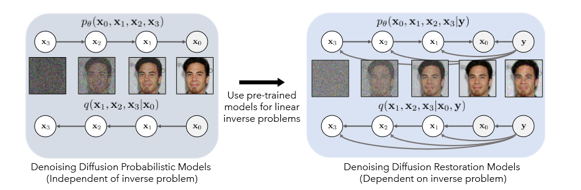

# Denoising Diffusion Restoration Models, DDRM

## Introduction

对于一般的Diffusion模型 (基于Denoising Diffusion Probabilistic Model, DDPM) 来说, 它们使用后验分布进行低效的有监督迭代. DDRM 提出了一种高效的无监督后验迭代方案. DDRM不仅能做降噪, 在超分辨等方面都能取得很好的效果(humm,, of course...), 是第一个通用逆采样求解器.

创新点:

- 高效, DDPM需要1k以上Step, 它只需要20左右Step;
- 是个通用方法, 能求解很多问题;
- 在降噪问题上尤为擅长, 因为它可以很好地保留输入信息的基本信息.

## Model

相比于DDPM, 公式表达上仅添加蓝色部分, 意思是每一`Step`都与输入信号 $y$ 有关, 即每一次扩散和采样的结果都忠实于测量值 $y$.
$$
\begin{align*}
p_\theta(x^{(0:T)}{\color{blue}|y})&=p_\theta^{(T)}(x^{(T)}{\color{blue}|y})\prod^{T-1}_{i=1}p_\theta^{(t)}(x^{(t-1)}|x^{(t)}{\color{blue},y})\\
q(x^{(1:T)}|x^{(0)}{\color{blue},y})&=q^{(T)}(x^{(T)}|x^{(0)}{\color{blue},y})\prod^{T-1}_{t=1}q^{(t)}(x^{(t)}|x^{(t-1)},x^{(0)}{\color{blue},y})\\
\end{align*}
$$

> 公式存在和之前笔记有点不同的解释, 但我看过后认为意思不变, 因此对公式进行了轻微调整.

对于一个线性逆问题, 可以表示为:
$$
y={\bf H}x+z,\ where\ {\bf H}\in{\mathbb R^{m\times n}},\ x\in{\mathbb R}^n,\ y\in{\mathbb R}^m,\ z\sim{\mathcal N}(0,\sigma^2_y{\bf I})
$$
其中, 我们希望从测量值 $y$ 恢复信号 $x$. 实现上, 可以使用SVD计算 $\bf H$. 通过SVD, 从数据 $x$ 中识别 $y$ 中缺失的信息.
$$
\bf H=U\Sigma V^T
$$
$\bf\Sigma$ 中包含$\bf H$的奇异值, 并将奇异值降序排列. 其他定义, 一般来说, 奇异值对于$m\le n$, 但该方法同样有效于$m\ge n$. 假设: 表示奇异值为$s_i\ge s_2\ge ...\ge s_m$, 定义 $s_i=0,\ i\in[m+1,n]$.

定义如下简化符号:

- $\overline x^{(t)}_i$ 是 $\overline x^{(t)}=V^Tx^{(t)}$ 的第i个元素, 由于$V$是正定的, 因此 $\overline x^{(t)}$ 和 x^{(t)}$ 是可以相互恢复的;
- $\overline y_i$ 是 $\overline y=\Sigma^†U^Ty$ 的第i个元素 (其中$†$表示这是Moore-Penrose伪逆, 反正就是一种伪逆);

对于 $\overline x_t$ 中每个元素, 可得到如下变分表达式:
$$
\begin{align*}
q^{(T)}(\overline x_i^{(T)}|x_i^{(0)},y)&=\left\{
\begin{array}{**lr**}
{\mathcal N}(\overline y_i,\sigma^2_T-\frac{\sigma^2_y}{s^2_i})&if\ s_i>0\\
{\mathcal N}(\overline x^{(0)}_i,\sigma^2_T)&if\ s_i=0
\end{array}
\right.\\
q^{(t)}(\overline x_i^{(t)}|x_i^{(t+1)},x^{(0)},y)&=\left\{
\begin{array}{**lr**}
{\mathcal N}(\overline x^{(0)}_i+\sqrt{1-\mu^2}\sigma_t\frac{\overline x^{(t+1)}_i-\overline x^{(0)}_i}{\sigma_{t+1}},\mu^2\sigma^2_t)&if\ s_i=0\\
{\mathcal N}(\overline x^{(0)}_i+\sqrt{1-\mu^2}\sigma_t\frac{\overline y_i-\overline x^{(0)}_i}{\sigma_y/s_i},\mu^2\sigma^2_t)&if\ \sigma_t<\frac {\sigma_y} {s_i}\\
{\mathcal N}((1-\mu_b)\overline x^{(0)}_i+\mu_b\overline y_i,\sigma_t^2-\frac{\sigma_y^2}{s_i^2}\mu_b^2)&if\ \sigma_t\ge\frac {\sigma_y} {s_i}\\
\end{array}
\right.
\end{align*}
$$
其中, $\mu\in (0,1]$是一个超参数, 用于描述相变方差, 且$\mu$和$\mu_b$依赖于$\sigma_t,\ s_i,\ \sigma_y$.

上公式的分布满足$q(x^t|x^0)=\mathcal N(x^0,\sigma_t^2{\bf I})$.

和DDPM类似, 本文目标得到对于$x^0$在每一步 $t$ 的预测值. 为了简化变量, 定义符号 $x^{(\theta,t)}$ 表示由模型 $f_\theta(x^{(t+1)},t+1):\R^n\times \R\rightarrow\R^n$ 预测的值. 定义 $\overline x^{(\theta,t)}_i$ 为 $\overline x^{(\theta,t)}=V^Tx^{(\theta,t)}$ 的第i个值.

由此得到DDRM的可训练参数 $\theta$ 的模型:
