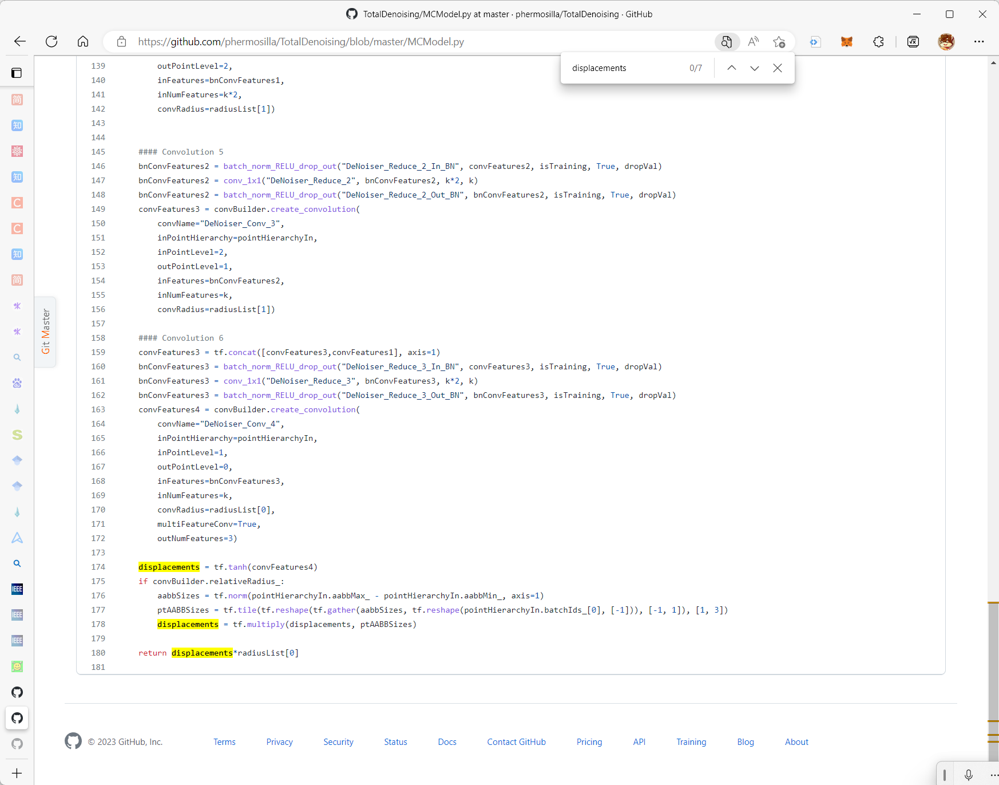
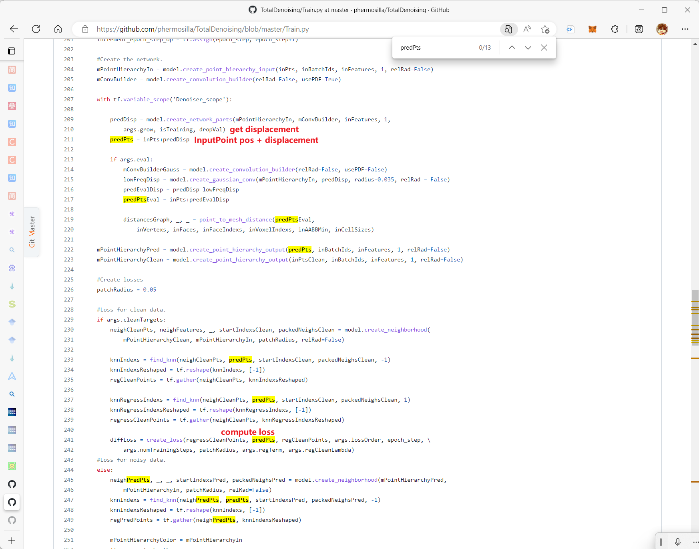
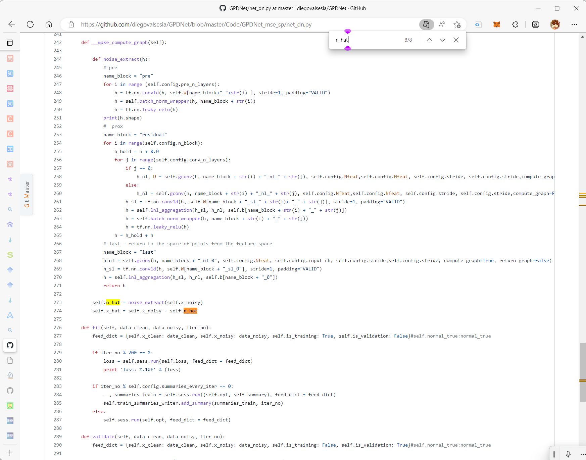

# About Displacement

## Works' name

| Net Name | Paper Name                                                   |
| :------: | :----------------------------------------------------------- |
|   PCN    | POINTCLEANNET: Learning to Denoise and Remove Outliers from Dense Point Clouds |
|  Total   | Total Denoising: Unsupervised Learning of 3D Point Cloud Cleaning |
|  3DPCD   | 3D POINT CLOUD DENOISING VIA DEEP NEURAL NETWORK BASED LOCAL SURFACE ESTIMATION |
|  GPDNet  | Learning Graph-Convolutional Representations for Point Cloud Denoising |

## About

|      Net Name       |            Output            |                       Target                       |
| :-----------------: | :--------------------------: | :------------------------------------------------: |
|         PCN         |            Point             |                  Point Min length                  |
| [**Total**](#Total) |         Displacement         |     compare (Input Point + Displacement) & GT      |
|   [3DPCD](#3DPCD)   |             404              |                        404                         |
|  [GPDNet](#GPDNet)  | noise (same as displacement) | compare(MSE) (Input Point - $\epsilon$ noise) & GT |

## Code

### Total

### 3DPCD

### GPDNet

