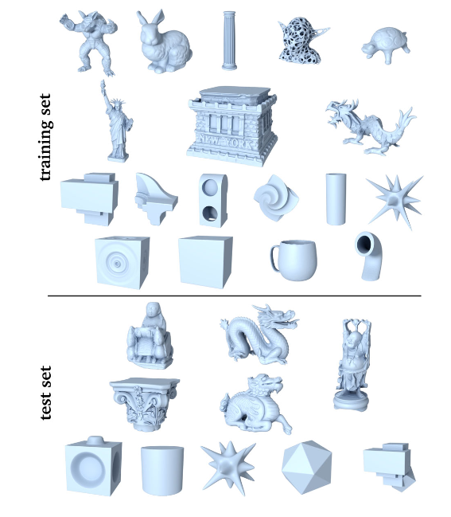

# Evaluation

## Point Clean Net

Dataset: PCNet

它使用了CD，基于倒角测量[FSG17, ADMG18]和CD变种[BTBW77]的方法能评估它们的数据集：
$$
c(\tilde {\mathbb P},\mathbb P)={\color{coral}\frac 1 N\sum_{p_i\in\tilde {\mathbb P}}\min_{p_j\in\mathbb P}||p_i-p_j||^2_2}+{\color{blue}\frac 1 M\sum_{p_j\in{\mathbb P}}\min_{p_i\in\tilde {\mathbb P}}||p_j-p_i||^2_2}
$$

- 橙色表示倒角距离；
- 蓝色表示惩罚，要求降噪结果均匀没有明显空隙，否则这个项会很大；

对于后面的扫描线数据集，它使用根方距离（RMSD）：
$$
d(\tilde {\mathbb P},\mathbb P)=\sqrt{\cfrac 1 N\sum_{p_i\in\tilde {\mathbb P}}\min_{p_j\in\mathbb P}||p_i-p_j||^2_2}
$$

Comparison：

- jet
- edge-aware
- bilateral
- DGCNN
- PointProNets

## Patch-Based Upsampling Denoising

Dataset: MNIST-CP，Sketchfab，ModelNet10

使用了三种：

- Chamfer distance：
  $$
  c(\tilde {\mathbb P},\mathbb P)=\frac 1 N\sum_{p_i\in\tilde {\mathbb P}}\min_{p_j\in\mathbb P}||p_i-p_j||^2_2
  $$
  
- Hausdorff distance: 这里使用的是双向HD：
  $$
  h(\mathbb A,\mathbb B)=\max_{a\in\mathbb A}\min_{b\in \mathbb B}||a-b||\\
  H(\tilde{\mathbb P},\mathbb P)=\max\{h(\tilde{\mathbb P},\mathbb P),h(\mathbb P,\tilde{\mathbb P})\}
  $$
  这个方法用于评估两个点集之间的相似度。

- point-to-surface distance (P2F): 若原始点集是从一个网格模型采样得到，那么就可以计算点于距离该点最近的面之间的距离，然后计算均值。
  $$
  \mathcal P(\tilde {\mathbb P},\mathcal S)=\frac 1 {|\tilde{\mathbb P}|}\sum_{p\in \tilde{\mathbb P}}\min_{q\in\mathcal S}||p-q||_2
  $$
  

Comparison:

- EAR
- PU-Net
- EC-Net

## Total Denoising

Dataset: ModelNet-40

变种CD：
$$
c(\tilde {\mathbb P},\mathbb P)={\frac 1 N\sum_{p_i\in\tilde {\mathbb P}}\min_{p_j\in\mathbb P}||p_i-p_j||^2_2}+{\frac 1 M\sum_{p_j\in{\mathbb P}}\min_{p_i\in\tilde {\mathbb P}}||p_j-p_i||^2_2}
$$

Comparison:

- mean
- bilateral
- PointCleanNet
- PointNet

## Differentiable Manifold Reconstruction

Dataset: Modelnet-40

两种：

- 变种CD：
  $$
  c(\tilde {\mathbb P},\mathbb P)={\frac 1 N\sum_{p_i\in\tilde {\mathbb P}}\min_{p_j\in\mathbb P}||p_i-p_j||^2_2}+{\frac 1 M\sum_{p_j\in{\mathbb P}}\min_{p_i\in\tilde {\mathbb P}}||p_j-p_i||^2_2}
  $$

- point-to-surface distance (P2S):
  $$
  \mathcal P(\tilde {\mathbb P},\mathcal S)=\frac 1 {|\tilde{\mathbb P}|}\sum_{p\in \tilde{\mathbb P}}\min_{q\in\mathcal S}||p-q||_2
  $$
  

Comparison:

- jet
- bilateral
- MRPCA
- GLR
- TotalDn
- PCNet

## Score-based Method

Dataset: PU-Net

两种：

- CD：
  $$
  c(\tilde {\mathbb P},\mathbb P)=\frac 1 N\sum_{p_i\in\tilde {\mathbb P}}\min_{p_j\in\mathbb P}||p_i-p_j||^2_2
  $$

- point-to-mesh distance (P2M): 除去计算点到最近面的距离，还计算了点到最近边的距离。
  $$
  \mathcal P(\tilde {\mathbb P},\mathcal S,\mathbb E)=\frac 1 {|\tilde{\mathbb P}|}\sum_{p\in \tilde{\mathbb P}}\min_{s\in\mathcal S}||p-s||_2+\frac 1 {|\tilde{\mathbb P}|}\sum_{p\in \tilde{\mathbb P}}\min_{e\in\mathbb E}||p-e||_2
  $$
  

Comparison:

- jet
- bilateral
- MRPCA
- GLR
- PCNet
- DMR

## 统计

密度无关的指标：

- CD：
  $$
  c(\tilde {\mathbb P},\mathbb P)=\frac 1 N\sum_{p_i\in\tilde {\mathbb P}}\min_{p_j\in\mathbb P}||p_i-p_j||^2_2
  $$

- P2F or P2S：
  $$
  \mathcal P(\tilde {\mathbb P},\mathcal S)=\frac 1 {|\tilde{\mathbb P}|}\sum_{p\in \tilde{\mathbb P}}\min_{q\in\mathcal S}||p-q||_2
  $$
  
- P2M:
  $$
  \mathcal P(\tilde {\mathbb P},\mathcal S,\mathbb E)=\frac 1 {|\tilde{\mathbb P}|}\sum_{p\in \tilde{\mathbb P}}\min_{s\in\mathcal S}||p-s||_2+\frac 1 {|\tilde{\mathbb P}|}\sum_{p\in \tilde{\mathbb P}}\min_{e\in\mathbb E}||p-e||_2
  $$
  
- 单向HD：
  $$
  h(\mathbb A,\mathbb B)=\max_{a\in\mathbb A}\min_{b\in \mathbb B}||a-b||\\
  H(\tilde{\mathbb P},\mathbb P)=h(\tilde{\mathbb P},\mathbb P)
  $$

密度会影响结果的指标：

- 变种CD：
  $$
  c(\tilde {\mathbb P},\mathbb P)={\frac 1 N\sum_{p_i\in\tilde {\mathbb P}}\min_{p_j\in\mathbb P}||p_i-p_j||^2_2}+{\frac 1 M\sum_{p_j\in{\mathbb P}}\min_{p_i\in\tilde {\mathbb P}}||p_j-p_i||^2_2}
  $$

- HD：
  $$
  h(\mathbb A,\mathbb B)=\max_{a\in\mathbb A}\min_{b\in \mathbb B}||a-b||\\
  H(\tilde{\mathbb P},\mathbb P)=\max\{h(\tilde{\mathbb P},\mathbb P),h(\mathbb P,\tilde{\mathbb P})\}
  $$

## 关于指标选择

由于部分指标结果会受到点云局部密度的影响，因此解决策略有两个方向：

1. 使用和密度无关的指标，或修改指标；
2. 对密度低的地方进行填充，但目前没有除了做up-sampling外的其他思路（本降噪模型可以很简单地实现上采样），因此暂时搁置；

我现在选择的指标如下：

- CD
- P2F
- 单向HD