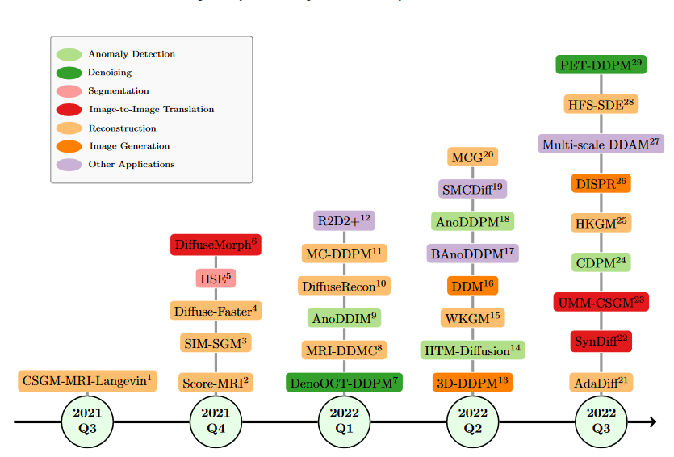
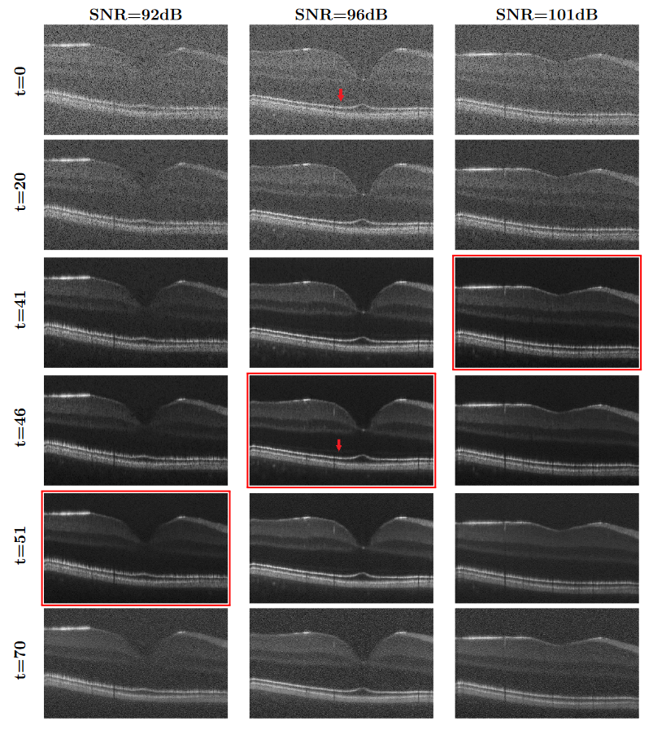
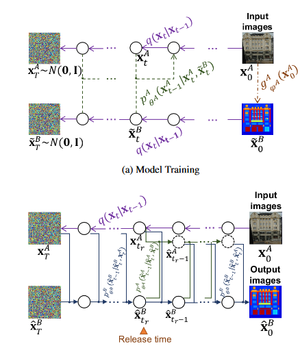
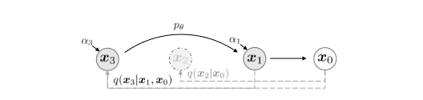

# PET image denoising based on denoising diffusion probabilistic models

这篇是一个医学图像的Diffusion降噪模型, 是基于DDPM的. 它能成功实现降噪, 是因为引入了两个重要辅助数据: 带噪声的图像$x_{noise}$ 和患者以前的图片 $x_{prior}$ .

对于扩散过程来说, PET-DDPM没有进行创新, 依旧沿用DDPM的扩散流程.

对于采样过程, PET-DDPM使用引入的两个新数据辅助降噪过程:
$$
p_\theta(x_{t-1}|x_t,x_{noise},x_{prior})\propto p_\theta(x_{t-1}|x_t,x_{prior})p(x_{noise}|x_{t-1},x_t,x_{prior})\\
p(x_{noise}|x_{t-1},x_t,x_{prior})\approx\mathcal N(x_t,\sigma_d^2{\bf I})
$$
其中:

- $\sigma_d$ 表示 $x_{noise}$ 的噪声强度;

修改采样过程:
$$
x_{t-1}=\frac 1 {\sqrt{\alpha_t}}\left[x_t-\frac {\beta_t}{\sqrt{1-\alpha_t}}{\color{blue}\varepsilon_{\hat\theta}(x_t,t,x_{prior})} \right]{\color{blue}-\frac{\sigma_t^2}{\sigma_d^2}(x_{noise}-x_t)}+\sigma_tz
$$
意思就是, 让噪声预测添加先验数据作为依据; 使用输入的噪声数据和t步数据的差表示可能丢失的信息, 通过减去实现每一步的信息恢复.

- 这篇和DDRM有异曲同工的思想, 但很多情况下, 先验数据是不存在的 (原文中说, 可以不提供), 因此, 在实用性上, 它和DDRM之间我认为需要实验.
- 对于这个模型, 需要手动调整噪声强度$\sigma_d$, 

# Unsupervised Denoising of Retinal OCT with Diffusion Probabilistic Model

传统方法是使用多次扫描病人的眼部, 从而通过通道降噪技术得到干净的图像, 但多次扫描病人眼部会让病人不舒服, 因此需要使用一次扫描就能出结果的方法. 本文使用Diffusion实现.

它完全没有修改diffusion算法本身...它固定噪声方差为$1e-4$, 然后输入噪声图像作为起始让它扩散$100$次, 然后从中挑选你觉得降噪完成的图像...(简单粗暴啊...)

如这个图片, 输入是三个信噪比不同的图, 然后开始扩散, 中间步中就存在去噪合适的结果, 然后就...结束了...额...

简单粗暴,,, 但 醍醐灌顶.

- 这篇和我之前提的引入$t$步猜测器, 在思想有一定交集, 但训练猜测器很难, 因此可以根据这篇提出一个修改思路:
  - 可以做一个假设, 假设固定 $T$ 的采样过程, 每步猜测的噪声的方差也固定. 若在采样到第 $t$ 步的结果是正确的, 那么基于某个评估标准 (e.g. $x$与$x_{noise}$的CD)的 $d(x)$, 满足 $d(x_{t-i})\approx d(x_{t+i})$ 的值近乎相等, 即以第 $t$ 步为轴, 噪声程度左右对称. 即函数 $d(x)$是关于$t$对称的.
  - 基于这个假设, 输入点云, 让它扩散完$T$步, 计算里面结果与$x_{noise}$的$d(x)$, 那么就能确定第$t$步的结果为输出的降噪结果. 

# About Diffusion-Based Denoise

除这两篇外, 还有部分diffusion基础论文的阅读没有些笔记.

对于现在的Diffusion模型来说, 大家实现的共同部分是使用了基于高斯噪声随机过程链, 因为这是Diffusion模型的最基础核心. 大家的关注点在:

- 如何设计针对目标噪声的解决思路, 比如使用Unet双向训练扩散; [图片来源](https://arxiv.org/abs/2104.05358)

  

- 如何设计采样方法, 让采样结果贴合目标: [图片来源](https://arxiv.org/abs/2010.02502)

  
  
  - DDRM和上面第一篇也属于这个范畴, 引入输入噪声图像作为降噪依据, 使结果尽可能贴近原图. 
  
- 还有些比较简单的工作, 在现有的模型上扩展可能性, 印象最深刻的就是[这篇](https://www.spiedigitallibrary.org/conference-proceedings-of-spie/12032/1203206/Unsupervised-denoising-of-retinal-OCT-with-diffusion-probabilistic-model/10.1117/12.2612235.short?SSO=1), 完全基于DDPM, 仅对$t$做了简单的工作. 当然, 这部分的工作非常少.

还有些有趣的工作, 例如[Palette](https://dl.acm.org/doi/abs/10.1145/3528233.3530757)修改了Diffusion噪声采样方法实现了Image2Image的效果.