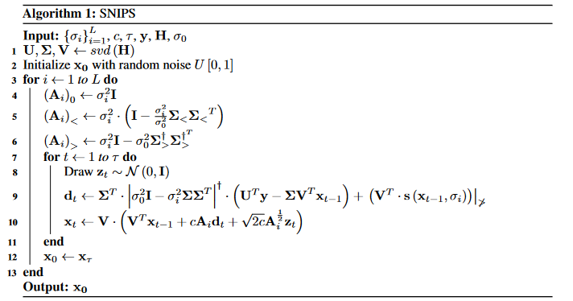
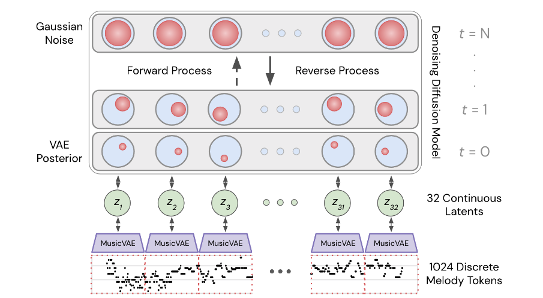
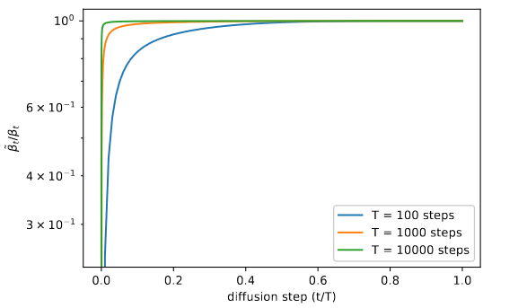
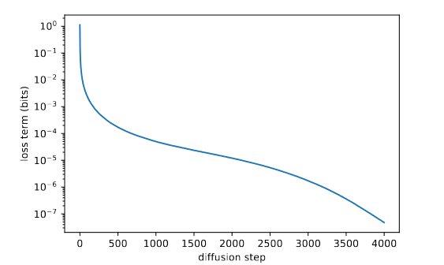
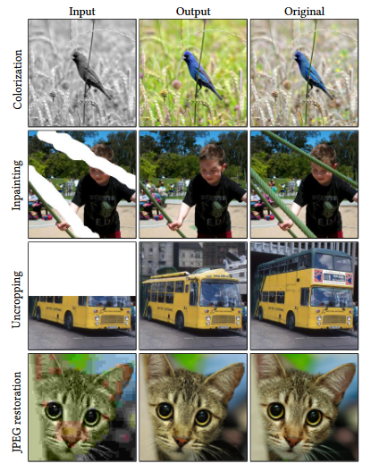
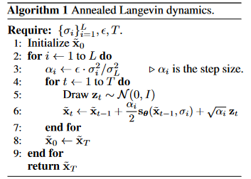

# SNIPS: Solving Noisy Inverse Problems Stochastically

这篇文章提供了一种基于Score Based的噪声逆问题的算法.

定义噪声问题:
$$
y={\bf H}x+z,\ z\sim \mathcal N(0,\sigma^2_0{\bf I})
$$
逆噪声问题就是从测量值 $y$ 中恢复信息 $x$.
$$
\bf H=U\Sigma V^T\\
p(\tilde x|y)=p(\tilde x|{\bf U^T}y)=p({\bf V^T}\tilde x|{\bf U^T}y)\\
where\ {\bf U^T}y={\bf \Sigma V^T} x+{\bf U^T}z={\bf \Sigma V^T}(\tilde x-n)+{\bf U^T}z\\
\Rightarrow y_T={\bf \Sigma} \tilde x_T-n_T+z_T
$$
对于降噪过程中的噪声, 定义 $\tilde x_i=\tilde x_{i+1}+\eta_i, \ \eta_i\sim \mathcal N(0,(\sigma^2_i-\sigma^2_{i+1}){\bf I})$

然后, 经过伪逆化简那套, 就得到了一个被规则约束完毕的降噪方法:



其中, 关于如何计算 `A` :
$$
(\alpha_i)_j=\left\{
\begin{array}{**ll**}
\sigma^2_i,&s_j=0\\
\sigma^2_i-\frac {\sigma^2_0}{\sigma^2_j},&\sigma_i s_j>\sigma_0\\
\sigma^2_i\cdot(1-s^2_j\frac{\sigma^2_i}{\sigma^2_0}),&0<\sigma_is_j<\sigma_0
\end{array}
\right.
$$

> 该文: Score-based的方法本身非常简单, 但是普遍认知是, 对于某种特定目标的生成, e.g.图像降噪, 需要设定较多的约束项限制它的迁移过程, 才能获得鲁棒的结果, 因为它的随机迁移过程需要经过严格的推导过程, 前面用了什么优化, 就要把优化严格推导到随机过程的最后...so...
>
> 在这不分析它的公式是什么意思了, 因为它在论文光推导就推了6页,,, 整整6页...
>
> 总结, Score-based是一个易用难优化的方法, 易用体现在它的基础思想可以很好地迁移到其他基于概率的网络上, 难优化体现在如上所述.

# SYMBOLIC MUSIC GENERATION WITH DIFFUSION MODELS

这篇不是关于降噪的, 讲的是音乐生成. 但是这篇对Diffusion结合VAE的工作非常具有启发性.



对于音频生成, 这篇先生成多段音频的潜在特征 $z_i$ , 然后使用VAE解码器解码潜在编码得到最终的音频.

训练分两部分, 训练能基于潜在编码生成音频的解码器和将连续潜在编码正向扩散的扩散模型, 最终Loss为上述二者的结合.

# Improved Denoising Diffusion Probabilistic Models

ImprovedDDPM是他们偶然试出来的一个方法, 他们发现, 在hybridObjective (混合目标) 下, 该方法的对数似然估计可以取得更优的结果.

在后续的DDPM中, 对Loss进行了非常多的消融与简化, 目前常见的simple Loss funtion为:
$$
L_{simple}=\mathbb E_{t,x_0,\varepsilon}[||\varepsilon-\varepsilon_\theta(x_t,t)||^2]
$$

他们实验发现, 定义 $\sigma^2_t=\beta_t$ 和 $\sigma^2_t=\tilde\beta_t$ 会产生一致的效果, 因为, 除了 $t=0$, 其他step的 $\tilde\beta_t/\beta_t\approx 1 $



因此可以理解为, DDPM采样结果时, 在早期, 方差对结果分布的影响很大, 但随着 t 的增加, 方差的减小, 方差对结果的影响远不如均值影响得大.

他们还认为, 尽管固定 $\sigma_t$ 是一个很好的生成选择, 但固定方差并不意味着对于 log-likelihood 的求解是个好选择. 



他们实验发现, 只有靠前的step的方差项对结果起贡献作用. 因此, 他们提出了一个可训练的方差项:
$$
\Sigma_\theta(x_t,t)=e^{v\ log\beta_t+(1-v)log\tilde\beta_t}
$$
他们的思路是, 让方差是 $\beta_t$ 和 $\tilde\beta_t$ 之间的差值, 但是对于 $v$ 来说, 不给它添加任何限制, 即不限制它必须在$[0,1]$范围内.

定义Loss:
$$
\mathcal L_{hybrid}=L_{simple}+\lambda L_{vlb},\ \lambda:=1e^{-3}
$$
训练时, 训练$L_{simple}$ 时不计算 $\Sigma_\theta(x_t,t)$ 的梯度, 同理, 计算 $L_{vlb}$ 时不更新 $u_\theta(x_t,t)$. 理论上, 似乎可以合并到 $L_{vlb}$ 内一起计算, 但作者实验发现, 这样会导致Loss结果难以优化, 而且拆开后的Loss效果更好.


> 上面: DDPM
>
> 下面: improvedDDPM
>
> 可见, 方差对结果的影响更大.

# Palette: Image-to-Image Diffusion Models

这是一篇22年Siggraph的工作, 它综合了过去的多种工作, 提出了基于DDPM的Image2Image的工作.



在它的方法中, 它定义 $x$ 为输入信息, $y$ 为输出信息. 在训练中, e.g.$x=GrayImg,\ y=RgbImg$, 训练一个神经网络 $f_\theta$ 去预测带噪声的 $\tilde y$ 的噪声, 网络输入输入信息 $x$ 和噪声指标 $\gamma$:
$$
\mathcal L=\mathbb E_{(x,y)}\mathbb E_{\epsilon\sim \mathcal N(0,{\bf I})}\mathbb E_\gamma\bigg|\bigg|f_\theta(x,\underbrace{\sqrt \gamma y+\sqrt{1-\gamma}}_{\tilde y},\gamma)-\epsilon\bigg|\bigg|^p_p
$$
Palette 的 $f_\theta$ 使用 U-Net 实现噪声预测.


> 若使用PointwiseNet实现点云的Shape2Shape (意会), 能否实现类似效果?

# Generative Modeling by Estimating Gradients of the Data Distribution, NCSE

这是一篇结合了Score-Based和Diffusion的文章, 是一个生成模型. 

> 当时了解到Diffusion时, 我觉得它和Score-based太像了, 但深入了解后发现, 虽然都基于概率估计, 但训练方法有很大不同, 而且Diffusion严格认为噪声遵循高斯分布, 因此它可以化简马尔科夫链为直接计算; Score-based没有规定分布是什么, 因此它的训练过程需要较多的约束. Score-based似乎只明确了如何采样分布, 使结果进行迁移 (降噪的讲故事版本)
>
> 刚开始时, 我设想过, 若假定Score-based的分布是满足高斯的, 那么是不是可以在噪声采样上, 将Score-based采样噪声归约到Diffusion中如何采样噪声的一种子问题呢?
>
> 再回到该方法, 既然这个方法已被提出了, Score-based和Diffusion的点云xx方法均被实现, 是不是意味着Score-based Diffusion做点云降噪也是可行的呢? 我认为是的.

```python
def dsm_score_estimation(scorenet, samples, sigma=0.01):
    perturbed_samples = samples + torch.randn_like(samples) * sigma
    target = - 1 / (sigma ** 2) * (perturbed_samples - samples)
    scores = scorenet(perturbed_samples)
    target = target.view(target.shape[0], -1)
    scores = scores.view(scores.shape[0], -1)
    loss = 1 / 2. * ((scores - target) ** 2).sum(dim=-1).mean(dim=0)

    return loss
```

在Loss计算上, 计算通过Score-Based估计出的**噪声下降的偏移量**与**加噪声后的点到原位置的偏移量**之间的距离模长:
$$
\mathcal l(\theta;\sigma)=\frac 1 2 \mathbb E_{p_{data}(x)}\mathbb E_{\tilde x\sim \mathcal N(x,\sigma^2I)}\Bigg[\Bigg|\Bigg|s_\theta(\overline x,\sigma)-\frac{x-\tilde x}{\sigma^2} \Bigg|\Bigg|^2_2\Bigg]\\
\mathcal L(\theta;\{\sigma_i\}^L_{i=1})=\frac 1 L\sum^L_{i=1}\lambda(\sigma_i)\mathcal l(\theta;\sigma)
$$
显然, 它的思想就是 $\nabla_{\overline x}log\ q_\sigma(\tilde x|x)=(x-\tilde x)/\sigma^2$

然后下面是采样方法, 和Diffusion非常相似:



# 思路总结

## 在扩散步`t`做工作

> 思路依据: [Unsupervised Denoising of Retinal OCT with Diffusion Probabilistic Model](https://deepai.org/publication/unsupervised-denoising-of-retinal-oct-with-diffusion-probabilistic-model)

这个思路继承了这篇工作和我之前提的引入$t$步猜测器. 由于训练猜测器很难, 因此可以根据这篇提出一个修改思路:

- 可以做一个假设, 假设固定 $T$ 的采样过程, 每步猜测的噪声的方差也固定. 若在采样到第 $t$ 步的结果是正确的, 那么基于某个评估标准 (e.g. $x$与$x_{noise}$的CD)的 $d(x)$, 满足 $d(x_{t-i})\approx d(x_{t+i})$ 的值近乎相等, 即以第 $t$ 步为轴, 噪声程度左右对称. 即函数 $d(x)$是关于$t$对称的.
  - 12.2 补充: 对称这步描述不严谨, 或者说是拐点更为合适.

- 基于这个假设, 输入点云, 让它扩散完$T$步, 计算里面结果与$x_{noise}$的$d(x)$, 那么就能确定第$t$步的结果为输出的降噪结果. 

> deep image prior  , 对t训练判别器

## 考虑预测值 $y$ 的降噪估计

> Foundation:
>
> - [DDRM](https://deepai.org/publication/denoising-diffusion-restoration-models)
> - [Palette: Image-to-Image Diffusion Models](https://deepai.org/publication/palette-image-to-image-diffusion-models)
> - [PET image denoising based on denoising diffusion probabilistic models](https://deepai.org/publication/pet-image-denoising-based-on-denoising-diffusion-probabilistic-models)

严格说, [Solve逆问题](#噪声逆问题 Noisy Inverse Problems)是这个问题的子问题. 在这, 我期望使用预测值 $y$ 来稳定噪声预测的过程, 或恢复Missing数据: 
$$
x_{t-1}=\frac 1 {\sqrt{\alpha_t}}\left[x_t-\frac {\beta_t}{\sqrt{1-\alpha_t}}{\color{red}\varepsilon_{\hat\theta}(x_t,t,y)} \right]{\color{blue}-\frac{\sigma_t^2}{\sigma_d^2}(y-x_t)}+\sigma_tz
$$
这是一个简单的例子, 目的是展示我这个思路的大致方向.

> DDRM是个非常不错的思路, 但它对于逆噪声问题的奇异值的理解是对于像素RGB的, 我不明确这个解法对于点云xyz是否等价.

对于这个方法, 难点集中在如何设计红色部分, 或者仅使用蓝色优化, 尝试是否可以实现降噪.

- 若要实现红色部分, 我需要一点时间调研目前有的能实现这个的网络, 我对网络的横向了解并不高, 还需 要一定积累.

## (Important) 将Score-Based作为Diffusion的噪声梯度估计方法

> Foundation:
>
> - Score-based: [Score-Based Point Cloud Denoising](https://ieeexplore.ieee.org/document/9711416)
>
> - Diffusion: [Diffusion Probabilistic Models for 3D Point Cloud Generation](https://ieeexplore.ieee.org/document/9578791)
> - Score-based diff: [Generative Modeling by Estimating Gradients of the Data Distribution](https://dl.acm.org/doi/10.5555/3454287.3455354)

这个思路可行性是最高的, 因此作为第一个尝试的Idea.

在这个方法中, 使用Score-Based作为偏移量预测的核 (偏移量可直接理解为预测噪声点云分布的梯度), 具体可见[上述Paper](#Generative Modeling by Estimating Gradients of the Data Distribution, NCSE)

这周除了阅读论文外, 还对实现这个的代码进行了整理, 并在脑海中做了简单的可行性分析, 若要实现这个方法, 需要如下工作:

- 重新设计数据集, Score-Based更适合使用knn构造patch, 若对点云切patch可能得到不了理想效果;
- 寻找或修改现有的Score-based, 因为输入参数涉及 $\beta_t$ ;
  - 目前想法: 在Resnet基础上concat LatentCode 和 $\beta_t$, LatenCode使用Scored-based降噪的方法 (基于这个思路可扩展[思路5](#基于当前我的工作和思路 3 的修改))

- 基于Score-based的推导修改Diffusion的Loss和Sampling算法.

## 噪声逆问题 Noisy Inverse Problems

> Foundation:
>
> - Score-based: [SNIPS: Solving Noisy Inverse Problems Stochastically](https://deepai.org/publication/snips-solving-noisy-inverse-problems-stochastically)
>
> - Diffusion: [DDRM](https://deepai.org/publication/denoising-diffusion-restoration-models)

Noisy Inverse Problems 是 Linear Inverse Problems 的一类子问题, 定义: 给一个信号做某种线性变换为 Linear Problems, 那么从结果逆向求解信号则文Linear Inverse Problems.
$$
y={\bf H}x+z\ \Rightarrow\ x={\bf H}^{-1}(y-z)
$$
无论是Diffusion还是Score-based都有基于求解逆问题的工作, 那么在此基础上是否也可以找到求解点云上的逆问题的网络方法呢? 直觉上, 我觉得这是数学上成立的.

> 难点在如何证明在数学上成立, SNIPS那篇工作给予了我启发, 但也让我意识到这个思路的推导的困难之大.

## 基于当前我的工作和思路 3 的修改

> Foundation:
>
> - Score-based: [Score-Based Point Cloud Denoising](https://ieeexplore.ieee.org/document/9711416)
>
> - Diffusion: [Diffusion Probabilistic Models for 3D Point Cloud Generation](https://ieeexplore.ieee.org/document/9578791)
>
> - Improved DDPM: [Improved Denoising Diffusion Probabilistic Models](https://deepai.org/publication/improved-denoising-diffusion-probabilistic-models)

参考Score-based降噪的LatenCode提取思路, 可以修改当前的模型, 改进分下面几个部分:

- 修改patch提取方式, 改用knn;
- 开始计算LatentCode修改为每次均计算一个LatentCode, 计算网络可分别尝试VAE和EdgeConvolution, 输入点云可产生以下选择:
  - 当前$x_t$
  - 不满足条件 $d$ 使用测量值 $y$, 满足后使用 $x_t$. 使用此思路需要设计条件 $d$
  - 使用 $x_t$ 和 $y$ 的某个线性组合 (变换?) 结果 $x_{t,y}$, 
    - **扩展思路**: 参考 ImprovedDDPM, 这个线性变换是否可以使用一个可学习的线性插值?