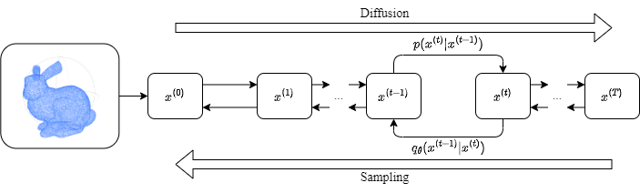
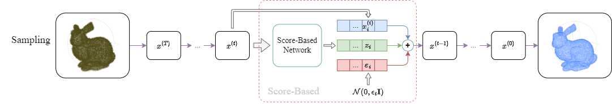
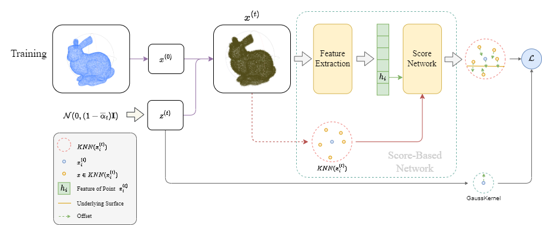

# Score-based Diffusion Points cloud Denoising

基于DDPM和Score-based denoising方法可以实现基于Score-based的diffusion点云降噪方法

> 假设：基于diffusion的噪声正向问题 $y={\bf H}x+z$ ，${\bf H}\sim {\bf I}$。

## 正向扩散

定义正向推导满足如下分布：
$$
q(x^{(t)}|x^{(t-1)})=\mathcal N(x^{(t)};\ \sqrt{1-\beta_t}x^{(t-1)},\ \beta_t{\rm I}),\ q(x_{1:T}|x_0)=\prod^T_{t=1}q(x^{(t)}|x^{(t-1)})
$$
定义 $\beta_t=\sigma^2_t,\ \alpha_t=1-\beta_t,\ \overline\alpha_t=\prod^t_{i=1}\alpha_t$

在扩散过程中，扩散遵循如下过程：
$$
x^{(t)}=\sqrt{\alpha_t}x^{(t-1)}+\sqrt{1-\alpha_t}z,\ z\sim\mathcal N(0,{\bf I})
$$
基于高斯可加性和随机过程推导，得到直接获得第 $t$ 步噪声点云的方法：
$$
\begin{align*}
x^{(t)}&=\sqrt{\alpha_t}x^{(t-1)}+\sqrt{1-\alpha_t}z_t\\
&=\sqrt{\alpha_t}(\sqrt{\alpha_{t-1}}x^{(t-2)}+\sqrt{1-\alpha_{t-1}}z_{t-1})+\sqrt{1-\alpha_t}z_t\\
&=\sqrt{\alpha_t\alpha_{t-1}}x^{(t-2)}+\sqrt{1-\alpha_t\alpha_{t-1}}\overline z_t\\
&=\ \cdots\\
&=\sqrt{\overline\alpha_t}x^{(0)}+\sqrt{1-\overline\alpha_t}z,\ z\sim\mathcal N(0,{\bf I})
\end{align*}
$$

## Sampling: 逆向采样

由于$q_\theta(x^{(t-1)}|x^{(t)})$是个难以表示的分布，由于期望使用Score-based替代，因此需要寻找Score-based与正向扩散方程之间的等价变换关系。

$$
\begin{align*}
x^{(t)}&=\sqrt{\alpha_t}x^{(t-1)}+\sqrt{1-\alpha_t}z,\ z\sim\mathcal N(0,{\bf I})\\
\Rightarrow x^{(t-1)}&=\frac{x^{(t)}-\sqrt{1-\alpha_t}z}{\sqrt{\alpha_t}},\ z=\frac{x^{(t)}-\sqrt{\alpha_t}x^{(t-1)}}{\sqrt{1-\alpha_t}}
\end{align*}
$$

定义 Score-based 分布梯度：
$$
\nabla_x log[q_\theta(x^{(t-1)}|x^{(t)})]\approx -z=-\frac{x^{(t)}-\sqrt{\alpha_t}x^{(t-1)}}{\sqrt{1-\alpha_t}}
$$
因此采样方程为：
$$
x^{(t-1)}=\frac{x^{(t)}+\sqrt{1-\alpha_t}\ \nabla_x log[q_\theta(x^{(t-1)}|x^{(t)})]}{\sqrt{\alpha_t}}+\varepsilon_t
$$

其中，$\varepsilon_t\sim \mathcal N(0,\epsilon_t{\bf I})$ 是一个随机扰动项，避免结果陷入局部。

## Training: 正向扩散Loss

目前对于训练过程，存在几个方案，主要关于对训练目标的调整。

### 朴素方法

最简单能被获得的就是高斯噪声 $z^{(t)}$，而且它与 Score-based 梯度存在直接对应。

由此，可直接得到Loss：
$$
\mathcal L_z(x_{0:T},\{\beta_i\}^T_{i=1})=\sum^T_{t=1}\beta_t^2\ \mathbb E_{x_i\in x^{(t)}}\bigg[\bigg|\bigg|\nabla_{x_i} log[q_\theta(x^{(t-1)}|x^{(t)})]+z^{(t)}_i\bigg|\bigg|^2_2\bigg]
$$
理由：无论 $z$ 是否随机，$x^{(t)}=x^{(0)}+scale*z$，$z$ 的方向必然指向目标平面，但不是最近方向。尽管不是最近方向，也可以起到一定的正则项的作用，朴素直观上也能具有较好的效果。

### 最短移动方法（包含正则项）

高斯随机的方向不是最快方向，那么可以根据 $x^{(t)}_i$ 在GT里面找到最近的点，从中获得的最近方向：
$$
\begin{align*}
\mathcal L_s(x_i)&=NN(x_i,x^{(0)},rad)-x_i\\
\mathcal L_s(x_i)&=FN(x_i,x^{(0)},rad)-x_i\\&\\
\end{align*}
$$
其中，$NN(x_i,x^{(0)},rad)$ 表示在GT $x^{(0)}$ 中获取半径 $rad$ 内距离 $x_i$ **最近**的点；$FN(x_i,x^{(0)},rad)$ 表示在点集 $x^{(0)}$ 中获取半径 $rad$ 内距离 $x_i$ **最远**的点；$L_r$ 为正则项。综合得到最后的Loss：
$$
\mathcal L_a=\sum^T_{t=1}\mathbb E_{x_i\in x^{(t)}}\bigg[\bigg|\bigg|\nabla_{x_i} log[q_\theta(x^{(t-1)}|x^{(t)})]-\big(\alpha \mathcal L_s(x_i)+(1-\alpha)\mathcal L_r(x_i)\big)\bigg|\bigg|^2_2\bigg]
$$
