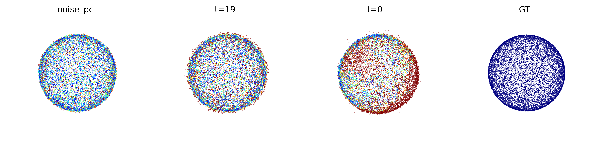
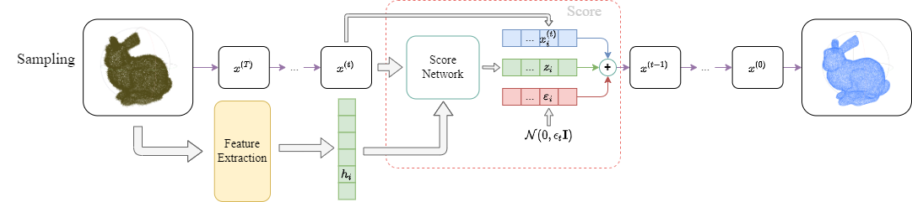
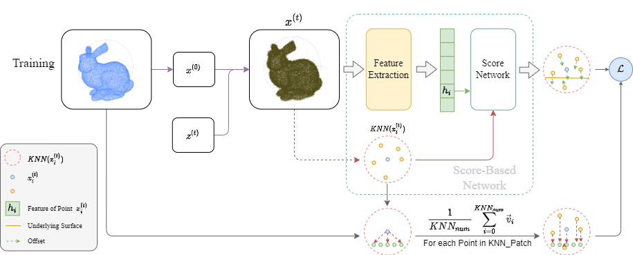
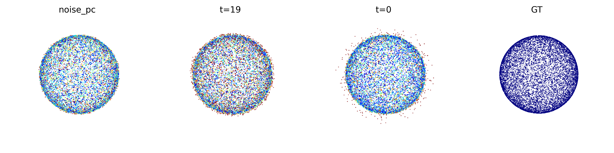
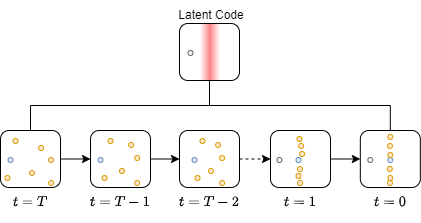
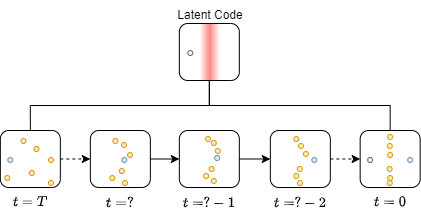
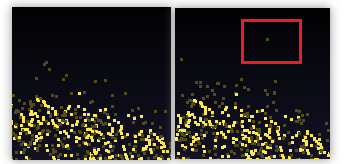
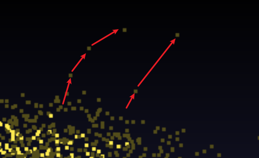

# Score-based Diffusion Points cloud Denoising

## 对之前提出的思路的实现

完成了对上周思路的实现，实现内容：

- 实现了基于最短移动的训练；
- 实现了采样；
- 对训练结果进行了简单的测试与分析；

### 实现结果与分析

刚开始使用的是Bunny，但显然效果非常糟糕，且难以分析，因此我生成了一个10K点的球进行训练与测试。

其中，$t=0$为降噪输出结果，但从其可视化结果上看，它在降噪过程中发生了明显的形变，这显然与特征提取的目的相违背。

其次，$t=19$和输入噪声点云的噪声明显不在一个数量级，初步分析认为是用于降噪的参数 $\beta$ 设置过大导致。

最后，$t=0$中存在较多的离群点，个人初步猜测其发生的原因与隧穿类似。

由于形变是不应该发生的，因此这是需要被优先解决的问题。

形变的发生原因初步推测：由于每步都对点云分布面的特征潜在编码进行重新计算，再加上离散数据导致的不可避免的采样误差，最终导致对分布面提取的潜在编码在每一步中均发生微小的变化，即每步猜测的分布平面的形状发生形变，并在每步影响 ScoreNetWork 对梯度的预测结果，最终导致降噪结果出现形变。

## 针对形变进行的修改

### 修改采样过程

既然猜测形变由每步都对潜在编码进行计算导致，那么理论上就只在开始进行一次计算就可以避免。若实现结果不发生形变，则可以证实猜想“多次计算潜在编码会导致形变”是正确的。

> 注：此处未排除是“计算潜在编码的网络本身的问题”的可能性。

修改采样过程：

### 对训练过程的轻度修改

为了完成上述测试，我修改了前面提出的最短移动方法的Loss计算过程。

> 注：目前的训练过程与采样过程不匹配，这次的修改可以理解为是”为了测试“的过度版本。

目标上，我不仅考虑了关注点 $x^{(t)}_i$ 的下降梯度方向，还多计算了KNN Patch内其他点的下降方向。目的是进一步排除问题。

> 修改训练过程发生在修改采样过程前面，已经证明该修改并不能解决形变问题。

### 实现结果与分析

从实现结果可见，上面的猜想是正确的，因为$t=0$的结果明显不发生形变，且噪声相比于前面有了明显的减少。

现有的问题：

- $t=19$中，出现噪声比输入还大的情况，初步猜想是 $\beta$ 参数设置问题；
- 离群点问题：见下一节

#### 离群点问题

对于预期的基于Latent Code确定分布平面的方法应该满足下面过程：（灰色点为初始位置）

对于蓝色点来说，它会一直向LatentCode所暗示的平面的梯度方向移动，最终稳定在平面中。

但若蓝色点在中间某个过程中错误地穿过了平面，而其它点依旧处于非常松散的状态，网络可能会计算一个错误的值（**猜测**”蓝色点下一步的移动方向保持与灰色点到平面方向一致“），结果是让蓝色点加速远离平面。

这个猜想的依据：在观察每一步的点云时，发现有几个点是上一步没有的，但在下一步突然出现后一直向远离平面方向进行移动。

因此我猜测，基于这个LatentCode实现的Score-based降噪，蓝色点的移动方向会一致保持与它初始位置到猜测平面的方向一致，即一直向某个方向移动。（下图是其中的两个离群点的移动轨迹）

其他可能导致这个问题的原因：

- 抖动值 $\varepsilon_t$ 过大；
- $\beta$ 参数设置过大；
- 训练过程与采样过程不匹配的必然结果；
- ...

## 后续探索方向

个人认为，解决 $t=19$ 所示的噪声问题比解决离群点问题优先级高，在解决思路上，我打算做如下尝试：

1. 测试 $\beta$ 参数是否会让结果变好；
2. 修改训练过程，让它更吻合采样过程；
3. 尝试分析抖动值 $\varepsilon_t$ 对结果的影响；

> 目前基于球点云进行训练与测试，但降噪效果符合预期后，会尝试加入其他模型。