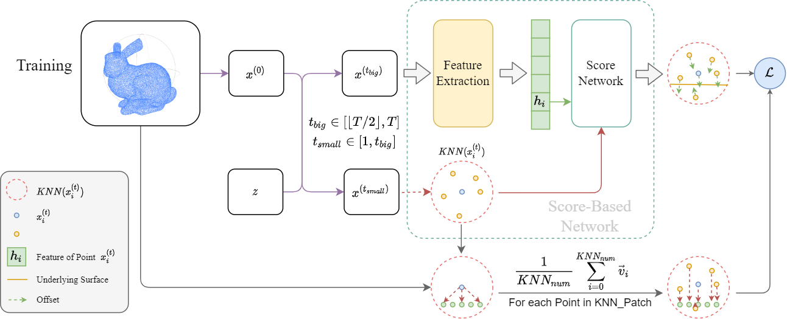
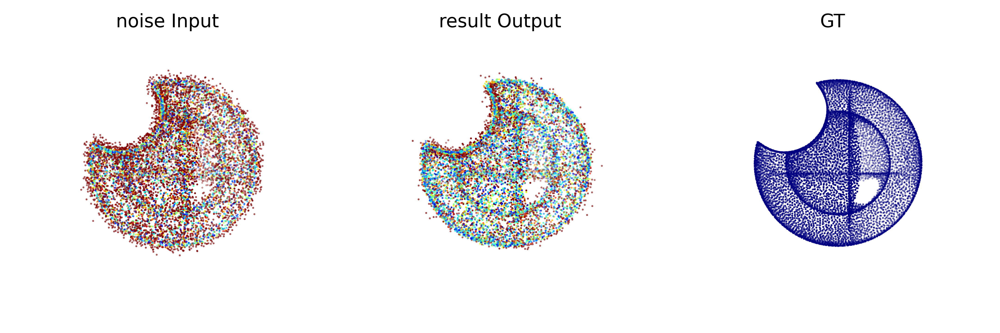
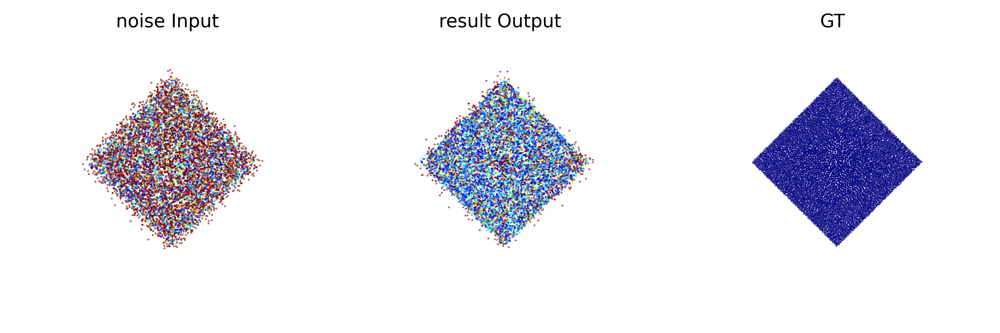
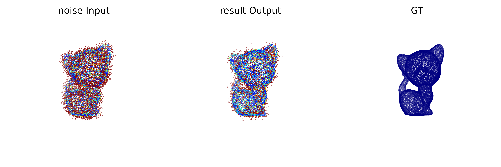

本周关于Score-based diffusion工作：

1. 对离群点问题进行了排除；（没有完成）
2. 针对采样方式对训练过程进行了修改；
3. 为测试添加了两个评估标准 cd_sph 和 p2f；
4. 添加了更多的训练样本和测试样本；

## 针对训练过程的修改

增加了 $t_{big}$ 和 $t_{small}$ 。使用 $x^{(t_{big})}$ 计算潜在编码，使用 $x^{(t_{small})}$ 作为实际的score-based计算。

它们使用同一个高斯噪声 $z$ ，因为经过不同大小的 $z$ 的模糊和knn切片，理论上应该不影响训练效果。

## 修改结果

仍然无法解决离群点问题，我认为这可能是训练score-based的训练目标的问题，我会在下周对训练这部分的公式进行重新梳理。

这次修改的结果，模型在能处理的噪声程度上有了非常大的改进，但这不是期望得到的目标结果，因为离群点问题依旧没有解决。

下面是三个结果：

关于离群点问题的猜想，我认为应该对训练时的下降距离目标的长度和采样时的下降距离的长度的公式重新推导，然后对原公式内的Loss进行修改。