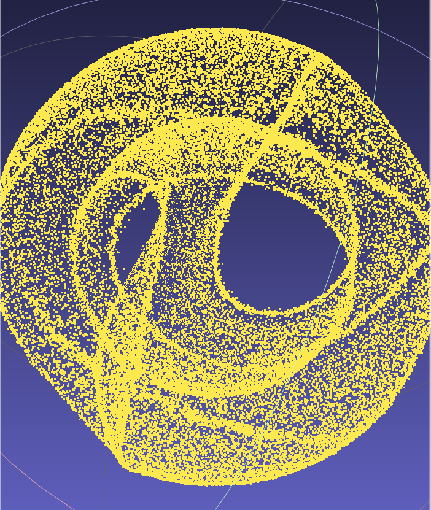

# 23_2_11周报

> 近期包括未来工作分为如下几个内容：
>
> 1. [进行中]针对已有的工作，通过结果分析它们潜在的问题，并明确SBD可优化的方向；
> 2. 针对如下两个意见修改模型，并分析训练结果：
>    1. [已完成]修改生成目标 $y$ 的随机顺序；
>    2. [训练中]将当前步的点云潜在特征与初始步的潜在特征一同作为Score-based模型的特征输入；
> 3. [已完成验证代码]通过指标分析训练结果；
> 4. [进行中]通过分析输入噪声点云，分析离群点可能由哪类点产生；
> 5. [大致完成] [2_5新增]分析迁移方程与噪声逆问题之间的关系，并进行测试；
>
> 本周工作：
>
> - 分析迁移方程与噪声逆问题之间的关系，并完成验证，并与未修改的模型进行了对比实验；
> - 将当前步的点云潜在特征与初始步的潜在特征一同作为Score-based模型的特征输入，用于对比实验的模型正在训练；

## 修正迁移方程

### 方法阐述

#### 问题阐述

对于diffusion的扩散和采样，使用的迁移方程为：
$$
x^{(t)}=\sqrt{\alpha_t}x^{(t-1)}+\sqrt{1-\alpha_t}z
$$
虽然这也是一种线性关系，但与传统的噪声逆问题描述的$y=Hx+z$有一定区别。

这个线性关系的表现在我现在参考的点云Diffusion模型中，如下图所示：

点云降噪的目标噪声点云的噪声程度很小（我训练中采样的参数Beta的值非常小，也是基于这个理由）强行解释可以说由于噪声较小，这个线性关系可以近似等价为Score-Based那篇描述的线性关系。

由于是强行解释，这意味着这是个潜在风险。因此我本周对这个问题提供了一个基于简单线性变换的解决方案（实验中描述为fix方法）。

#### 关于线性关系

$$
x^{(t)}=\sqrt{\alpha_t}x^{(t-1)}+\sqrt{1-\alpha_t}z,\ z\sim\mathcal N(0,{\bf I})
$$

$\sqrt{\alpha_t}$ 是对 $x^{(t-1)}$ 的一次线性变换，若把变换矩阵理解为 ${\rm H} =\sqrt{\alpha_t}\ {\rm I}$，因此这个迁移方程可以用如下线性逆变换描述：
$$
y=\sqrt{\alpha_t}\ {\rm I}\ x+z,z\sim \mathcal N(0,(1-\alpha_t){\rm I})
$$
对于SBD使用的Score-Based方法是基于 $y={\rm I}\ x+z$ 实现的，那么若要基于上述描述实现，**只需要在涉及这个Score-Based方法前对目标 $x^{(t)}$ 进行一次关于 $\sqrt{\alpha_t}$ 的线性变换。**

#### Diffusion过程推导（添加一个变量）

**$\Rightarrow$** 后是修正了这个线性变换后的结果：
$$
\begin{align*}
x^{(t)}&=\sqrt{\alpha_t}x^{(t-1)}+\sqrt{1-\alpha_t}z_t\\
&=\sqrt{\alpha_t}(\sqrt{\alpha_{t-1}}x^{(t-2)}+\sqrt{1-\alpha_{t-1}}z_{t-1})+\sqrt{1-\alpha_t}z_t\\
&=\sqrt{\alpha_t\alpha_{t-1}}x^{(t-2)}+\sqrt{1-\alpha_t\alpha_{t-1}}\overline z_t\\
&=\ \cdots\\
&=\sqrt{\overline\alpha_t}x^{(0)}+\sqrt{1-\overline\alpha_t}z,\ z\sim\mathcal N(0,{\bf I})\\
{\color{blue}\Rightarrow\ x^{(t)}_{a}}
&={\color{blue}\frac{x^{(t)}}{\sqrt{\overline\alpha_t}}}=x^{(0)}+\sqrt{\frac{1-\overline\alpha_t}{\overline\alpha_t}}z,\ z\sim\mathcal N(0,{\bf I})
\end{align*}
$$
基于这个修正结果 $x^{(t)}_{a}$，使用 $x^{(t)}_{a}$ 和 $x^{(0)}$ 训练Score-Based计算梯度理论上会比原先的 $x^{(t)}$ 和 $x^{(0)}$ 更加准确。

重定义 Score-based 分布梯度：
$$
\nabla_x log[q_\theta({\color{blue}x^{(t-1)}_a|x^{(t)}_a})]\approx -z_\theta\propto\min\{||x^{(0)}_i-x^{(t)}_{a}||^2_2\ |x^{(0)}_i\in x^{(0)}\}
$$

> 多元高斯分布规约到一维高斯分布条件：多元变量之间相互无关。对于本模型训练时使用的随机是3D多元无关高斯分布，因此规约成立。
>
> 定义 $\Sigma=\sigma^2{\rm I}\\$：
> $$
> {p(x;\mu,\Sigma)=\frac 1{\sqrt{(2\pi)^n|\Sigma|}}e^{-\frac{(x-\mu)^T\Sigma^{-1}(x-\mu)}{2}}}
> \propto
> {p(x;\mu,\sigma^2)=\frac 1{\sqrt{(2\pi)^n}\sigma}e^{-\frac{(x-\mu)^2}{2\sigma^2}}}
> $$

#### Sampling过程推导（无公式上的修改）

对于信息的估计均值 $\mu_\theta$ **保持不变**：
$$
\begin{align*}
q(x^{t-1}|x^t,x^0)&=q(x^t|x^{t-1},x^0)\frac {q(x^{t-1}|x^0)}{q(x^t|x^0)}\\
&\propto {\rm exp}(-\frac 1 2\underbrace{(\frac {\alpha_t} {\beta_t}+\frac 1{1-\overline \alpha_{t-1}})(x^{t-1})^2}_{x^{t-1}方差}-\underbrace{(\frac {2\sqrt{\alpha_t}} {\beta_t}x^t+\frac {2\sqrt{\overline\alpha_{t-1}}}{1-\overline \alpha_{t-1}}x^0)(x^{t-1})^2}_{x^{t-1}均值}\\&+   \underbrace{C(x^t,x^0)}_{与x^{t-1}无关}),\\where\ &\alpha_t=1-\beta_t,\ \overline\alpha_t=\prod^T_{i=1}\alpha_i\\
&C(x^t,x^0)=(\frac 1 {\beta_t}-\frac 1{1-\overline \alpha_t})(x^t)^2+(\frac 1{1-\overline \alpha_{t-1}}-\frac 1{1-\overline \alpha_t})(x^0)^2+\frac {2\overline\alpha_t}{1-\overline \alpha_t}x^0x^t
\\
\Rightarrow
\mu_\theta(x^t,t)&=\frac 1 {\sqrt {\alpha_t}}(x^t-\frac{\beta_t}{\sqrt{1-\overline a_t}}z_\theta)\\
\Rightarrow x^{t-1}&=\frac 1 {\sqrt {\alpha_t}}(x^t-\frac{\beta_t}{\sqrt{1-\overline a_t}}z_\theta)
\end{align*}\\
$$

### 实验分析

从[低噪声结果](#0.01)中可以认为，上面阐述的问题确实会导致高频信息收敛的误差，但由于误差较小，对低频内容影响并不明显。修正迁移方程可以让高频信息的恢复得到明显的改善，具体体现于lcosahedron等结果的特征边的误差更小。

从其他结果的可视化中发现，相同训练迭代次数下，修正了方程的模型的低频信息恢复能力似乎没有原先的均匀。但从后面的指标结果上看，修正方程可以有效提高降噪效果。因此可以认为，修正方程让模型更多关注了高频信息的恢复，因此需要更多迭代才能达到原先的对低频信息的恢复效果。

对于sculpt这个结果，我发现在降噪过程中，粒子会向高频边缘聚集（这个现象在其他结果中也能观测到）。对于这类结果的好坏我无法进行评估，因为一方面是它增强了高频部分信息的信息量，但代价是高频附近的信息量相对减少（因为都向高频聚集）。

### 关于模型修改的思考

基于春节前的讨论，我在2月5号的周报工作中修改了训练过程中随机生成的y的顺序，即先随机小步 $t_{small}$，再随机大步 $t_{big}\in[t_{small},T]$。这样处理的结果是：

- 训练中生成的大多数用于模拟输入噪声点云 $t_{big}$ 集中在大噪声那个区间，因为 $t_{big}\in[t_{small},T]$。这可能是当前模型对大噪声点云的降噪效果较优的主要原因。
-  $t_{big}$ 很少生成小噪声的噪声点云样本，这可能会导致小噪声样本缺少训练，导致对高频细节的收敛不足；

因此我觉得关于 $t_{small}$ 和 $t_{big}$ 的随机决策方案还有一定的可实验空间。

## 结果可视化

SBD的两个结果使用25.6w次迭代的模型，Score-Based使用100w次迭代的模型。

SBD（Ours fix）为本周修正了迁移方程后的结果。

### 0.01

SBD（Ours fix）

SBD（Ours）

Score-Based

### 0.02

SBD（Ours fix）

SBD（Ours）

Score-Based

### 0.03

SBD（Ours fix）

SBD（Ours）

Score-Based

## 指标对比

副标题命名规则，训练集-点云点数-噪声类型-噪声程度。

训练参数（部分）：

| Parameter      | Value                                     |
| -------------- | ----------------------------------------- |
| KNN_num        | 64 and 128                                |
| Training set   | 10000_possion,30000_possion,50000_possion |
| diffusion_step | 30                                        |
| beta           | $[1e-5,5e-5]$                             |
| iterations     | 256000                                    |

对比的是Score-based提供的迭代1e6模型的结果。

下面选取的样本不经过挑选，是测试输出的前10个结果。

标准使用p2f。

### PUNet-10000-possion-0.01

| Name        | Score-Based |   Ours   | Ours(Fix) |
| ----------- | :---------: | :------: | :-------: |
| moai        |  0.000059   | 0.000155 | 0.000145  |
| duck        |  0.000079   | 0.000164 | 0.000160  |
| elk         |  0.000098   | 0.000262 | 0.000225  |
| elephant    |  0.000063   | 0.000273 | 0.000219  |
| quadric     |  0.000085   | 0.000259 | 0.000230  |
| cow         |  0.000073   | 0.000231 | 0.000202  |
| fandisk     |  0.000053   | 0.000161 | 0.000152  |
| Icosahedron |  0.000052   | 0.000146 | 0.000129  |
| star        |  0.000055   | 0.000135 | 0.000119  |
| kitten      |  0.000058   | 0.000170 | 0.000151  |

### PUNet-10000-possion-0.02

| Name        | Score-Based |   Ours   | Ours(Fix) |
| ----------- | :---------: | :------: | :-------: |
| moai        |  0.000105   | 0.000176 | 0.000163  |
| duck        |  0.000128   | 0.000186 | 0.000178  |
| elk         |  0.000171   | 0.000319 | 0.000256  |
| elephant    |  0.000154   | 0.000307 | 0.000255  |
| quadric     |  0.000169   | 0.000311 | 0.000265  |
| cow         |  0.000140   | 0.000272 | 0.000239  |
| fandisk     |  0.000117   | 0.000194 | 0.000180  |
| Icosahedron |  0.000093   | 0.000155 | 0.000140  |
| star        |  0.000090   | 0.000141 | 0.000134  |
| kitten      |  0.000118   | 0.000199 | 0.000175  |

### PUNet-10000-possion-0.03

| Name        | Score-Based |   Ours   | Ours(Fix) |
| ----------- | :---------: | :------: | :-------: |
| moai        |  0.000254   | 0.000213 | 0.000212  |
| duck        |  0.000255   | 0.000217 | 0.000221  |
| elk         |  0.000385   | 0.000397 | 0.000345  |
| elephant    |  0.000351   | 0.000373 | 0.000360  |
| quadric     |  0.000377   | 0.000391 | 0.000358  |
| cow         |  0.000279   | 0.000332 | 0.000316  |
| fandisk     |  0.000296   | 0.000256 | 0.000273  |
| Icosahedron |  0.000192   | 0.000183 | 0.000171  |
| star        |  0.000193   | 0.000159 | 0.000169  |
| kitten      |  0.000284   | 0.000262 | 0.000246  |

### PUNet-50000-possion-0.01

| Name        | Score-Based |   Ours   | Ours(Fix) |
| ----------- | :---------: | :------: | :-------: |
| moai        |  0.000030   | 0.000069 | 0.000050  |
| duck        |  0.000056   | 0.000087 | 0.000070  |
| elk         |  0.000050   | 0.000120 | 0.000100  |
| elephant    |  0.000028   | 0.000141 | 0.000090  |
| quadric     |  0.000039   | 0.000104 | 0.000086  |
| cow         |  0.000038   | 0.000099 | 0.000076  |
| fandisk     |  0.000027   | 0.000067 | 0.000046  |
| Icosahedron |  0.000023   | 0.000046 | 0.000034  |
| star        |  0.000038   | 0.000054 | 0.000045  |
| kitten      |  0.000026   | 0.000065 | 0.000046  |

### PUNet-50000-possion-0.02

| Name        | Score-Based |   Ours   | Ours(Fix) |
| ----------- | :---------: | :------: | :-------: |
| moai        |  0.000067   | 0.000085 | 0.000069  |
| duck        |  0.000087   | 0.000099 | 0.000083  |
| elk         |  0.000090   | 0.000145 | 0.000118  |
| elephant    |  0.000086   | 0.000168 | 0.000111  |
| quadric     |  0.000094   | 0.000145 | 0.000122  |
| cow         |  0.000086   | 0.000130 | 0.000100  |
| fandisk     |  0.000073   | 0.000086 | 0.000065  |
| Icosahedron |  0.000049   | 0.000052 | 0.000042  |
| star        |  0.000062   | 0.000056 | 0.000053  |
| kitten      |  0.000058   | 0.000083 | 0.000064  |

### PUNet-50000-possion-0.03

| Name        | Score-Based |   Ours   | Ours(Fix) |
| ----------- | :---------: | :------: | :-------: |
| moai        |  0.000230   | 0.000103 | 0.000095  |
| duck        |  0.000238   | 0.000115 | 0.000109  |
| elk         |  0.000256   | 0.000162 | 0.000143  |
| elephant    |  0.000257   | 0.000193 | 0.000160  |
| quadric     |  0.000261   | 0.000176 | 0.000165  |
| cow         |  0.000244   | 0.000155 | 0.000146  |
| fandisk     |  0.000260   | 0.000114 | 0.000112  |
| Icosahedron |  0.000195   | 0.000063 | 0.000065  |
| star        |  0.000207   | 0.000064 | 0.000068  |
| kitten      |  0.000204   | 0.000101 | 0.000094  |

