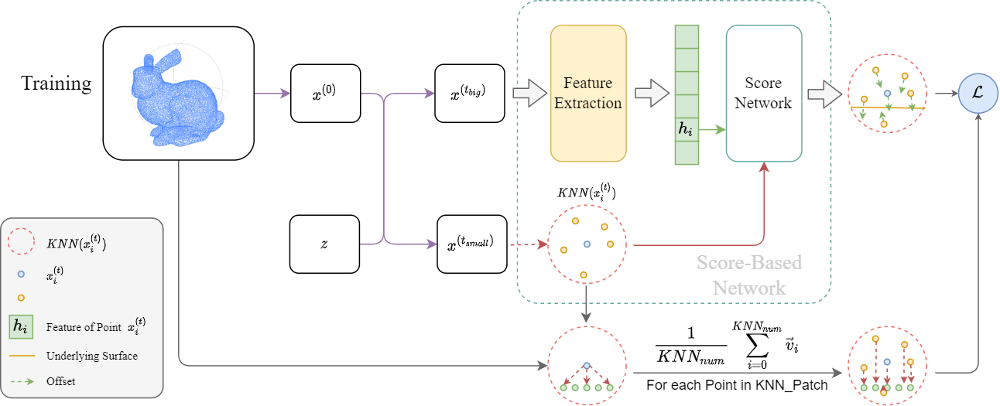
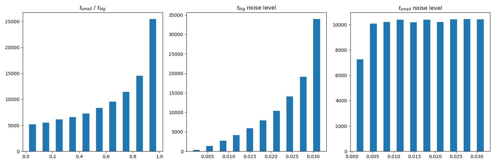
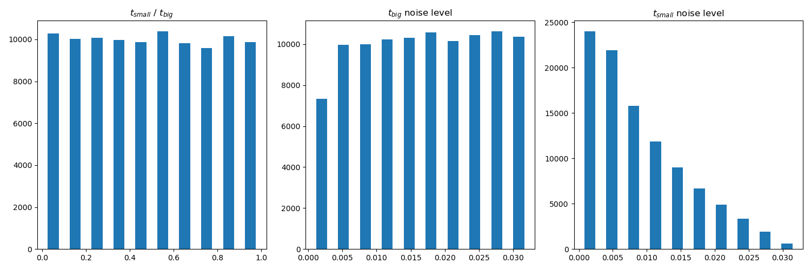
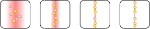
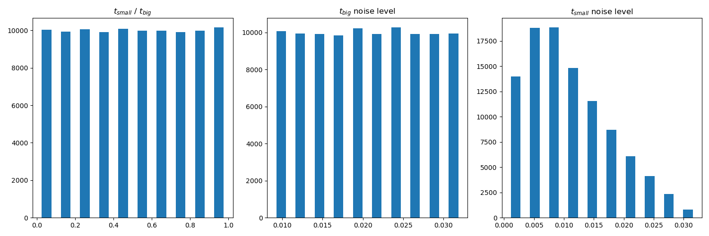
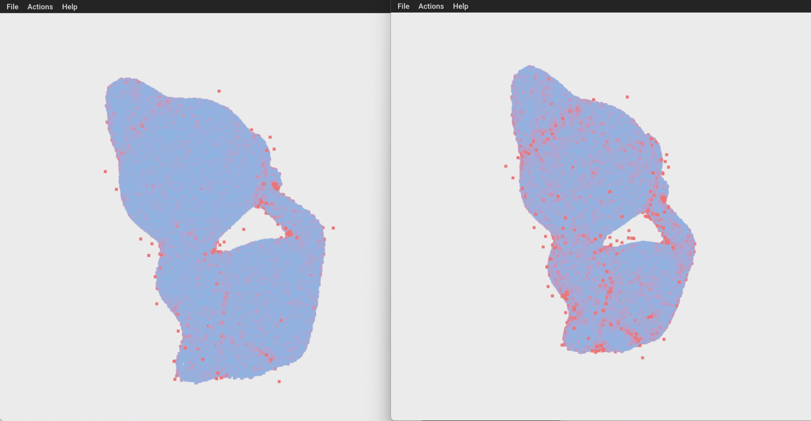
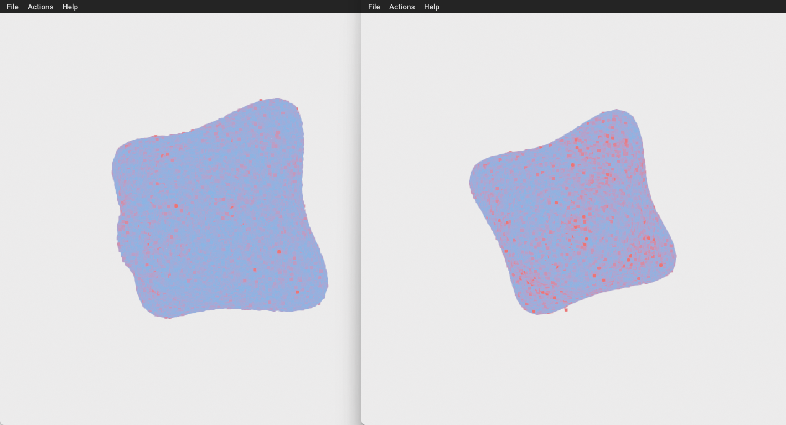
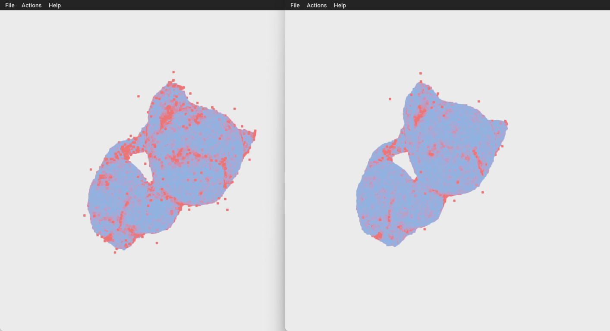
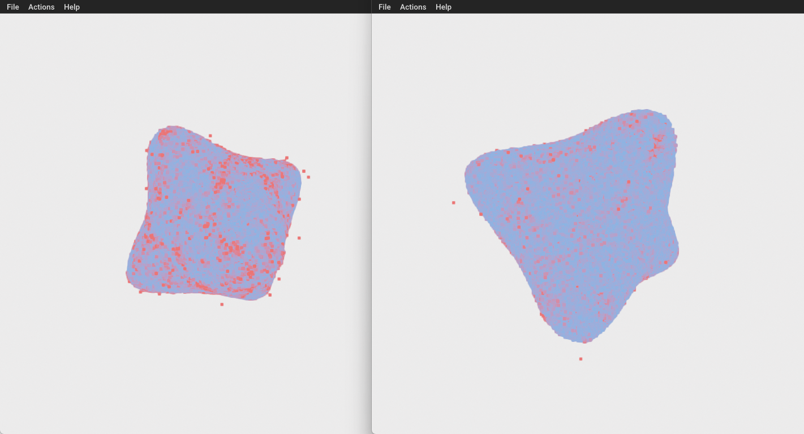

# 2_26 周报

> 本周工作主要为下面几个：
>
> 1. 验证关于 $t_{small},t_{big}$ 的猜想，并得到了一个有理论依据的结论；
> 2. 统计了已有的点云降噪工作中使用的Dataset、Evaluation metric 和 Comparison；
> 3. 添加了两类可视化工具：包含更多的 Evaluation metric 和 CD-based 3d可视化。
>
> 关于训练中的扩散过程，我有一个基于随机微分方程 (Stochastic Differential Equation, SDE) 的推导思路，这是下周的一个尝试内容。

## 更合理的 $t_{small},t_{big}$ 生成策略

 $t_{small},t_{big}$ 的生成策略决定了用于自监督的两个样本 $x^{(big)},x^{(small)}$ 的噪声程度的分布，实验证明：不同的生成策略会影响Sampling过程的好坏和对样本噪声的敏感度。

对于第 $t$ 步的样本 $x^{(t)}$，它的噪声程度可通过如下公式计算：
$$
L_{t}=\frac{\sqrt{1-\bar{\alpha}_t}}{\sqrt{\bar{\alpha}_t}}
$$
通过观察 $L_t$ 的直方图，就可以快速判断采样样本的噪声程度的分布。

对于模型训练来说，只要迭代次数够多，那么模型可以对不同程度噪声的样本均有个较好的降噪效果。但不好的 $t_{small},t_{big}$ 生成策略会让训练的难度有非常夸张的增长。

下表为如下策略的训练结果（为了提高效率，我适当缩小了训练集，并确保理论上大方向上不影响训练结果）（控制变量： $t_{small},t_{big}$ 生成策略）：

| 策略（测试噪声：0.01） |    CD （归一化）     |   Point-to-Subface   |     HD（标准化）     |
| ---------------------- | :------------------: | :------------------: | :------------------: |
| 2-11原始策略           |    0.000163490589    |    0.000110232998    |    0.015290613286    |
| 第一次尝试             | 太糟糕，当时忘了记录 | 太糟糕，当时忘了记录 | 太糟糕，当时忘了记录 |
| 对第一次尝试的修改     |  **0.000141879517**  |  **0.000091748605**  |  **0.014466880076**  |

| 策略（测试噪声：0.02） |    CD （归一化）     |   Point-to-Subface   |     HD（标准化）     |
| ---------------------- | :------------------: | :------------------: | :------------------: |
| 2-11原始策略           |    0.000165044530    |  **0.000108053484**  |  **0.021538155992**  |
| 第一次尝试             | 太糟糕，当时忘了记录 | 太糟糕，当时忘了记录 | 太糟糕，当时忘了记录 |
| 对第一次尝试的修改     |  **0.000163982048**  |  **0.000108601261**  |    0.022375815734    |

| 策略（测试噪声：0.03） |    CD （归一化）     |   Point-to-Subface   |     HD（标准化）     |
| ---------------------- | :------------------: | :------------------: | :------------------: |
| 2-11原始策略           |  **0.000196737230**  |  **0.000135074190**  |  **0.030974166933**  |
| 第一次尝试             | 太糟糕，当时忘了记录 | 太糟糕，当时忘了记录 | 太糟糕，当时忘了记录 |
| 对第一次尝试的修改     |    0.000212527837    |    0.000150893815    |    0.032692635525    |

总结：

- 这次修改让模型可以更好地恢复低噪声点云，且从训练梯度上可见还有稳定下降的空间；
- 原始策略在高噪声点云的恢复效果更好，但训练时输出梯度和loss比较混乱，且从32000开始就没有明显下降；
- 之前提出的增加displacement部分的loss没法看出效果

### 基于 2_11 的原始策略

原始的生成策略可用如下算法描述：
$$
\begin{align*}
t_{small}&\leftarrow Random[0,Step]\\
t_{big}&\leftarrow Random[t_{small},Step]
\end{align*}
$$

从直方图可知：

- $t_{big}$ 对应的噪声样本大多集中在大噪声，低噪声样本较少；
- $t_{small}$ 对应的噪声样本分布均匀；
- $t_{small}\ /\ t_{big}$ 表明，模拟的Sampling过程集中在对大噪声的提取中；

综上可预测该策略训练的结果：

- 对大噪声的提取能力强，可以在噪声较大的样本中更准确地估计噪声；
- 缺乏细化能力，即对高频信息恢复能力较弱，对小噪声样本的恢复能力缺乏学习；

### 第一次尝试：

$t_{big}$ 对应的样本是输入噪声点云，因此均匀的 $t_{big}$ 应该能让网络能更好处理不同噪声程度的输入噪声，因此算法修改如下：
$$
\begin{align*}
t_{big}&\leftarrow Random[0,Step]\\
ratio&\leftarrow Random[0,1]\\
t_{small}&\leftarrow t_{big}*ratio
\end{align*}
$$

从直方图可知：

- $t_{big}$ 对应的噪声样本均匀覆盖各种程度的噪声样本；
- $t_{small}\ /\ t_{big}$ 非常均匀，意味着对于输入噪声样本 $x_{noise}$ ，采样均匀覆盖了采样的整个过程；

综上，该策略理论上的结果应该是：

- 对不同程度的噪声均能具有较好的提取效果；
- 对小噪声样本的降噪效果比原始方法更优；

但是，训练过了前期后完全无法收敛，最后结果也非常糟糕。

### 对第一次尝试的分析与修改

**分析**：

首先，我回顾了我是用的Score-Based Net和Feature Net涉及的论文和代码，确定它们存在分布上的解释性。因此我认为可以通过分布解释第一次尝试失败的原因。

对于带噪声的点云，其中的一个点云切片可以通过一个至少4维的高维分布描述点的空间分布（如图中红色表示这些点对应的分布），即 $p_{noise}=p_{clear}*n,n\in\mathcal N(0,\sigma^2 I),\sigma >0$，其中 $p_{noise}$ 与 $p_{clear} $ 的分布形式是不一样的，即 $p_{noise}=p_{clear}*n,n\in\mathcal N(0,\sigma^2 I),\sigma >\varepsilon,\exist \varepsilon>0$，例如你用高斯分布拟合 $x=0,\forall x\in X,|X|\rightarrow \infty$ 的点集，结果是得到方差为 $\sigma \rightarrow +\infty$，这并不合理。

由于计算机存在浮点位限制，因此这个情况就变为了当 $p_{noise}\not=p_{clear}*n,n\in\mathcal N(0,\sigma^2 I),0<\sigma <\varepsilon,\exist \varepsilon>0$，更一般的解释是：噪声程度小于一定程度，就无法通过一个连续分布进行拟合。

因此第一次尝试失败的原因可以归纳与以下两个原因：

- $t_{big}$ 随机的噪声程度太小，让 Feature Net 在理解上出现混淆；
- $t_{small}$ 随机的噪声程度太小，让 Score-Based 在理解上出现混淆；

**修改**

因此修改上，进行如下考虑：

- 输入噪声点云的噪声集中在 $[0.01,0.03]$ ，因此要让 $t_{big}$ 对应的噪声样本集中在 $[0.01,0.03]$；
- $t_{small}$ 对应的噪声程度不能太小；

修改算法如下：
$$
\begin{align*}
T&:x\rightarrow y,\ \ x\in [0.01,0.03]\ \ \ y\in (0,Step][0.01,0.03]\\
t_{big}&\leftarrow T(Random[0.01,0.03])\\
ratio&\leftarrow Random(0,1]\\
t_{small}&\leftarrow t_{big}*ratio
\end{align*}
$$

从直方图可知：

- $t_{big}$ 对应的噪声样本均匀覆盖噪声区间 $[0.01,0.03]$ ；
- $t_{small}$ 对应的噪声样本避免了较小的噪声输入；
- $t_{small}\ /\ t_{big}$ 非常均匀；

从指标中可知道：

- 上述对第一次尝试失败的分析是可行的；
- 对小噪声的降噪效果明显低于原始策略；
- 对大噪声的降噪效果变弱了，但可以通过提高迭代次数进行改善。

## 基于可视化分析

由于训练集缩小，所以收敛得没有之前好，即存在一些离群点。之前实验发现，提高迭代次数可以有效减少离群点数量

左边：修改优化后的策略；右边：原始策略，样本：0.01噪声程度-kitten

左边：修改优化后的策略；右边：原始策略，样本：0.01噪声程度-star

**从结果可见：**

- 优化策略让模型更注重于低频部分，对低噪声的高频部分恢复的也比原始策略好。

左边：修改优化后的策略；右边：原始策略，样本：0.03噪声程度-kitten

左边：修改优化后的策略；右边：原始策略，样本：0.03噪声程度-star

**从结果可见：**

- 优化策略在和原始策略相同迭代次数下，并没有那么擅长大噪声。
