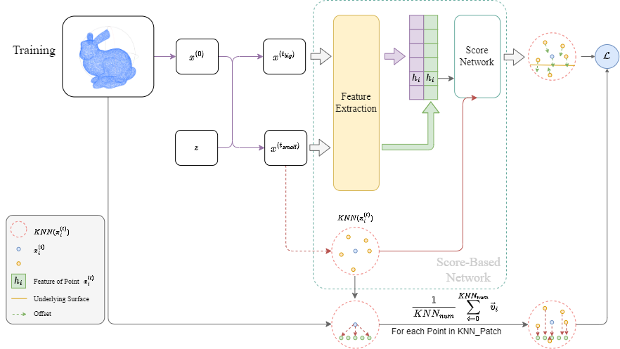
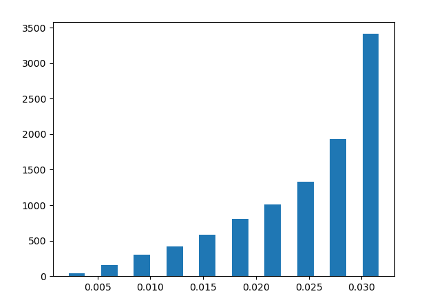
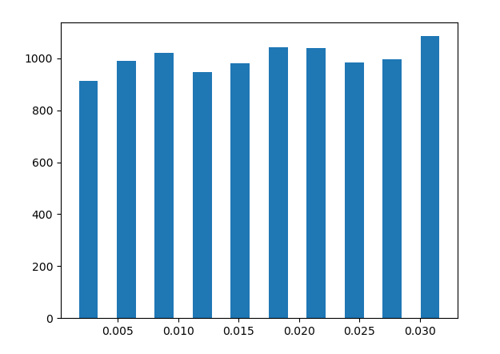
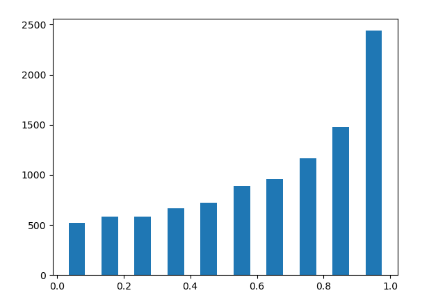
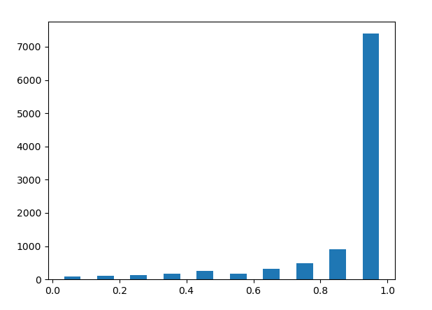

# 23_2_19周报

> 本周是考试周，因此工作内容均为简单尝试和训练：‘
>
> - [与预期结果有差异] 尝试将每步的特征与输入噪声点云的特征进行cat，并将合并后的噪声作为ScoreNet预测梯度的特征向量输入；
> - 尝试了一个均匀的 $y_{small},y_{big}$ 训练策略，但有效果降低，我对此进行了原因分析，并尝试了一个新的修改。

## 关于潜在特征

采样过程略，因为思路类似。

但从结果上看，似乎添加每步的Feat并不能优化结果。降噪效果有，但并不理想。

我不知道这个方向应该怎么分析和改进，有点超出我的理解范围（或者在我现有知识的理解中，它应该会更好）。

### 指标对比

副标题命名规则，训练集-点云点数-噪声类型-噪声程度。

训练参数（部分）：

| Parameter      | Value                                     |
| -------------- | ----------------------------------------- |
| KNN_num        | 64 and 128                                |
| Training set   | 10000_possion,30000_possion,50000_possion |
| diffusion_step | 30                                        |
| beta           | $[1e-5,5e-5]$                             |
| iterations     | 256000                                    |

训练过程使用控制变量，训练了两个不同的模型进行对比实验：

- Use Step Feat：使用跳接Feat
- **not** Use Step Feat：不使用跳接Feat

下面选取的样本不经过挑选，是测试输出的前10个结果。

标准使用p2f。

#### PUNet-50000-possion-0.01

| Name        | Use Step Feat | **not** Use Step Feat |
| ----------- | :-----------: | :-------------------: |
| moai        |   0.000871    |       0.000328        |
| duck        |   0.000859    |       0.000308        |
| elk         |   0.000860    |       0.000262        |
| elephant    |   0.000919    |       0.000458        |
| quadric     |   0.000913    |       0.000405        |
| cow         |   0.000986    |       0.000454        |
| fandisk     |   0.000837    |       0.000351        |
| Icosahedron |   0.000723    |       0.000167        |
| star        |   0.000833    |       0.000239        |
| kitten      |   0.000905    |       0.000339        |

#### PUNet-50000-possion-0.03

| Name        | Use Step Feat | **not** Use Step Feat |
| ----------- | :-----------: | :-------------------: |
| moai        |   0.000981    |       0.000251        |
| duck        |   0.001016    |       0.000279        |
| elk         |   0.001030    |       0.000262        |
| elephant    |   0.001079    |       0.000279        |
| quadric     |   0.001048    |       0.000346        |
| cow         |   0.001168    |       0.000337        |
| fandisk     |   0.000954    |       0.000308        |
| Icosahedron |   0.000898    |       0.000277        |
| star        |   0.000989    |       0.000227        |
| kitten      |   0.001087    |       0.000281        |

## 关于 $y_{big},y_{small}$

对于之前使用的 $y_{big},y_{small}$ 策略中，$y_{big}$ 的直方图如下，显然这是一个缺少对低噪声样本生成的训练方式：

因此猜测，若可以让 $y_{big}$ 的分布更加均匀是否可以让低噪声得到更好的训练，由于考试周，我这里直接采用了一个简单粗暴的中间映射:
$$
x'=x^{10}
$$
显然让 $y_{big}$ 的分布更加均匀，如下所示：

但从指标对比中可发现，它并没有对结果有优化的趋势。显然问题还出在 $y_{big},y_{small}$ 策略中，因此我对 $v=y_{small}/y_{big}$ 的分布进行分析。

- 过去的策略：

  

- 本周修改后的策略：

  

因此，从 $v=y_{small}/y_{big}$ 的分布进行分析不难发现，这两种策略生成的噪声样本均集中在降噪Sampling过程的早期，即它缺少对于Sampling过程后期对细节和小噪声的降噪和恢复。

综上所述，这次对 $y_{big},y_{small}$ 策略的实验的失败是理所当然的。并我认为，下一次实验的 $y_{big},y_{small}$ 策略需要满足下面两个要求：

- 生成的 $y_{big}$ 的分布必须均匀；
- 生成的 $y_{small}$ 的 $v=y_{small}/y_{big}$ 的分布必须均匀；

以上两点分别对应下面两个目标：

- 训练时的噪声样本必须均匀分布在 $[0.001,0.03]$
- 训练时生成的采样中间噪声样本对应于整个范围的 $v=y_{small}/y_{big}$ 必须均匀分布在 $[0,1]$，即必须有能均匀覆盖整个Sampling过程的样本。

### 指标对比

副标题命名规则，训练集-点云点数-噪声类型-噪声程度。

训练参数（部分）：

| Parameter      | Value                       |
| -------------- | --------------------------- |
| KNN_num        | 128                         |
| Training set   | 30000_possion,50000_possion |
| diffusion_step | 30                          |
| beta           | $[1e-5,5e-5]$               |
| iterations     | 256000                      |

下面选取的样本不经过挑选，是测试输出的前10个结果。

标准使用p2f。

#### PUNet-50000-possion-0.01

| Name        | Ours(Fix) | Ours(Fix, use New  $y_{big},y_{small}$ ) |
| ----------- | :-------: | :--------------------------------------: |
| moai        | 0.000050  |                 0.000062                 |
| duck        | 0.000070  |                 0.000080                 |
| elk         | 0.000100  |                 0.000092                 |
| elephant    | 0.000090  |                 0.000089                 |
| quadric     | 0.000086  |                 0.000086                 |
| cow         | 0.000076  |                 0.000087                 |
| fandisk     | 0.000046  |                 0.000056                 |
| Icosahedron | 0.000034  |                 0.000041                 |
| star        | 0.000045  |                 0.000056                 |
| kitten      | 0.000046  |                 0.000060                 |

#### PUNet-50000-possion-0.03

| Name        | Ours(Fix) | Ours(Fix, use New  $y_{big},y_{small}$ ) |
| ----------- | :-------: | :--------------------------------------: |
| moai        | 0.000095  |                 0.000095                 |
| duck        | 0.000109  |                 0.000110                 |
| elk         | 0.000143  |                 0.000137                 |
| elephant    | 0.000160  |                 0.000149                 |
| quadric     | 0.000165  |                 0.000151                 |
| cow         | 0.000146  |                 0.000138                 |
| fandisk     | 0.000112  |                 0.000096                 |
| Icosahedron | 0.000065  |                 0.000063                 |
| star        | 0.000068  |                 0.000076                 |
| kitten      | 0.000094  |                 0.000089                 |

## 关于Loss优化

定义 Score-based 分布梯度：
$$
\nabla_x log[q_\theta({x^{(t-1)}_a|x^{(t)}_a})]\approx -z_\theta\propto\min\{||x^{(0)}_i-x^{(t)}_{a}||^2_2\ |x^{(0)}_i\in x^{(0)}\}
$$

当前训练监督的是点云的梯度方向和梯度大小，即：
$$
\begin{align*}
\mathcal L_s(x_i)&=\frac 1 K \sum^K_{j=1} KNN(x_i,x^{(0)},K)_j-x_i\\
\mathcal L_z(x_{0:T},\{\beta_i\}^T_{i=1})&=\sum^T_{t=1}\mathbb E_{x_i\in x^{(t)}_a}\bigg[\bigg|\bigg|\nabla_{x_i} log[q_\theta({x^{(t-1)}_a|x^{(t)}_a})]+\mathcal  L(x_i)\bigg|\bigg|^2_2\bigg]
\end{align*}
$$
除外还能使用的方法如监督 $(x^{(t)}_a+grad)_i$ 和 $x^{(0)}_i$ 之间的距离，即将噪声样本使用网络得到的偏移量偏移后距离 $x^{(0)}_i$ 的距离。

关于使用 $x^{(0)}_i$ 作为监督目标的理由：

- 训练输入的点云均是通过在网格上进行**均匀采样**得到的，期望上可以让输出的结果更加均匀。

  > 2月13号和辛老师讨论中认为，降噪结果向高频偏移是可以的，部分工作甚至希望输入点云在高频有更多信息。
  >
  > 使用 $x^{(0)}_i$ 作为监督目标可能会让偏移程度减轻，这和讨论结果相反，但我觉得可以尝试一下。

-  $x^{(0)}_i$ 是已经有的，是现成的输入内容。

因此可以定义一个附加项，由于它的指向与最优下降方向有轻微差距，可以起到正则项的作用
$$
\begin{align*}
\mathcal L_0(x_{0:T},\{\beta_i\}^T_{i=1})&=\sum^T_{t=1}\mathbb E_{x_{t,i}\in x^{(t)}_a,x_{0,i}\in x^{(0)}}\bigg[\bigg|\bigg|(x_{t,i}-\nabla_{x_{t,i}} log[q_\theta({x^{(t-1)}_a|x^{(t)}_a})])-x_{0,i}\bigg|\bigg|^2_2\bigg]\\
\mathcal L&=\mathcal L_z+\alpha\mathcal L_0,\ where\ \alpha=0.01

\end{align*}
$$
计划下周会进行对这个改动的对比实验。

## 关于训练集和测试集

后续可以尝试该方法在其他训练集下的效果，但这个工作的优先级靠后，目前以前面三个为主。