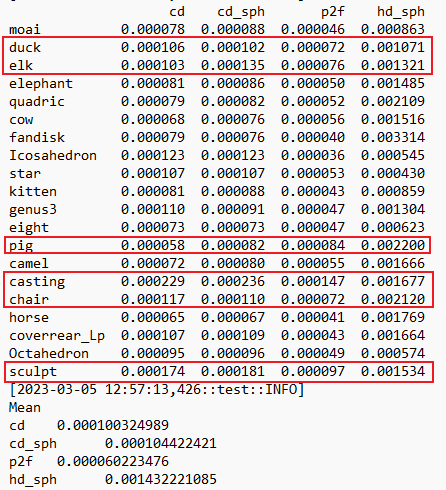
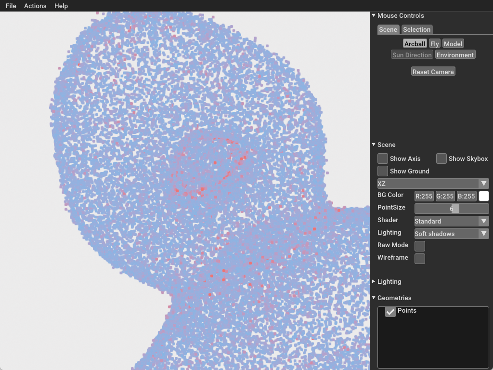
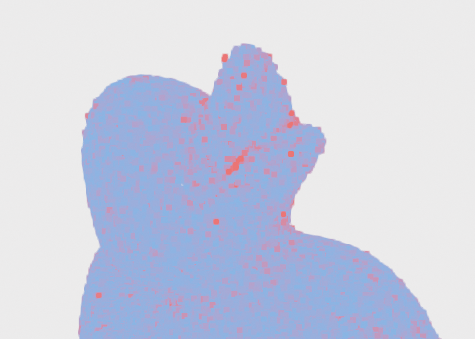
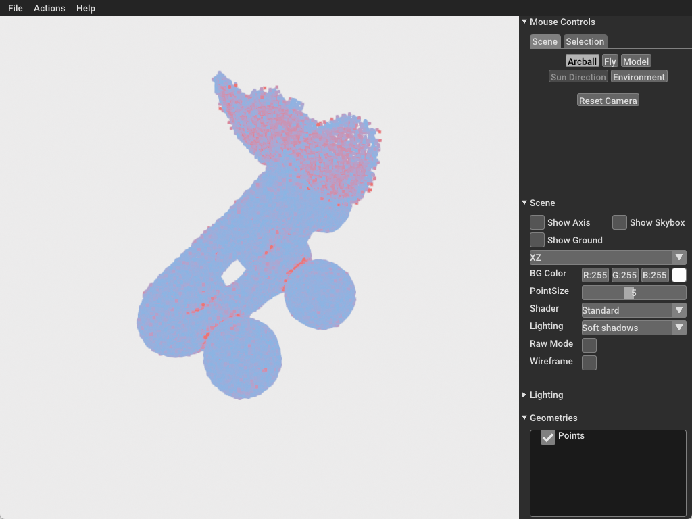
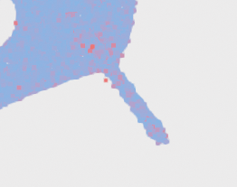
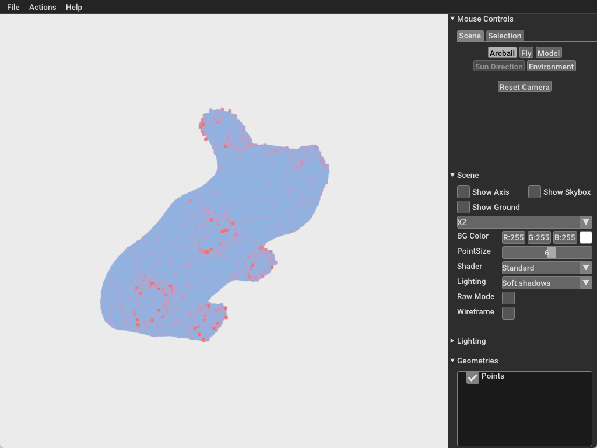
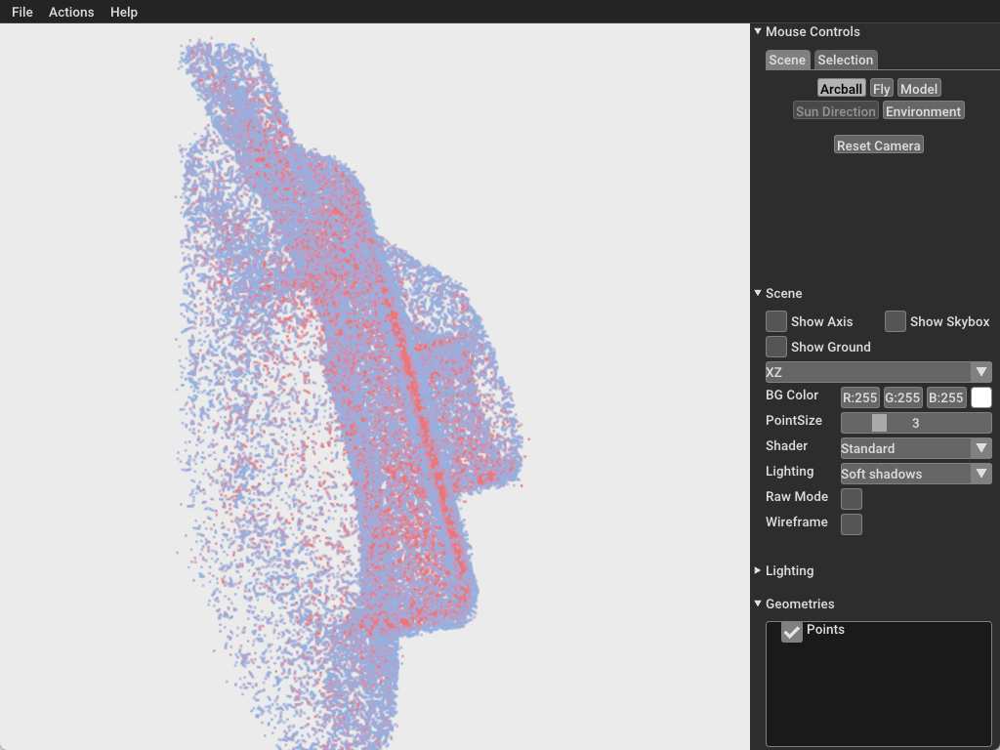
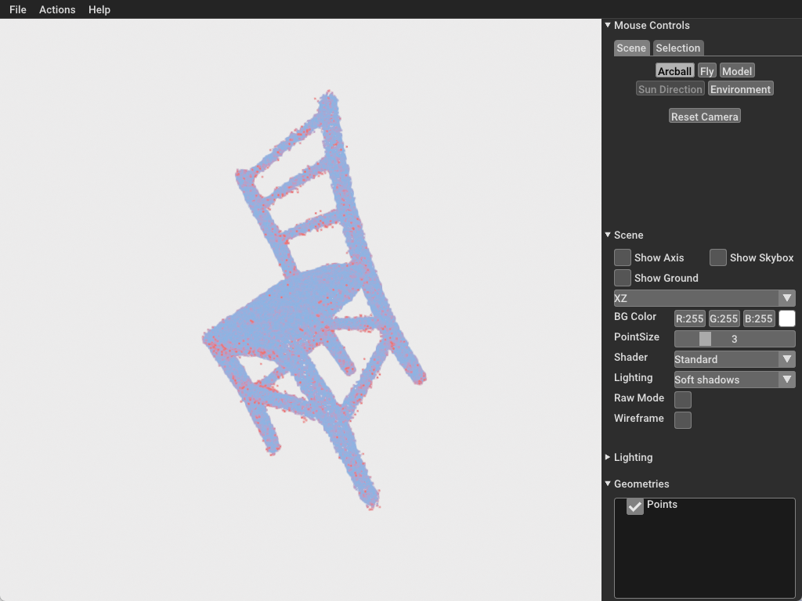
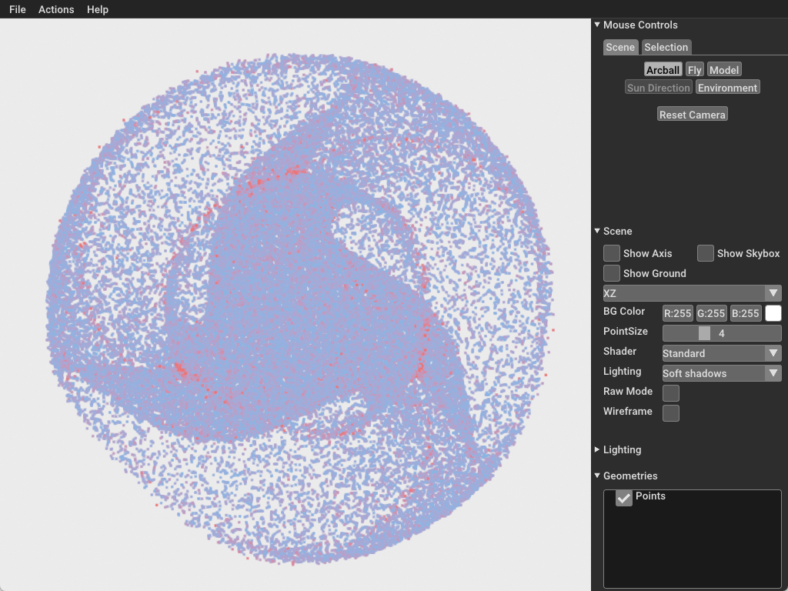
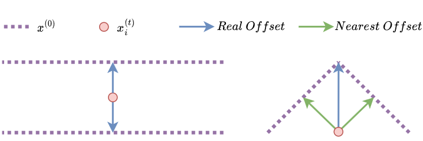

# 23_3_5周报

> 本周工作：
>
> 1. 审稿；
> 2. 将上周的模型训练了一个较大迭代次数的结果，并进行了分析与对比；
> 3. 修改了 $x^{(t)}_a$ 的生成策略，让它更贴近模型所基于的高斯定义。

## 对上周 v3.3 与过去的模型对比

首先，关于 Score-based 提供的代码，仅使用它 Github 上提供的代码和运行命令，没法达到它论文上提供的指标。

### 指标对比

**Test: PUNet_50000_0.01**

| Method      | cd ($*10^4$) | p2f ($*10^4$) |
| ----------- | :----------: | :-----------: |
| Score-based |     0.71     |     0.40      |
| Our (Last)  |     1.33     |     0.82      |
| Our (Now)   |     1.04     |     0.60      |

**Test: PUNet_50000_0.02**

| Method      | cd ($*10^4$) | p2f ($*10^4$) |
| ----------- | :----------: | :-----------: |
| Score-based |     1.28     |     0.83      |
| Our (Last)  |     1.49     |     0.96      |
| Our (Now)   |     1.43     |     0.91      |

**Test: PUNet_50000_0.03**

| Method      | cd ($*10^4$) | p2f ($*10^4$) |
| ----------- | :----------: | :-----------: |
| Score-based |     1.92     |     1.32      |
| Our (Last)  |     1.82     |     1.25      |
| Our (Now)   |     1.98     |     1.39      |

### 详细结果分析

其中，PUNet_50000_0.01 p2f指标下和其他的结果的指标差别过大：

#### duck

嘴部的内部和外部的内凹处过平滑。

#### elk

耳朵是个薄板。轮子和身体的夹角除有过平滑问题。

俯视视角，薄板的外形保留了，但从上面可知内部完全无法降噪，因此内部存在大量的错误点。

#### pig

点云的脚处不是watertight的，是四个镂空边缘，因此降噪效果很差。

耳朵高频边缘存在偏移。

#### casting

最糟糕的结果，因为它可以说全部由薄板组成。结果上外形都得到了保留，但薄板间的噪声点全部没有被降噪。

#### chair

椅子是另一类比较难降噪的模型，因为它由圆管构成。但结果上，相比于薄板，对圆管的降噪效果还可以。

#### sculpt

和上面的 duck 和 elg 一样，噪声主要集中在两个平面的内夹角处。粒子向高频聚集的现象没有之前那么明显，可能是因为模型迭代后，高频的梯度估计更加精确导致的结果。

### 问题分析

以上问题归纳来说是训练梯度的估计不够精确，主要问题可以如下描述：

- $x^{(0)}$ 为训练输入点云，等价于 Ground Truth；
- $x^{(t)}_i$ 训练自生成的噪声点云中的一个噪声点；
- $Real\ Offset$ 正确的下降梯度方向；
- $Nearest\ Offset$ 最近距离的下降梯度方向；

目前，我的训练算法中，计算梯度方向使用的是 KNN 寻找最近4个点，并计算 Nearest Offset，然后把它们平均得到监督的梯度方向，但显然这存在下面两个问题：

- 对于第一种情况，Nearest Offset 等于 Real Offset，但是对于薄板中间的点来说，它有两个可行方向，因此对最近点方向的平均结果必定是近似于零向量，因此薄板中间的噪声点无法得到有效降噪训练；
- 对于第二种情况，Real Offset 位于多个 Nearest Offset 的夹角处，因此目前使用的算法计算的向量长度与 Real Offset 的长度相比较短；

关于这块内容，我会在下周先调研现有工作中的解决方法，然后再针对具体问题进行具体算法设计。

## 对于 $x^{(t)}_a$ 生成策略的修改（未实验）

原先生成 $x^{(T)}_a$ 和 $x^{(t)}_a$ 可用如下过程描述：
$$
\begin{align*}
z_{rand}&\leftarrow \mathcal N(0,{\rm I}^{3\times 3})\\
x^{(T)}_a&\leftarrow \frac{\sqrt{\bar \alpha_T}x^{(0)}+\sqrt{1-\bar \alpha_T}\ z_{rand}}{\sqrt{\bar \alpha_T}}\\
x^{(t)}_a&\leftarrow \frac{\sqrt{\bar \alpha_t}x^{(0)}+\sqrt{1-\bar \alpha_t}\ z_{rand}}{\sqrt{\bar \alpha_t}}
\end{align*}
$$
这样的策略导致随机的两个样本中对应的点沿面切线方向的偏移较大。

> **复制之前的定义：**
>
> 多元高斯分布规约到一维高斯分布条件：多元变量之间相互无关。对于本模型训练时使用的随机是3D多元无关高斯分布，因此规约成立。
>
> 定义 $\Sigma=\sigma^2{\rm I}\\$：
> $$
> {p(x;\mu,\Sigma)=\frac 1{\sqrt{(2\pi)^n|\Sigma|}}e^{-\frac{(x-\mu)^T\Sigma^{-1}(x-\mu)}{2}}}
> \propto
> {p(x;\mu,\sigma^2)=\frac 1{\sqrt{(2\pi)^n}\sigma}e^{-\frac{(x-\mu)^2}{2\sigma^2}}}
> $$

若基于 $x^{(0)}$ 和 $x^{(T)}_a$ 构建近似于法线方向的 $x^{(t)}_a$ 生成策略，或许可以提高训练效果：
$$
\begin{align*}
z^T_{rand}&\leftarrow \mathcal N(0,{\rm I}^{3\times 3})\\
x^{(T)}_a&\leftarrow \frac{\sqrt{\bar \alpha_T}x^{(0)}+\sqrt{1-\bar \alpha_T}\ z^T_{rand}}{\sqrt{\bar \alpha_T}}\\
{\color{blue}z^t_{rand}}&{\color{blue}\leftarrow \frac{(x^{(T)}_a-Nearest(x^{(T)}_a,x^{(0)}))\sqrt{\bar \alpha_T}}{\sqrt{1-\bar \alpha_T}}}\\
x^{(t)}_a&\leftarrow \frac{\sqrt{\bar \alpha_t}x^{(0)}+\sqrt{1-\bar \alpha_t}\ z^t_{rand}}{\sqrt{\bar \alpha_t}}
\end{align*}
$$
$Nearest(x^{(T)}_a,x^{(0)})$ 表示从 $x^{(0)}$ 找到距离 $x^{(T)}_{a,i},x^{(T)}_{a,i}\in x^{(T)}_{a}$ 最近的点。

下周会先对基于这个策略在不同点云下生成的 $z^t_{rand}$ 进行 Jarque-Bera 检验，确认它们满足正态性，然后开展实验和公式解释。
