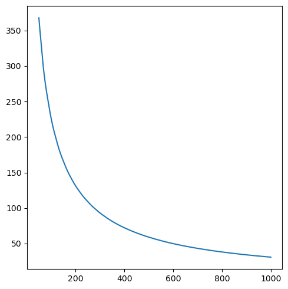
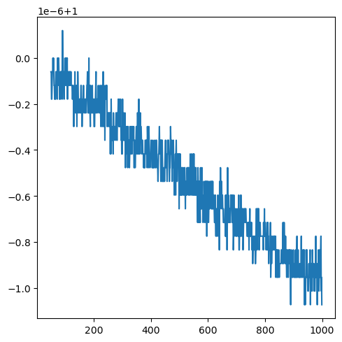

# 3-12周报

> 本周工作：
>
> 1. Foundation Model 调研任务；
> 2. 点云（和 Mesh）数据集收集；
> 3. 寻找梯度估计的灵感：收集传统点云降噪论文和与3D梯度有关的深度论文；
> 4. 完善公式推导，~~找到了一个可尝试的修正了权重的新loss。~~ **证明了原loss更可靠**。
> 5. 对模型部分代码优化，在不影响效率下大大降低了GPU显存占用；
>
> 周报内容是对 工作4 的阐述。
>
> 关于上周提出的 **对于 $x^{(t)}_a$ 生成策略的修改**，训练实验结果显示不合理，且基于 $Nearest$ 生成的结果显然不通过 Jarque-Bera 检验。（注：原方法的中间变量均通过JB检验）

## 公式推导与分析

> 对部分符号进行重定义，为了降低公式编写难度，例如 $x^{(t)}$ 重定义为了 $x^t$。

过去的 Loss 的依据是 Score-based，但 Diffusion的随机过程和 Langevin 过程存在区别，因此具体内容的计算上存在不同。

### SBD Loss推导

定义 Diffusion Process 的分布描述：
$$
q(x^{1:T}|x^0)=\prod^T_{t=1}q(x^t|x^{t-1}),\ q(x^t|x^{t-1})=\mathcal N(x^t;\ \sqrt{1-\beta_t}x^{t-1},\ \beta_t{\rm I})
$$
定义 Sampling Process 的分布描述：（带 $\theta$ 的为需要训练的
$$
\begin{align*}
p_\theta(x^{0:T}|F_{T})&=p(x^T)\prod^T_{t=1}p_\theta(x^{t-1}|x^{t},F_{T})\\
where\ p_\theta(x^{t-1}|x^{t},F_{T})&=\mathcal N(x^t;\ \sqrt{1-\beta_t}x^{t-1},\ \beta_t{\rm I}),\ p(x^T)=\mathcal N(x^T;x^0,L_{noise}{\rm I^3})
\end{align*}
$$
其中，$F_T=EdgeFeature(x^T)$

训练方法 $p_\theta$ 使用它的负对数似然估计的变分上界：（**绿色部分**为相比于上行公式**修改的部分**，目的是降低阅读难度）
$$
\begin{align*}
\mathbb E[-\log p_\theta(x^0)]&\le \mathbb E_q\bigg[-\log \frac {p_\theta(x^{0:T}|F_{T})}{q(x^{1:T}|x^0)}\bigg]\\
&= E_q\bigg[-\log p(x^T)-\sum_{\color{green}t\ge1}\log \frac {p_\theta(x^{t-1}|x^{t},F_{T})}{q(x^t|x^{t-1})}\bigg]\\
&=E_q\bigg[-\log p(x^T)-\sum_{\color{green}t> 1}\log \frac {p_\theta(x^{t-1}|x^{t},F_{T})}{q(x^t|x^{t-1})}-{\color{green}\log\frac {p_\theta(x^{0}|x^{1},F_{T})}{q(x^1|x^{0})}}\bigg]\\
\end{align*}
$$
根据贝叶斯定理: $q(x^t|x^{t-1})=\cfrac{q(x^{t-1}|x^t)q(x^t)}{q(x^{t-1})}$，但是 $q(x^{t-1}|x^t)$ 是无法直接处理的。又因 $q(x^{1:T}|x^0)$ 令 $q(x^t|x^{t-1},x^0)=q(x^t|x^{t-1})$ 满足，因此引入 $x^0$ 作为条件 $q(x^t|x^{t-1})=q(x^t|x^{t-1},x^0)=\cfrac{q(x^{t-1}|x^t,x^0)q(x^t|x^0)}{q(x^{t-1}|x^0)}$。
$$
\begin{align*}
&=E_q\bigg[-\log p(x^T)-\sum_{t> 1}\log \frac {p_\theta(x^{t-1}|x^{t},F_{T})}{\color{green}q(x^{t-1}|x^t,x^0)}\cdot \frac{\color{green}q(x^{t-1}|x^0)}{\color{green}q(x^{t}|x^0)}-{\log\frac {p_\theta(x^{0}|x^{1},F_{T})}{q(x^1|x^{0})}}\bigg]\\
\because \ &\sum_{t>1}\log \bigg[\frac{q(x^{t-1}|x^0)}{q(x^{t}|x^0)}\bigg]=\log q(x^1|x^0)-\log q(x^T|x^0)\\
\therefore\ &=E_q\bigg[-\log \frac{p(x^T)}{\color{green}q(x^T|x^0)}-\sum_{t> 1}\log \frac {p_\theta(x^{t-1}|x^{t},F_{T})}{q(x^{t-1}|x^t,x^0)}-{\log {\color{green}p_\theta(x^{0}|x^{1},F_{T})}}\bigg]\\
&= E_q\bigg[D_{KL}({q(x^T|x^0)}\ ||\ {p(x^T)})+\sum_{t> 1}D_{KL}({q(x^{t-1}|x^t,x^0)} \ ||\ {p_\theta(x^{t-1}|x^{t},F_{T})})-{\log {p_\theta(x^{0}|x^{1},F_{T})}}\bigg]\\
&={\color{red}D_{KL}({q(x^T|x^0)}\ ||\ {p(x^T)})}+E_q\bigg[\sum_{t> 1}D_{KL}({q(x^{t-1}|x^t,x^0)} \ ||\ {p_\theta(x^{t-1}|x^{t},F_{T})})\bigg]-{\color{red}\log {p_\theta(x^{0}|x^{1},F_{T})}}\\
&=:loss
\end{align*}
$$
其中，红色项显然是常数项，对Loss的下降并不会起到任何作用，因此带 $F_T$ 的 Diffusion 最优化问题可描述为：
$$
\begin{align*}
Simplify&\Rightarrow loss=E_q\bigg[\sum_{t> 1}D_{KL}({q(x^{t-1}|x^t,x^0)} \ ||\ {p_\theta(x^{t-1}|x^{t},F_{T})})\bigg]\\
&\Leftrightarrow \mathop{\arg\min}\limits_{\theta}\ E_q\bigg[\sum_{t> 1}D_{KL}({q(x^{t-1}|x^t,x^0)} \ ||\ {p_\theta(x^{t-1}|x^{t},F_{T})})\bigg]
\end{align*}
$$
结论：

- 引入 $F_T$ 只影响 ${q(x^{t-1}|x^t,x^0)}$ 和 ${p_\theta(x^{t-1}|x^{t},F_{T})}$ 的相对熵；

#### 引入 Score-based 得到目标 Loss

对于 Diffusion process 来说：
$$
q(x^{t-1}|x^t,x^0)=\mathcal N(x^{t-1};\tilde\mu(x^t,x^0),\tilde\beta_t)
$$
分解得到：（$note:\bar\alpha_t=\prod^T_{i=1}\alpha_i,\alpha_t=1-\beta_t$）
$$
\begin{align*}
q(x^{t-1}|x^{t},x^0)&={\color{teal}q(x^{t}|x^{t-1},x^0)}\frac{\color{brown}q(x^{t-1}|x^0)}{\color{olive}q(x^{t}|x^0)}\\

&={\color{teal}\mathcal N(x^{t};\sqrt{\alpha_{t}}x^{t-1},\beta_t{\rm I})}\frac{\color{brown}\mathcal N(x^{t-1};\sqrt{\bar\alpha_{t-1}}x^{0},(1-\bar\alpha_{t-1}){\rm I})}{\color{olive}\mathcal N(x^{t};\sqrt{\bar\alpha_{t}}x^{0},(1-\bar\alpha_{t}){\rm I})}\\

&\propto \exp(-\frac 1 2({\color{teal}\frac{(x^t-\sqrt{\alpha_t}x^{t-1})^2}{\beta_t}}+{\color{brown}\frac{(x^{t-1}-\sqrt{\bar\alpha_{t-1}}x^{0})^2}{1-\bar\alpha_{t-1}}}-{\color{olive}\frac{(x^t-\sqrt{\bar\alpha_t}x^{0})^2}{1-\bar\alpha_t}}))\\

&= \exp(-\frac 1 2({\color{red}(\frac {\alpha_t} {\beta_t}+\frac 1{1-\bar\alpha_{t-1}})}(x^{t-1})^2-2{\color{blue}(\frac {\sqrt{\alpha_t}} {\beta_t}x^t+\frac {\sqrt{\overline\alpha_{t-1}}}{1-\bar\alpha_{t-1}}x^0)}x^{t-1}+C(x^t,x^0)))\\

\end{align*}
$$
由此可以解得：
$$
\begin{align*}
\tilde \beta_t&=\frac 1{\color{red}\frac {\alpha_t} {\beta_t}+\frac 1{1-\bar\alpha_{t-1}}}=\frac{1-\bar\alpha_{t-1}}{1-\bar\alpha_{t}}\beta_{t}\\
\tilde\mu(x^t,x^0)&=\frac{\color{blue}\frac {\sqrt{\alpha_t}} {\beta_t}x^t+\frac {\sqrt{\overline\alpha_{t-1}}}{1-\bar\alpha_{t-1}}x^0}{\color{red}\frac {\alpha_t} {\beta_t}+\frac 1{1-\bar\alpha_{t-1}}}\\
&=\frac{\sqrt{\alpha_t}1-\bar\alpha_{t-1}}{1-\bar\alpha_t}x^t+\frac{\sqrt{\bar\alpha_{t-1}}\beta_{t}}{1-\bar\alpha_t}x^0\\
Reparameterizing&\Rightarrow\frac 1 {\sqrt{\alpha_t}}(x^t(x^0,z)-\frac {\beta_t}{\sqrt{1-\bar\alpha_t}}z),z\sim\mathcal N(0,{\rm I})
\end{align*}
$$
其中，$x^t(x^0,z)=\sqrt{\bar\alpha_t}x^0+\sqrt{1-\bar\alpha_t}z$

这里开始，我**引入 Score-based** 作为 $p_\theta$ 中计算梯度的模型，把上面的最优化问题进行限制。定义 Score-based 计算梯度：
$$
\sqrt{\bar\alpha_t}\nabla_x log[s_\theta(x^{t-1}_a|x^{t}_a,F_T)]\approx -z_\theta(x^t,F_T)\propto\min\{||x^{0}_i-x^{t}_{a}||^2_2\ |x^{0}_i\in x^{0}\},\ x^{t}_{a}=\frac{x^{t}}{\sqrt{\overline\alpha_t}}
$$ {t}
Sampling Process 同理得到：
$$
p_\theta(x^{t-1}|x^t,F_T)=\mathcal N(x^{t-1};\mu_\theta(x^t,t,F_T),\Sigma_\theta(x^t,t)),\Sigma_\theta(x^t,t)=\sigma^2{\rm I}=\tilde\beta^2_t{\rm I}\\
\Rightarrow \mu_\theta(x^t,t,F_T)=\frac 1 {\sqrt{\alpha_t}}(x^t(x^0,z)-\frac{\beta_t}{\sqrt{1-\bar\alpha_t}}z_\theta(x^t,F_T))
$$
对于两个高斯分布的 KL 散度来说（借鉴VAE的推导），我们可以得到如下推导：
$$
\begin{align*}
D_{KL}({q} \ ||\ {p_\theta})&=D_{KL}(\mathcal N(x^{t-1};\tilde\mu(x^t,x^0),\tilde\beta_t)||\mathcal N(x^{t-1};\mu_\theta(x^t,t,F_T),\Sigma_\theta(x^t,t)))\\
&=\frac 1 2(n+\frac 1 {\tilde\beta_t^2}||\tilde\mu(x^t,x^0)-\mu_\theta(x^t,t,F_T)||^2-n+\log 1)\\
&=\frac 1 {2\tilde\beta_t^2}||\tilde\mu(x^t,x^0)-\mu_\theta(x^t,t,F_T)||^2\\

&= \frac 1 {2\tilde\beta_t^2} \bigg|\bigg|\Big(\frac 1 {\sqrt{\alpha_t}}(x^t(x^0,z)-\frac {\beta_t}{\sqrt{1-\bar\alpha_t}}z)\Big)-\Big(\frac 1 {\sqrt{\alpha_t}}(x^t(x^0,z)-\frac{\beta_t}{\sqrt{1-\bar\alpha_t}}z_\theta(x^t,F_T))\Big)\bigg|\bigg|^2_2\\

&=\frac 1 {2\tilde\beta_t^2} \bigg|\bigg|\frac {\beta_t}{\sqrt{\alpha_t(1-\bar\alpha_t)}}\big(z_\theta(x^t,F_T)-z\big)  \bigg|\bigg|^2_2\\

\because p(x;\mu,\Sigma)&=\frac 1{\sqrt{(2\pi)^n|\Sigma|}}e^{-\frac{(x-\mu)^T\Sigma^{-1}(x-\mu)}{2}}
\propto
p(x;\mu,\sigma^2)=\frac 1{\sqrt{(2\pi)^n}\sigma}e^{-\frac{(x-\mu)^2}{2\sigma^2}},when\ \Sigma=\sigma^2{\rm I}\\

\therefore\ \ \ \ \ \ \ \ \ \ \ \ \ \ \ \ &\Rightarrow \frac 1 {2\tilde\beta_t^2} \bigg|\bigg|
\frac{\beta_t\sqrt{\bar\alpha_t}}{\sqrt{\alpha_t(1-\bar\alpha_t)}}\Big(\nabla_x log[s_\theta(x^{t-1}_a|x^{t}_a,F_T)]-\nabla_xq(x_a^t)\Big) \bigg|\bigg|^2_2

\end{align*}
$$
其中，$\nabla_xq(x_a^t)$ 为我们通过算法估计的梯度方向，目前是个待改善内容。

综上所述：
$$
\mathcal L(x_a^{0:T},\{\beta_i\}^T_{i=1})=\sum_{t>1}\frac 1 {2\tilde\beta_t^2}\mathbb E_{q}\bigg[\bigg|\bigg|\frac{\beta_t\sqrt{\bar\alpha_t}}{\sqrt{\alpha_t(1-\bar\alpha_t)}}\Big(\nabla_x log[s_\theta(x^{t-1}_a|x^{t}_a,F_T)]-\nabla_xq(x_a^t)\Big)\bigg|\bigg|^2_2\bigg]
$$
结论：

- loss形式上和当前使用的loss一致，但增加了跟噪声方差有关的权重项。
- loss形式上和DDPM的差不多。

可视化权重项可见（上图），这个权重大小和噪声方差负相关。将这个权重与真实噪声方差相乘（下图），得到的结果是稳定在 $1\pm 10^{-6}$ 的一个数值。由此不难侧面证明这个权重项的作用是把噪声项归一化。

### 缺陷

通过梯度估计算法提取的“噪声样本”可以理解为一个真实梯度混合了错误噪声的样本。那么对于噪声程度较小的样本来说，错误噪声在噪声样本中的占比的偏高，若把它归一化，那么这个错误就会被很大程度地放大，最终干扰到loss下降结果。

解决方法有两个：

- 使用更高精度的梯度估计算法；
- 训练时避免训练噪声程度过小的样本。

### 进一步优化

权重的作用是让loss更加关注细节，但对于点云来说，局部Patch的点数不足以支持梯度估计算法对细节的微小噪声进行提取（或许这里我可以尝试通过假设检验算出一个置信度）。但是我们可以在 $\mathcal L(x_a^{0:T},\{\beta_i\}^T_{i=1})$ 的基础上继续得到一个变分上界。
$$
\begin{align*}
\mathcal L(x_a^{0:T},\{\beta_i\}^T_{i=1})&\le \sum_{t>1}\mathbb E_{q}\bigg[\bigg|\bigg|\nabla_x log[s_\theta(x^{t-1}_a|x^{t}_a,F_T)]-\nabla_xq(x_a^t)\bigg|\bigg|^2_2\bigg]\\
&\le\mathbb E_{t,q}\bigg[\bigg|\bigg|\nabla_x log[s_\theta(x^{t-1}_a|x^{t}_a,F_T)]-\nabla_xq(x_a^t)\bigg|\bigg|^2_2\bigg]\\
&=:\mathcal L_{simple}(x_a^{0:T},\{\beta_i\}^T_{i=1})

\end{align*}
$$
**最后这个公式就是原先我们训练使用的公式**。当 $\mathcal L_{simple}(x_a^{0:T},\{\beta_i\}^T_{i=1})\rightarrow 0$，则 $\mathcal L(x_a^{0:T},\{\beta_i\}^T_{i=1})\rightarrow 0$ 显然成立。

## 总结

丰富了Loss推导的理论过程，并从数学上证明了原Loss的正确性与可靠性。
