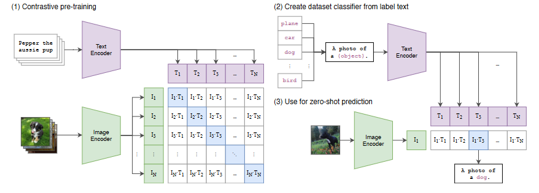
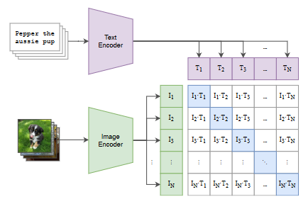
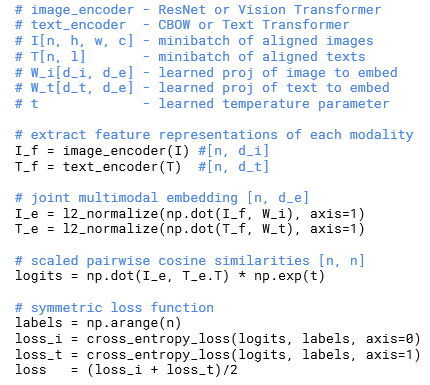
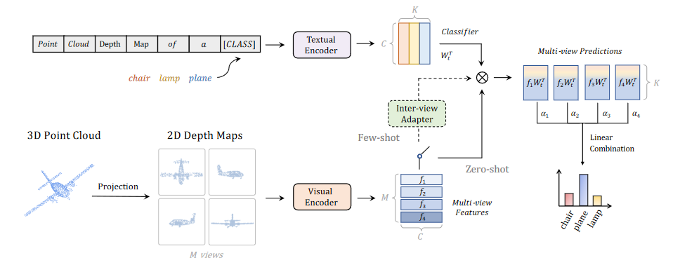
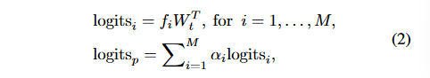
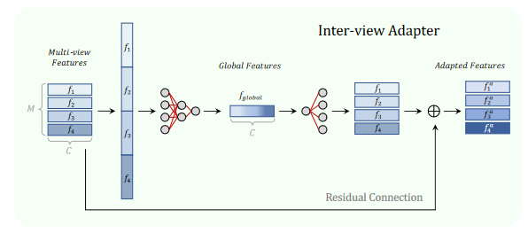
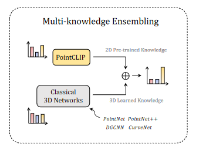
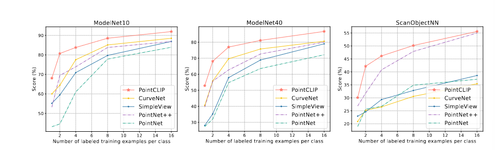

# 读！都给我读！

## CLIP

**bg**

what is zero-shot transfer? https://zhuanlan.zhihu.com/p/34656727

Weak supervision: 弱监督，允许标签带噪声（即带一些理解偏差）

一大堆看得头疼的前人工作（我都没看）

### Motivation

> 文章那么描述。
>
> “We emphasize that what is common across this line of work is not any of the details of the particular methods used but the appreciation of natural language as a training signal.” (Radford 等, 2021, p. 3)
>
> 意思是，无论我们怎么做，这些工作都是企图从自然语言中有监督地学习表达。深度方法给我们一个高效的学习工具，使我们可以更好地从自然语言中学习核心意思（表征）
>
> 从自然语言中学习相比其他训练方法有如下优势：
>
> 1. 相比做众包分类数据集，从自然语言监督扩展特征空间更加容易；
> 2. 训练自然语言模型可以利用互联网上的大量文本资源进行监督学习；
> 3. 从自然语言中学习不仅只学到的是一种特征表达，还能将这种特征表达与语言本身进行关联（这点体现在文本编码器和 zero-shot 线性分类器）
>
> 深度模型优化的必定是连续问题。对于离散标签，我们的做法是把它们映射到连续空间，然后让网络学习从数据到这连续空间的映射关系，最后把连续结果离散化得到分类结果（离散标签）。

对于现有的表征学习，主要分为两个方向：

1. 利用现有的 (image-text) pair数据集，从text中学习image表征。但这方向的工作少，数据集小，原因作者认为是因为这些工作对比baseline在指标上太低，导致较少人对此有兴趣。
2. 尽可能获得更多数据做弱监督训练。但是这类方法受限于数据集中的标签分类的种类，用作者的举例就是：你用一个有18291个类别的训练集训练，那么结果就固定分类在了这18291个类别上，若要扩展类别等价于增加训练集类别，没法从根本解决问题。

作者认为，方向1证明了视觉表征是可行的，方向2证明扩充数据能提升效果（即使数据非"gold-labels"）。那么，把表征作为label是否就可以融合二者的优点了？即实现相比于原先分类标签（离散空间）范围更广的表征空间（连续空间）作为分类标签。这是作者这篇工作的Motivation。

### Contribution

1. 创建了一个 400 million 的pair数据集；
2. 证明了CLIP是更好的。
   1. 在实验中训练了迭代跨度为2个数量级的8个模型，并证明它们的预测效果是光滑稳定的（简单说就是不会随着迭代升高出现过拟合）。
   2. 实验证明CLIP可用于多任务，e.g. OCR 地理定位 动作识别。
   3. CLIP 优于公开可用的 ImageNet 模型。
   4. CLIP 比其他公开的 有监督 ImageNet模型更加鲁棒。
3. 找到了挑选可用于实现大模型的子模型的一些关键指标，并设计了一个高效的匹配策略。
   1. 关键指标：允许不那么精确的表达，但是训练效率必须高（高训练效率指尽可能短时间达到一个可用的性能）
   2. 匹配策略：预测整个文本与那个图像匹配，而非该文本的确切单词。

### Method

#### Model

网络框架CLIP是一个简化的 ConVIRT。（简化理由见：[后续章节](#Selecting an Efficient Pre-Training Method)）

详细看这篇  https://zhuanlan.zhihu.com/p/486857682

#### dataset

感谢前人的工作，作者创建了一个 400 million 的 (image-text) pair数据集。

现有工作用的是 MS-COCO 、Visual Genome 、YFCC00M。

这篇工作从互联网的公开资源中收集得到 400million 个pair。

#### Selecting an Efficient Pre-Training Method

作者发现，训练效率很关键，决定了有监督扩展自然语言的可行性。基于效率这个重要指标，它们选择了预训练模型。

发现过程中，他们先选了准确率高的模型，但他们发现，这两个模型过于要求自己从图片预测的单词必须是精确的，这导致无论是训练效率还是扩展都异常艰难。其他工作发现，图像生成模型（当时以GAN为主）可以学到高质量的图像表征，但问题是相同性能的训练数量级翻一倍。

**总结**，不需要到单词粒度的精确匹配，训练效率和对一句话的表征理解更重要。

基于这些发现，他们还设计了一个匹配策略：预测整个文本与哪个图像匹配，而非该文本的确切单词。

算法：

关于过拟合：预训练训练集很大，过拟合不是主要问题。

本文发现使用线性投影和非线性投影差别不大，他们觉得可能在自监督表征学习中才能有差异。

简化了ConVIRT的投影函数 $t_v,t_u$，因为pair在整个数据集中没有重复出现。其中图片转换保留了什么他没说（或者我漏看了）

优化了loss中的softmax t为 log参数化乘法标量，避免需要超参数（减少一个调参）

#### Choosing and Scaling a Model

image Encoder：ResNet-50 + 抗锯齿 impovement 和 优化ResNet-D

- attention pooling替换global average pooling
- **第二个架构**（一时没找到它指的是什么）使用了Vision Transformer (ViT)

text Encoder：Transformer+Radford提出的一个修改

- 完了，全是专有名词。。

Scaling：Tan&Le(2019)实现缩放图像。

#### Training

pass

### Experiment

看它的实验概括 https://zhuanlan.zhihu.com/p/486857682

---

## PointCLIP

### Contribution

1. 把CLIP引用与点云识别工作，将 2D预训练的知识 迁移到 3D领域，可在没有任何 3D训练 的情况下对点云进行跨模态零样本识别；
2. 一个Inter-view adapter，实现了3D点云图像到CLIP模型的迁移；
3. 最先进
4. 泛化性能好，数据集 ModelNet10 ModelNet40 和最有挑战性的 ScanObjectNN 都不错。

>零样本：识别没有训练样本的新类别样本；
>
>跨模态：一个事物或事件的本身形式不同，可以是文字也可以是图像和视频，不同形式的物体都能识别为一个表达就是跨模态；这里的跨模态指文本和点云之间．

### Motivation 

显然，就是把2D的CLIP用在3D点云。

路线是3D生成多个View的深度图（Depth Maps），然后把图输入Visual Encoder得到表征。

### Method

#### Revisit of CLIP

文章在这把CLIP的输入描述为带分类信息的文本。

但**这有个问题**，CLIP为了减少可能的超参数，把包含了softmax的部分优化为了一个log参数化方法，PointCLIP又把softmax加回来了。为什么？是不是因为作者发现那个简化结果不好，然后发现还是调参好，所有偷换概念把它又加回来了？

#### Model

难点：

- 3D中可用于训练的数据相比2D远远不够，即通过训练三维网络进行迁移学习是困难的。

解决方法：

- 在预训练的CLIP的基础上进行对点云进行zero-shot学习。
  - 做法：把点云转深度图，即图像；
  - 解释：点云是一组无序的三维离散数据，它的稀疏性和分布于基于网格的图像有很大区别。因此把点云的多个View生成投影图像可以消除3D和2D之间的模态差距，从而实现3D和2D之间的多模态。
  - 投影图像直接使用深度图进行存储。

##### Image Encoder

依旧使用 Visual Encoder。

Input：M个不同views的Depth Maps。

Output：M个对应的图像表征。

##### Textual Encoder

依旧使用原的。

Input：固定 Point Cloud Depth Map of a {CLASS}，CLASS 为K个点云的具体分类。

Output：K个自然语言特征。

##### Linear Combination

其中，$\alpha_i$ 是超参数，衡量了第i个view的feature的重要程度。对于这个超参数，作者的解释是：这一些列过程对于 unseen 的3D点云数据是非参数的，因为是在2D是进行预训练。

##### Inter-view Adapter for PointCLIP（这才是需要训练的东西哈）

Motivation：性能不够，增量来凑。

few-shot：相比于zero-shot的基于其他样本建立关联实现迁移，few指对于全新事物需要一点学习样本建立新关联。

- 比如让人理解一个从未有过的事物或定义（这个事物与人理解的所有事物完全没有任何关联），你需要给人一点例子才能让他理解这个；

但是对于CLIP模型进行微调使其更符合本任务是不行的，因为涉及庞大的参数和3D小样本（必定会导致过拟合）。

参考前人工作后，本文在其中增加了一个3层MLP，目的是增强在 few-shot 的性能。训练这个Inter-view Adapter的过程中冻结CLIP的两个Encoder，并通过交叉熵训练这个adapter。

总结：

- adapter的作用是融合特征，保留原图像特征的基础上，融合adapter提炼附加特征。
- 作用是，不改变原CLIP模型基础上，把3D点云数据集通过adapter适配进CLIP这个模式中。
- 实验：哇哦！提高了欸！（拍手手）

##### Multi-knowledge Ensembling

把PointCLIP和其他模型的结果一起融合训练可以得到一个更好的结果，这证明了这些模型之间具有互补性。

### Experiment

#### Dataset

数据集 ModelNet10 ModelNet40 和最有挑战性的 ScanObjectNN

https://zhuanlan.zhihu.com/p/474870801

补充一个训练更快（基于已经训练好的CLIP当然快啦）

---

## OpenSegmentation

RealName：Open-vocabulary semantic segmentation