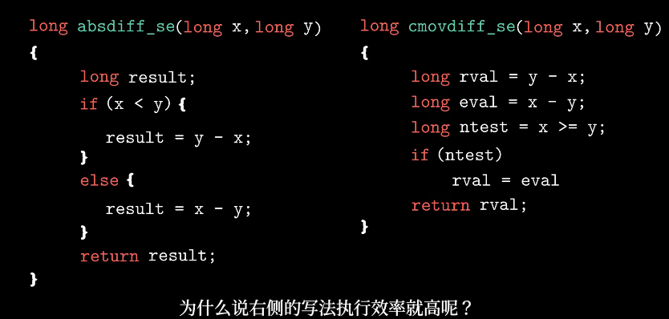
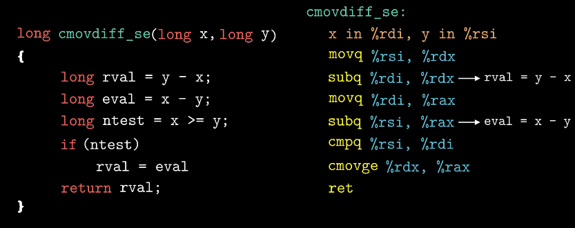
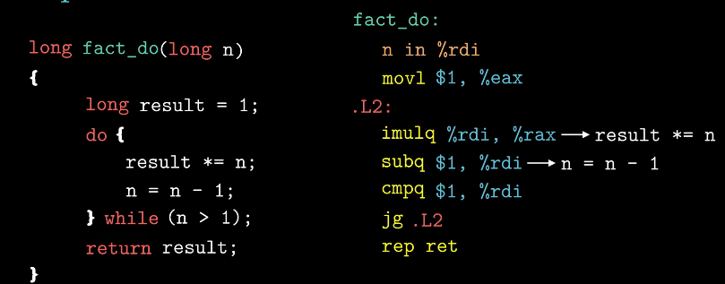
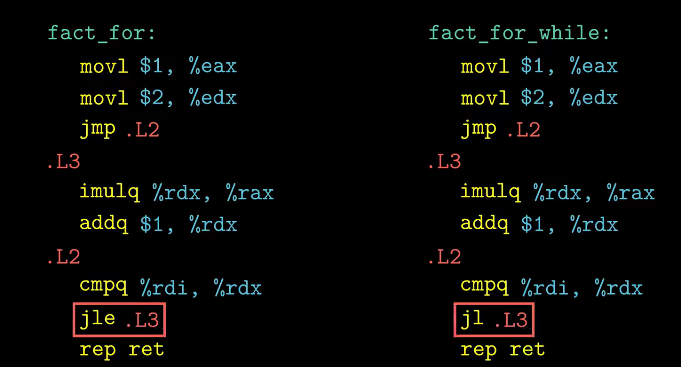
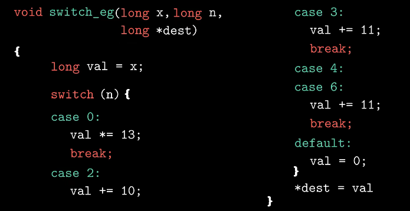
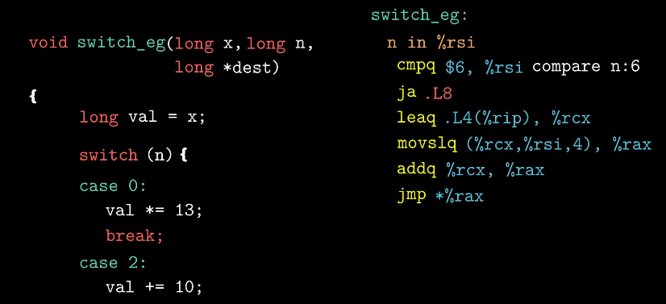
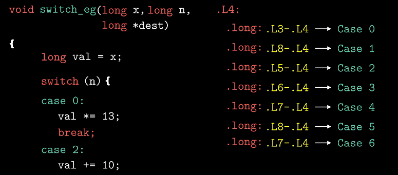
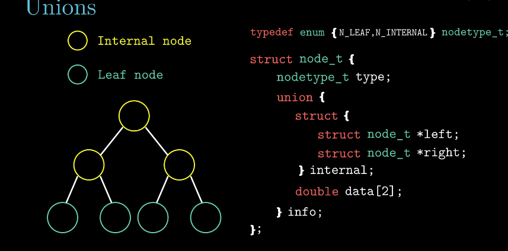

# 分支优化

基于传送指令（cmovge）的代码会比跳转指令的效率高。

处理器会猜测跳转指令是否执行，若猜错会导致效率大幅度下降。

在左程序中，if-else运行时，处理器会根据分支预测器来猜测每天跳转指令是否执行，即预读取if中的指令，但猜错了（即运行else）会导致读取浪费，还要重读一个else，浪费更多时间。

传送则无需猜测，因为没有分支。

# 循环

while和do-while的区别在于判断指令的位置。

for和while和do-while区别不大。

# switch

判断参数n与立即数6的大小。

switch使用一组很长的跳转表实现映射，每个元素为代码位置的指针。

对于确实的case 1 和5，使用默认的跳转值L8表示。

优点是分支的数量与处理时间无关，不用做过多的猜测。

# 结构内存大小优化

联合体需满足内容互斥，其大小为内容的最大字段长度。

在二叉树节点中，有两种节点，内部节点和叶子节点：

-   内部节点：不包含值，包含两个指向孩子节点的指针；
-   叶子节点：包含值，不包含两个指向孩子节点的指针；

因此可将值和两个指针做为一个联合体，从而节省一半的空间。

但联合体不能分辨节点类型，因此使用了一个枚举变量存储节点类型。

# 防止缓冲区溢出

## Stack Randomization 栈随机化

思想：栈的位置在程序每次运行时都有变化。

由操作系统实现，使一个程序在不同机器上每次运行的位置均不同。

算法：Address-Space Layout Randomization, ASLR 地址空间布局随机化

## Stack Corruption Detection  栈破坏检测

编译器会在产生的汇编代码中加入一种栈保护者的机制来检测缓冲区越界，即在缓冲区与栈保存的状态值之间存储一个特殊值（canary，金丝雀 值），这个值每次运行都不同。

>   从前煤矿工会从金丝雀的声音判断空气是否有毒。

## Limiting Executable Code Regions 限制可执行代码区域

消除攻击者向代码插入可执行代码的能力。

思想：通过检查页限定内存页是否可被读写。

