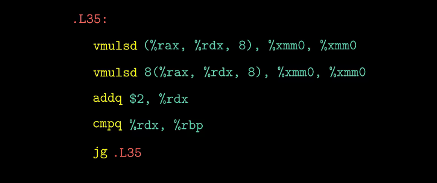

# 分支优化

基于传送指令（cmovge）的代码会比跳转指令的效率高。

处理器会猜测跳转指令是否执行，若猜错会导致效率大幅度下降。

在左程序中，if-else运行时，处理器会根据分支预测器来猜测每天跳转指令是否执行，即预读取if中的指令，但猜错了（即运行else）会导致读取浪费，还要重读一个else，浪费更多时间。

传送则无需猜测，因为没有分支。

# 循环

while和do-while的区别在于判断指令的位置。

for和while和do-while区别不大。

# switch

判断参数n与立即数6的大小。

switch使用一组很长的跳转表实现映射，每个元素为代码位置的指针。

对于确实的case 1 和5，使用默认的跳转值L8表示。

优点是分支的数量与处理时间无关，不用做过多的猜测。

# 结构内存大小优化

联合体需满足内容互斥，其大小为内容的最大字段长度。

在二叉树节点中，有两种节点，内部节点和叶子节点：

-   内部节点：不包含值，包含两个指向孩子节点的指针；
-   叶子节点：包含值，不包含两个指向孩子节点的指针；

因此可将值和两个指针做为一个联合体，从而节省一半的空间。

但联合体不能分辨节点类型，因此使用了一个枚举变量存储节点类型。

# 防止缓冲区溢出

## Stack Randomization 栈随机化

思想：栈的位置在程序每次运行时都有变化。

由操作系统实现，使一个程序在不同机器上每次运行的位置均不同。

算法：Address-Space Layout Randomization, ASLR 地址空间布局随机化

## Stack Corruption Detection  栈破坏检测

编译器会在产生的汇编代码中加入一种栈保护者的机制来检测缓冲区越界，即在缓冲区与栈保存的状态值之间存储一个特殊值（canary，金丝雀 值），这个值每次运行都不同。

>   从前煤矿工会从金丝雀的声音判断空气是否有毒。

## Limiting Executable Code Regions 限制可执行代码区域

消除攻击者向代码插入可执行代码的能力。

思想：通过检查页限定内存页是否可被读写。

# 冒险相关

## 数据冒险

对于这种情况，进行addq操作时，流水线还未将数据写入rdx和rax中，其结果是用于addq操作的数据为0，即结果为0.

冒险分为两类，数据冒险和控制冒险，这种情况为数据冒险。

最简单的操作为暂停操作，即指令在译码阶段读取寄存器时，对将读取寄存器的ID值分别于执行阶段、访存阶段、写回阶段的目的寄存器的ID值进行比较，若相等，即存在相关。对相关的寄存器间插入气泡进行等待。

但频繁插入气泡，会导致效率降低。

为了减少等待的时间，引入了数据转发技术，即在硬件中增量两个逻辑块和旁路路径。

转发可以直接使用寄存器的数据，免去了等待时间。共5个转发源，后4个无空间就暂时不画上去了x

若五种条件都不符合，就直接读取寄存器的数据。

数据冒险已经被优化得还行了，一个周期内就能解决，且不会大大增加该周期所需的时间，即由冒险导致的周期浪费主要集中在控制冒险。

## 控制冒险

每次运行完指令，都需要知道下一条指令的地址，对于ret返回指令，只有进行完才能知道该指令在栈中的地址，即运行到W周期时才能读出。对于判断指令jXX，只有运行完计算，才能知道是否要跳转到分支指令处运行。

该图将调用proc的内容单独提取了出来，而proc只包含一个指令ret。但流水线处理ret指令时，无法执行其他指令，需要暂停流水线，译码器会插入3个气泡。

对于跳转结果，无非是跳转和不跳转两种。我们往往插入一个分支预测，即假设运行总是跳转或总是不跳转。分支预测的准确性对程序的影响非常大，（实际中的分支预测比这复杂得多）

假设总是不跳转：

若该程序实际不要跳转，即分支判断错误，下两条指令不应被执行。当运行完jne后，下两条指令并未实际运行（差一个周期），并不会影响程序的正确性，这时只需要将这两条指令从流水线中剔除。

虽然没有导致实际错误，但浪费了两个周期。

# 性能优化

1.   选择适当算法和数据结构；
2.   考虑到编译器的能力和局限性；
3.   将程序分块，不同模块并行进行。

编译器很难对包含指针和函数调用的程序进行优化，因为有特例，如下二者所示：

## 减少函数调用

例如如下例子：

复杂度由$O(n^2)$将为$O(n)$

因此得到第一个优化：

但消除函数调用并不一定会提高效率。

例如：

其结果并没有提高，甚至部分程序的效率变低了。

其原因是因为每次调用都会产生两次读内存和一次写内存，产生了不必要的内存引用。其解决办法是，可以使用一个临时变量进行临时存储，减少了访存时间。

最后的结果相对于原函数，有了非常显著的提升。

## 运算耗时

1.   Latency延迟：运算完成需要的总时间；
2.   Issue发射：两次运算之间间隔的最小时钟周期数；
3.   Capacity容量：一次可完成的次数；

由于内存吞吐量和执行顺序的限制，往往一个周期无法一次完成多个计算。

对于程序性能的评估，往往能使用程序流图表示。

### 数据流图

对于这个案例：这是一个对data内的数据的遍历，一次乘法需要3个时钟周期，一次加法需要1此时钟周期，所以乘法所在的链成为了制约程序效率的关键。

## 循环展开

>   对于这种线性性能，应用度量标准CPE，
>
>   psum1的CPE为9.0，psum2的CPE为6.0

循环展开为2时，效率有了一定提升，成功减少了循环开销操作，但展开到3时，没有提升，止步于延迟界限，这是由于数据流图中制约程序性能的主要操作没有得到进一步优化。

从combine5 2X1的汇编代码中可见：

一次展开产生两个vmulsd操作。

从数据流图中可见，乘法是制约整个程序运行的关键，累加每次操作无法有效减少关键路径长度。

既然主链制约了程序性能，那么就可以考虑拆分主链，提高主链的并行性。于是有了2X2的循环展开。

这种写法有效的提升了程序性能，甚至可以继续展开。但展开到10X10时，性能甚至趋近于程序吞吐界限。

对combine5还有种优化，就是调整括号位置：

对于那些需要多个周期完成的操作，其效率有显著的优化。其原因它的关键路径比原先短了一半。

