# 概论

-   什么是编译器？
    -   将某一种语言翻译为目标机器上能运行的程序。

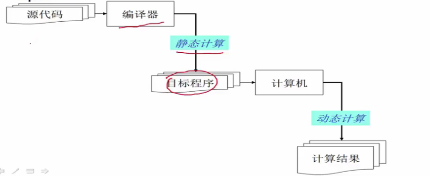

目标代码要求和源代码的**语义**相同，计算机需要对目标代码进行正确执行。

编译器与解释器：

1.  解释器也是处理程序的一种程序；
2.  编译器输入源代码，输出可执行程序，离线编译器offline；
3.  解释器输入源代码，输出程序运算结果，在线编译器online；

编译器高层结构：

1.  编译器具有非常模块化的高层结构；
2.  编译器可看成多个阶段构成的“流水线”；

一种没有优化的编译器结构：

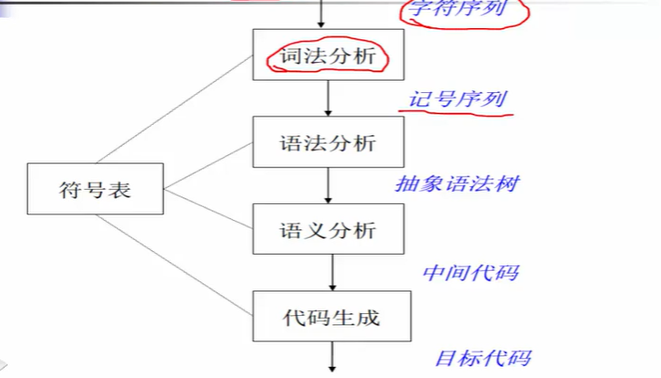

词法分析：判断输入都是什么类型的词

语法分析：判断语法是否有错；

语义分析：判断语义是否有错；

更复杂的编译器结构：

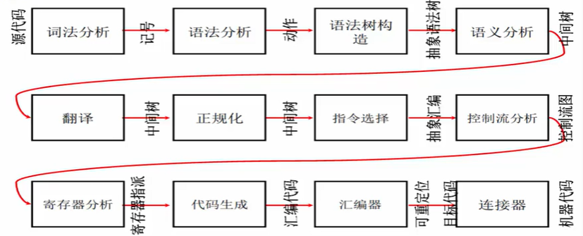

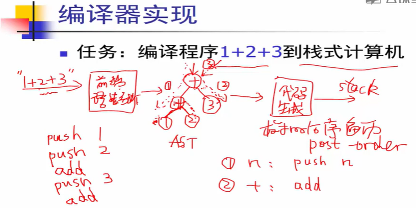

AST：抽象语法树

使用树的后序遍历完成代码生成。

# 词法分析

## 简介

编译器前端内容：

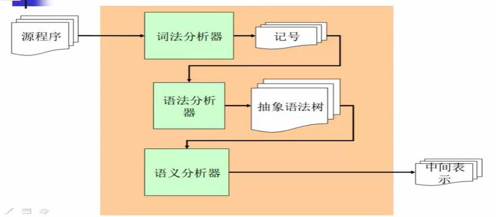

语义分析器，又可叫为类型检查器，检查语法树的正确性。

词法分析器会将程序文本切分为各种记号，去掉后续不用的字符，如空格、回车。

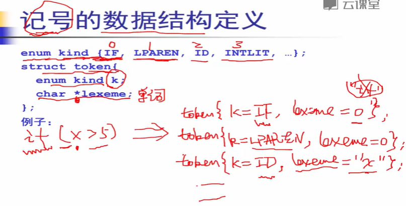

对于记号来说，记号的数量是有限的，因此可以用枚举类型枚举完所有种类，随后用字符串存储变量的内容。

小结：

-   词法分析器的任务：字符流到记号流：
    -   字符流：
        -   和被编译的语言密切相关（ASCII，UNICODE，or ... ）；
    -   记号流：
        -   编译器内部定义的数据结构，编码所识别出的词法单元。

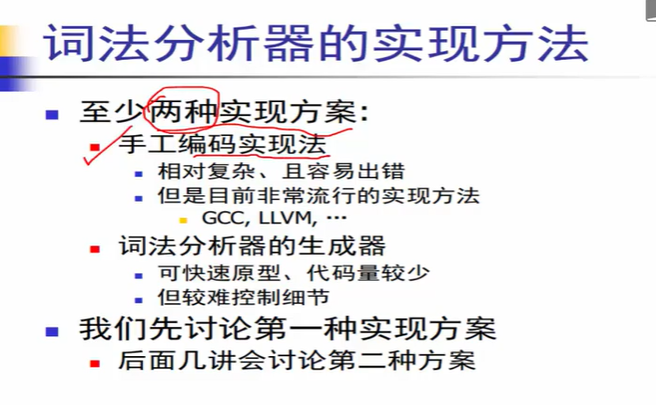

## 词法分析器的手工构造

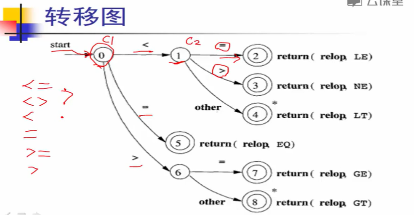

*代表回退；

伪代码：

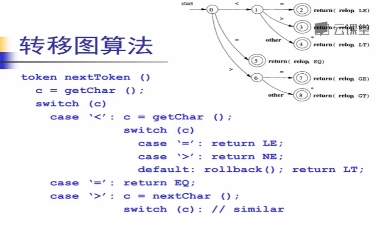

对于其他标识符的转移图实现也比较类似：

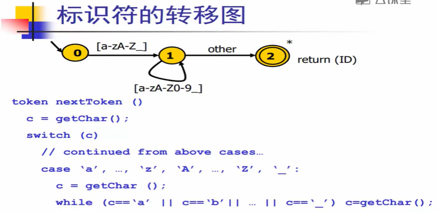

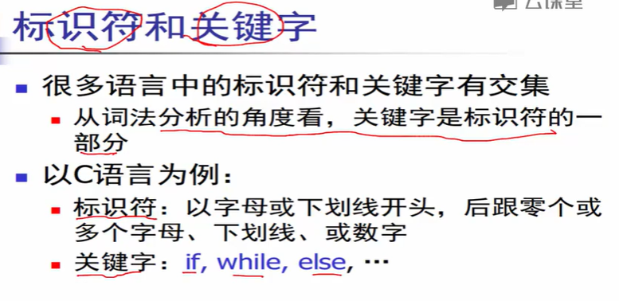

关键词是标识符的一种！

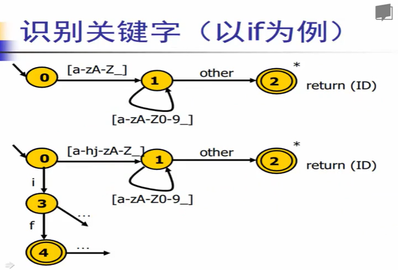

方法1：添加关键边，罗列所有可能，但可扩展性差，出错率可能略高。

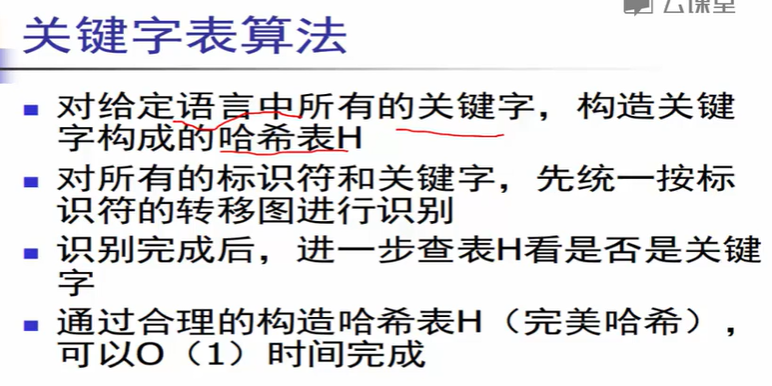

方法2：将关键词先作为标识符识别，识别完后查表看该标识符是否为关键字。
