# 概论

-   什么是编译器？
    -   将某一种语言翻译为目标机器上能运行的程序。

目标代码要求和源代码的**语义**相同，计算机需要对目标代码进行正确执行。

编译器与解释器：

1.  解释器也是处理程序的一种程序；
2.  编译器输入源代码，输出可执行程序，离线编译器offline；
3.  解释器输入源代码，输出程序运算结果，在线编译器online；

编译器高层结构：

1.  编译器具有非常模块化的高层结构；
2.  编译器可看成多个阶段构成的“流水线”；

一种没有优化的编译器结构：

词法分析：判断输入都是什么类型的词

语法分析：判断语法是否有错；

语义分析：判断语义是否有错；

更复杂的编译器结构：

AST：抽象语法树

使用树的后序遍历完成代码生成。

# 词法分析

## 简介

编译器前端内容：

语义分析器，又可叫为类型检查器，检查语法树的正确性。

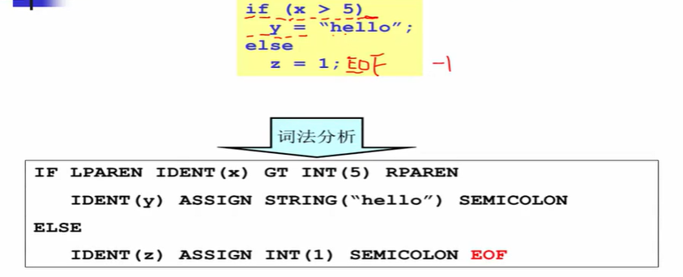

词法分析器会将程序文本切分为各种记号，去掉后续不用的字符，如空格、回车。

对于记号来说，记号的数量是有限的，因此可以用枚举类型枚举完所有种类，随后用字符串存储变量的内容。

小结：

-   词法分析器的任务：字符流到记号流：
    -   字符流：
        -   和被编译的语言密切相关（ASCII，UNICODE，or ... ）；
    -   记号流：
        -   编译器内部定义的数据结构，编码所识别出的词法单元。

## 词法分析器的手工构造

*代表回退；

伪代码：

对于其他标识符的转移图实现也比较类似：

关键词是标识符的一种！

方法1：添加关键边，罗列所有可能，但可扩展性差，出错率可能略高。

方法2：将关键词先作为标识符识别，识别完后查表看该标识符是否为关键字。

## 正则表达式

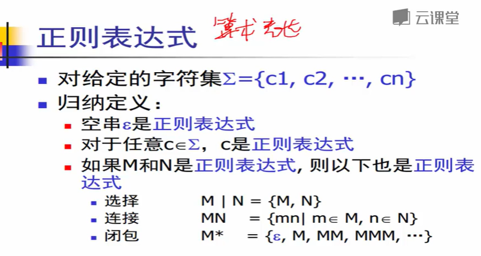

-   选择是合集，连接是两个串拼接，闭包是单元素无限连接（科林连接）

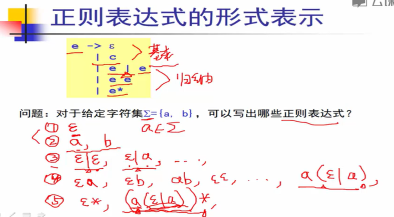

## 有限状态自动机

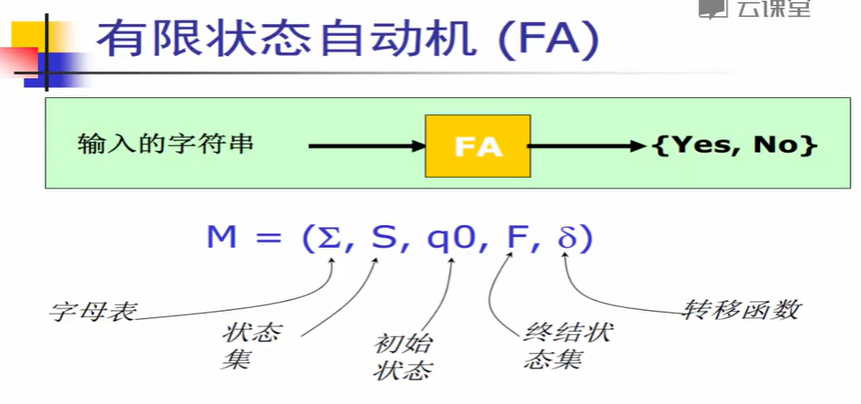

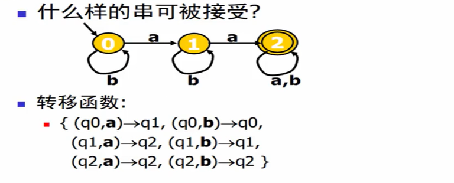

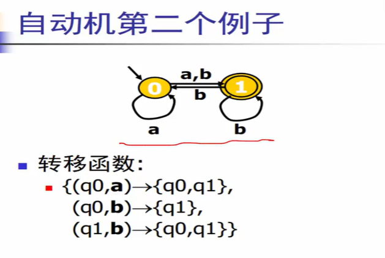

NFA：非确定自动机；

DFA：确定自动机；

区别在于NFA的一个状态在同一个条件下有多个转移方向，只要有一种路径能得到正确结果，就是对的。

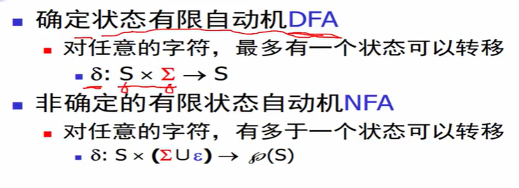

-   那个不可名状的符号是幂集符号。

## 从正则表达式RE到NFA：Thompson算法

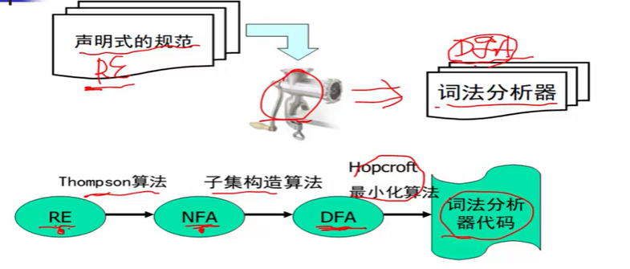

Thompson:

-   基于对RE的结构做归纳：
    -   对基本的RE直接构造；
    -   对复合的RE递归构造；
-   递归算法，实现起来不到100行c代码；

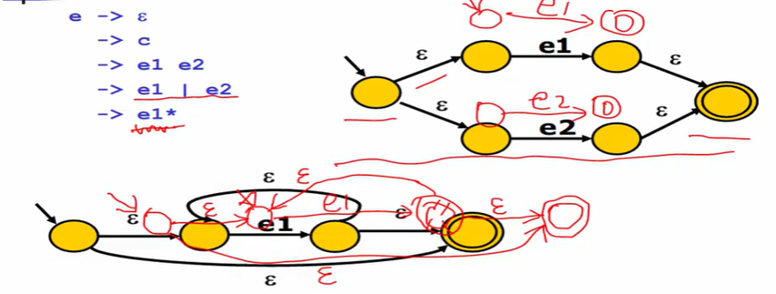

## NFA转换为DFA：子集构造算法

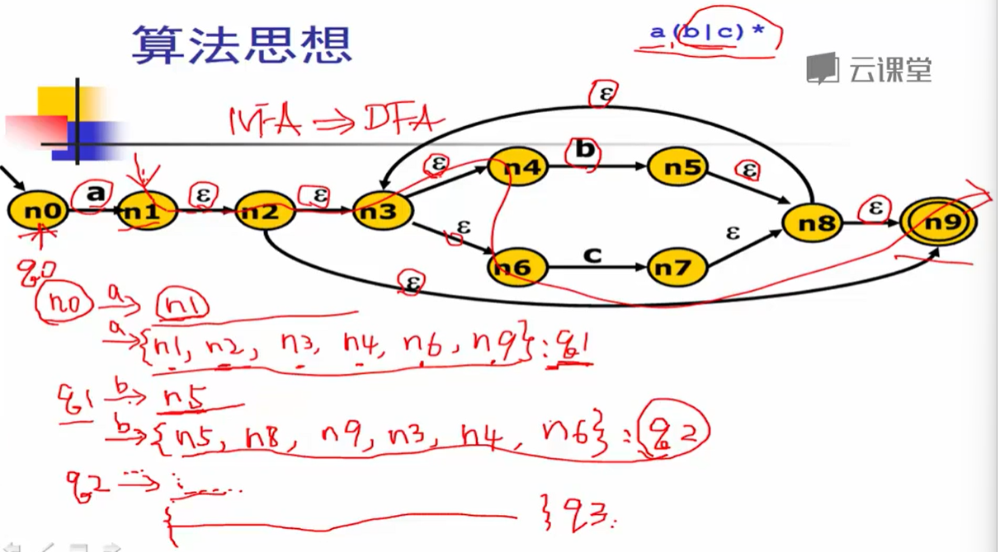

将所有可通过$\varepsilon$走到的点构成一个集合，继续迭代。

最后可以得到一个由子集组成的DFA，其不包含$\varepsilon$边。

-   这是一个不动点算法，因为每次迭代都会构造一个非空集合，新集合的不同元素数是单调递增的，即总会走完工作表。

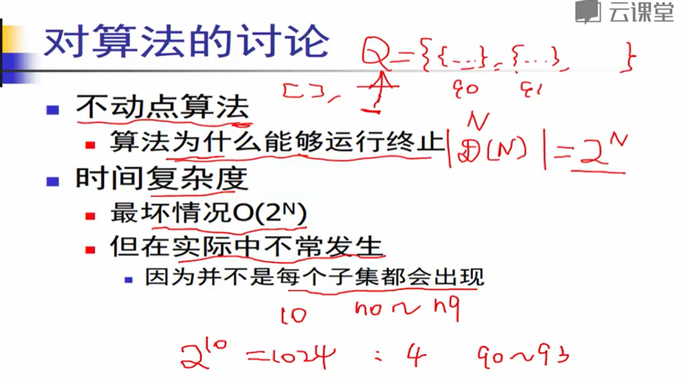

基于深度优先遍历的算法：

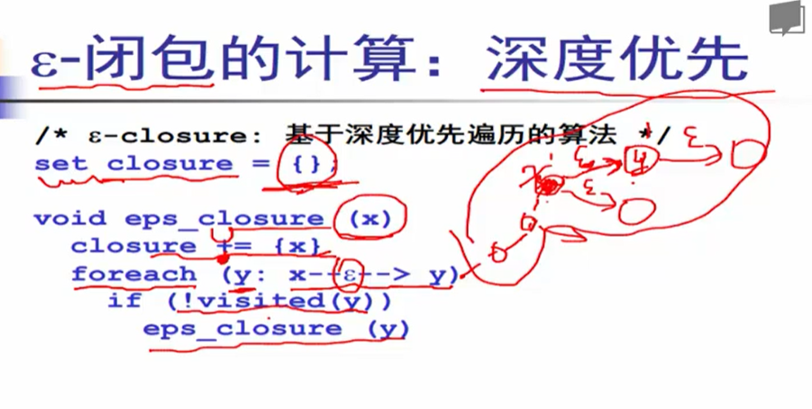

子集构造算法：工作表算法：

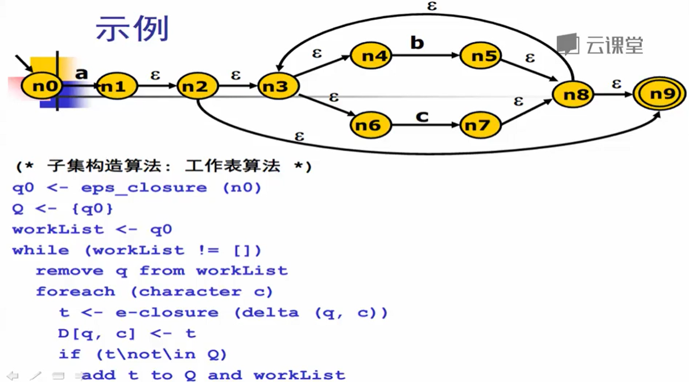

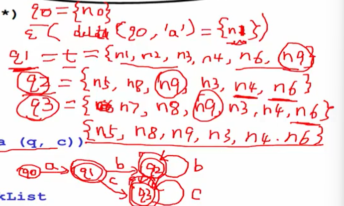

>   其中，包含`n9`的都是接受状态。

